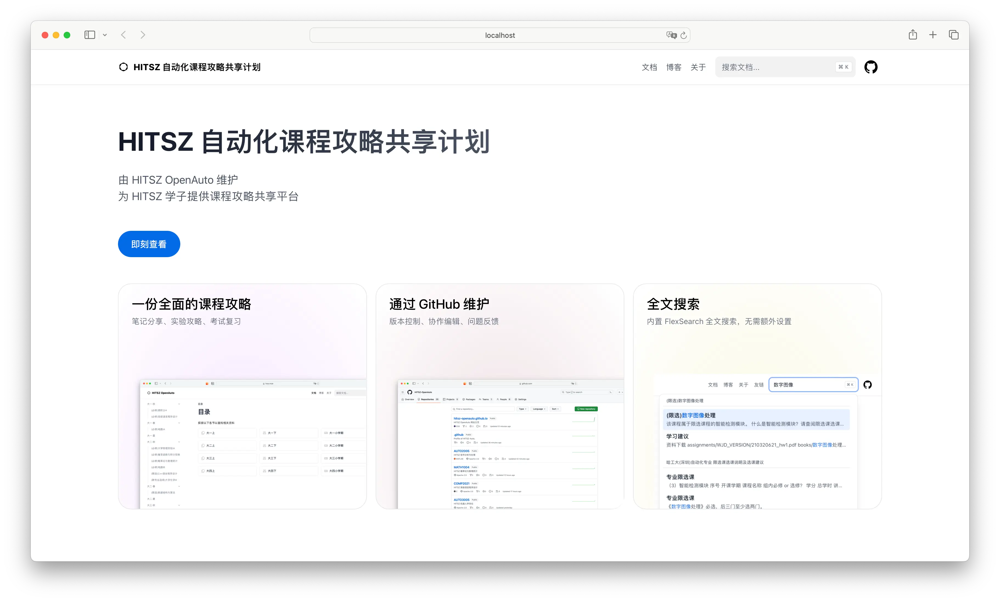

<h3 align="center">
	<br/>
</h3>
<h1 align="center">hoa.moe</h1>
<h5 align="center"><a href="README.md">English</a> | <a href="README-zh.md">中文</a></h5>

<p align="center">本网站使用 <a href="https://gohugo.io/">Hugo</a> 框架和 <a href="https://imfing.github.io/hextra/">Hextra</a> 主题进行构建，由 <a href="https://github.com/HITSZ-OpenAuto">HITSZ OpenAuto</a>团队管理维护。</p>




## 网站特点

- **快速高效** - 使用当前世界上构建网站速度最快的 Hugo 框架搭建。
- **响应式布局及美观的暗黑主题** - 网站支持所有设备正常访问，无论是移动端还是桌面端。我们还提供了暗黑模式以供用户在不同亮度条件下进行选择。
- **完善的文本搜索功能** - 网站的文本搜索功能由 FlexSearch 进行驱动，不需要任何额外配置。
- **评论功能** - 网站支持由 [giscus](https://giscus.app/) 提供的评论功能。
- **持续集成** - 网站的所有文档都会从 [HITSZ OpenAuto](https://github.com/HITSZ-OpenAuto) 组织的仓库下自动抓取，更新不需要任何人为干预。

## 快速部署

### 克隆本仓库

```bash
git clone https://github.com/HITSZ-OpenAuto/hoa.moe.git --recurse-submodules
```

### 安装 Hugo 框架

请安装 Hugo 的拓展版本。

```bash
# Windows
winget install Hugo.Hugo.Extended

# macOS
brew install hugo

# Linux
sudo snap install hugo
```

### 在本地环境下运行

```bash
cd hoa.moe
hugo server
```

现在，你可以在浏览器里访问 `http://localhost:1313` 查看网站的本地运行版本进行网站开发。

## 如何贡献

如果你想为本网站贡献说明文档，请阅读 [HITSZ OpenAuto 文档编写指南](https://hoa.moe/blog/writing-rules/)。

如果你想在本网站发布博客文章，你可以在 `content/blog` 文件夹下按照格式创建一个新的 markdown 文本文件, 编辑完成后向我们提交 pull request。如果你不熟悉 Git 的使用方法, 你也可以将文章通过邮件的方式发送至 [📮hi@hoa.moe](mailto:hi@hoa.moe)，我们会在第一时间审核你的文章。

## 开源许可证

由贡献者编写部分的许可采用 CC BY-NC-SA 4.0 协议；本网站源代码采用 [MIT 许可](LICENSE)。

## 鸣谢

- [Hugo](https://gohugo.io/)
- [Hextra](https://imfing.github.io/hextra/)
- [Programming VTuber Logos (addon edition)](https://github.com/PetricaT/ProgrammingVTuberLogos-Addon), [@Petrica](https://github.com/PetricaT) 帮助我们设计了首页中好看的 Logo
