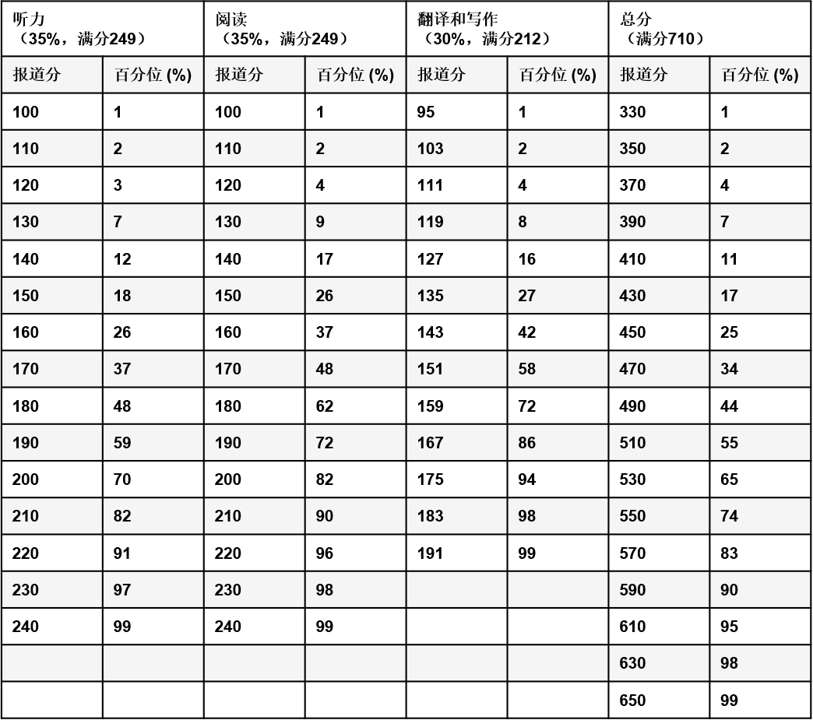
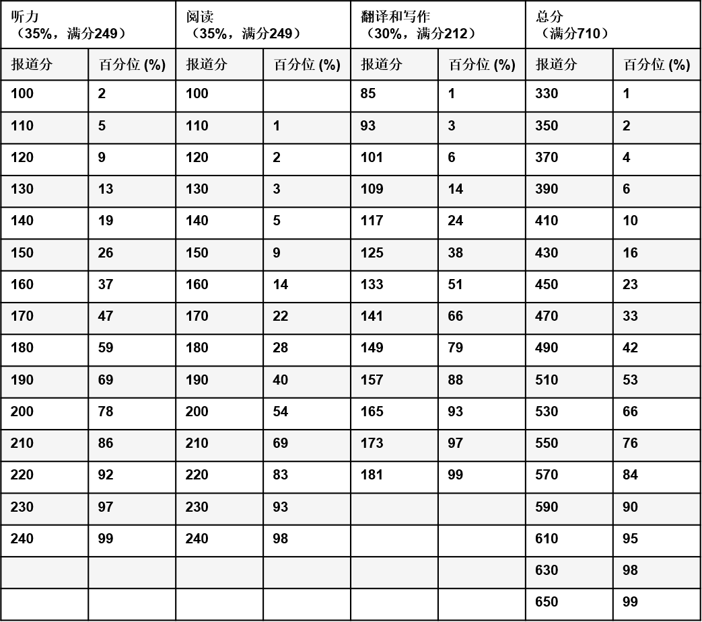

全国大学英语四、六级考试简称 CET（**C**ollege **E**nglish **T**est），是对于每位学子都很重要的考试。保研、考研、找工作都对英语成绩有要求，而四、六级成绩是其中最基础的两项（至少四级如此）。

四六级考试每年进行两次，分别是 12 月份和 6 月份，每次考试有 2-3 套题。每次四六级考试开始报名时，学院都会有通知，切勿错过。

本文主要介绍四、六级 **笔试** 的信息。然而，在此之前，先明确一个问题：

### 要不要报考口试？

四六级中，笔试和口试是两个独立的项目，且口试为选考项目。在报道成绩时，笔试和口试的成绩 **分开报道**：（可以点开 [考试大纲](https://cet.neea.edu.cn/res/Home/1704/55b02330ac17274664f06d9d3db8249d.pdf) 翻到第 212 页，看看四、六级的成绩单长什么样）

- 笔试呈现为一个总分与三小项得分，大家平时说的「四六级考试成绩」或者「过没过」都指的是 **笔试成绩**，一般向用人单位提供的四六级成绩也是**笔试成绩**；
- 而口试的成绩只有等级没有分数。如果不报考口试，则该部分显示为空，但**不影响**笔试分数，也就「几乎」不影响你的四、六级成绩单在别人面前的呈现效果。只有确定想要通过四六级考试证明自己的口语水平的情况下才考虑报考口试。

大多数人并不用通过四六级考试证明自己的口语水平（要么没有需求，要么可以通过 IELTS / TOEFL 等考试来证明）。所以，对于绝大多数人，这个问题的结论是：

<b>不用报名。
</b>
 

报名时官网会弹出来口语报名界面，一般来说无需理睬。（当然，假若你决计要报，哈工深本身就是四、六级口试考点，不用跑去其他地方，这点无需担心。）

以下部分仅涉及四六级笔试部分。

---

### 四六级成绩怎么看？

首先区分两个概念： **原始分和报道分**。原始分，也就是卷面总分，满分是 100 分；而报道分则是对原始分赋分得到。所谓赋分，就是通过某种原始分和报道分的对应关系，将原始分映射到报道分上的过程，实际上就是函数。

四、六级成绩单上呈现的是 **报道分**，不是原始分。总报道分是用下面这个公式计算出来的：

$$
报道分 = \frac{原始分 - Mean}{SD} \times 70 + 500
$$

其中，$ Mean $是常模群体[^1]平均分，$ SD $是常模群体标准差；你可以认为是抽样确定好的常数。由于官方并不公布这两个常数，因此即使知道报道分，你也无法逆推出卷面分/原始分。

各题型（见下一节）也有报道分，总报道分等于它们的和。报道分的满分是 710 分，其中听力满分 249 分（35%），阅读满分 249 分（35%），翻译和写作满分共 212 分（30%）。各题型的原始分占总原始分的比例，等于各题型的报道分占总报道分的比例。

另外，四级*不设及格线*（官网原话），但四级成绩在 425 分及以上者才能报考六级。


既然无法由报道分知道原始分，那么报道分有什么用呢？



报道分数其实只是「卷面分在常模群体中排位比例」的反映；也就是说，可以从报道分得出你在全国考生（的代表群体）中的**大致**排名情况，它不过是排名的另一种说法；与原始分不同，报道分是赋分而来，绝对分数并不直接反映你的卷面情况。新高考地区的同学应该较为熟悉这一点。~~当然高考赋分的分数意义重大~~


{}

{}

{}

{}


此处有关报道分的解释都引用自 [官网分数解释](https://cet.neea.edu.cn/html1/folder/19081/5124-1.htm) ，大家可以去查看，里面有更多例子。


### 分项分数及试题组成

**PART 1 写作（15%）：** 短文写作。

**PART 2 听力理解（35%） ：试卷上仅给出<u>选项</u>，试题在听力录音中；四、六级考试仅有这一项的题型构成不同。**

{}

四级：

| **测试内容** | **测试题型**   | **题量** | **分值比例**     |
| ------------ | -------------- | -------- | ---------------- |
| 短篇新闻     | 选择题（单选） | 7 题     | 7%（每题 1 分）  |
| 长对话       | 选择题（单选） | 8 题     | 8%（每题 1 分）  |
| 听力篇章     | 选择题（单选） | 10 题    | 20%（每题 2 分） |

六级：

| **测试内容**   | **测试题型**   | **题量** | **分值比例**     |
| -------------- | -------------- | -------- | ---------------- |
| 长对话         | 选择题（单选） | 8 题     | 8%（每题 1 分）  |
| 听力篇章       | 选择题（单选） | 7 题     | 7%（每题 1 分）  |
| 讲话/报道/讲座 | 选择题（单选） | 10 题    | 20%（每题 2 分） |

{}

**PART 3 阅读理解（35%）：**

1.词汇理解（选词填空，共 10 空，每小题 0.5 分，共占 5%）

2.长篇阅读（给出 10 个句子，要求匹配到对应的段落，每小题 1 分，共占 10%）

3.仔细阅读（10 小题，每小题 2 分，共占 20%。一般是两篇，每篇 5 道单项选择题）

**PART 4 翻译（15%）：** 汉译英，翻译一段话。

点击 <a href="https://cet.neea.edu.cn/html1/report/16123/196-1.htm" target="_blank">这里</a> 查看 CET 官网给出的的具体题型分布。

[考试大纲](https://cet.neea.edu.cn/res/Home/1704/55b02330ac17274664f06d9d3db8249d.pdf) 从第 150 页开始给出*具体的样卷*，可以看看，熟悉题型分布。不过，实际上作文并不是印在最前头，而是试题册最后一面。

### 考试流程

**哈工深考场不需要自带耳机，听力是广播播放！**

四级正式考试时间 9:00 - 11:20；六级正式考试时间 15:00 - 17:25。**时间点可能有些许误差，以考前实际安排为准！**

| 时间                                     | 事项                                                                                                                           |
| :--------------------------------------- | :----------------------------------------------------------------------------------------------------------------------------- |
| 四级 8:40 - 9:00 六级 14:40 - 15:00   | 试音时间                                                                                                                       |
| 四级 9:00 - 9:10 六级 15:00 - 15:10   | 发放试题册[^2] 、答题卡 1 和 2[^3]、条形码 填写个人信息，粘贴条形码 **_只允许浏览作文试题， 禁止翻阅试题册其他部分_** |
| 四级 9:10 - 9:40 六级 15:10 - 15:40   | 作文答题时间 **_只允许作答作文，也不能翻阅其他部分_**                                                                       |
| 四级 9:40 - 10:05 六级 15:40 - 16:10  | 听力答题时间                                                                                                                   |
| 四级 10:05 - 10:10 六级 16:10 - 16:15 | 收答题卡 1，期间不允许作答。 **_听力播放完毕后立即收卷， 务必在听力播放间隙涂好答题卡_**                                 |
| 四级 10:10 - 11:20 六级 16:15 - 17:25 | 完成其余部分                                                                                                                   |
| 四级 11:20 六级 17:25                 | 考试结束，收答题卡 2 和试题册                                                                                                  |

### 备考策略

> 诸位都是能上哈工深的人，相信大部分同学已经有了自己的一套英语学习习惯；适合自己的才是最好的，**了解题型组成以后**，如果读者觉得自己的习惯有效果，或者看完这一部分觉得「这人写的怎么怪怪的」，完全不必拘泥于笔者自己的建议，可以直接跳到 [学习渠道推荐](#学习渠道推荐) 。
>
> 对于比较迷茫的同学，笔者推荐利用各种信息资源平台，例如 B 站——在上面搜索「四六级 XX 题型备考策略」，可以看到专门研究四六级的专业人士给出的建议，不妨试一试！
>
> 下面给出的只是笔者的个人想法，不构成明确的行动指南。

通过研究分数构成和真题，我们不难发现：
分值的大头是听力和阅读，各占 35%；此外，它们都是客观题，而客观题相比主观题最大的优势就是：可以蒙，可以利用各种做题技巧，拿分相对容易。_相比之下_，仅各占 15% 分值的作文和翻译都是实打实的分，性价比实在不高。
如果你觉得 _考高分_ 比 _提高英语水平_ 的优先级高一些，那么备考的重点也应该是客观题。

#### 客观题

客观题的总体备考策略很简单——熟能生巧，毕竟都是客观题，只需要做做往年真题的这两部分，做多了手感自然就有了。

##### 听力

一般而言听力的正确率低于阅读，因此笔者四、六级考前一周的复习时间主要是在练听力，力求在听懂大致意思的基础上，记住尽可能多的细节。

##### 阅读

笔者英语老师推荐的做题顺序是

1. 两篇仔细阅读（阅读理解）
2. 长篇阅读
3. 词汇理解（选词填空）

_也就是没必要按照试题册顺序来_。理由也很~~功利~~简单：根据分值和难度综合判断，

- 仔细阅读 分值高而且难度低、耗时相对短
- 长篇阅读 分值中等，但需要读非常长的文章
- 词汇理解 分值太低

> 当然笔者的情况是 阅读 + 翻译 时间充裕，所以我觉得没必要分这么细

仔细阅读的做题步骤是：

1. 先读一个问题
2. 看段落前几句或者通读某一段，定下答案区间
3. 读完原文，再读选项并选择
4. 看下一个问题，回到 1.

这是笔者六级考试时采用的 [长篇阅读做题方法](https://www.bilibili.com/video/BV1Ea411i7Da/)，不需要细致地通读全文。

#### 主观题

##### 作文

一般是议论文或者应用文，想偷懒可以吃高中老本，也可以学习各种资料上的范文。

##### 翻译

只能靠平时积累；一个技巧是，如果不确定某种译法是否正确，不要硬生生地把中文直译为英文，可以把中文词汇的意思用英文表达出来。

> 例如，忘记「时钟」的说法，你可以翻译为 the thing to show time（

### 学习渠道推荐

个人体会，上手就做真题，不需要做模拟题。

以 4-6 套/年（2-3 套/次）的出题速度，真题数量已经足够你找手感、研究了。况且模拟题质量参差不齐，既然有权威优质的真题资源，何必忍受模棱两可的答案呢？若你是大一下及之后参加考试，那么因为学业任务沉重，不可能花太多时间来刷题，就更应该选择真题。

笔者用的是「四六级黄皮书」，体验极好，列举一些优点：

- 真题数量多
- 答案分册，方便批改，而且有详解
- 附赠听力音频
- **完全按照官方试题册进行排版印刷。黄皮书上的一套试题就是一本试题册，和官方的排版一致，可以让你提前适应考试风格。**

市面上还有不少大品牌出版的资料，你还可以多搜搜，货比三家，看看别人对它们的评价再做决定。

此外，有学院也会在考前一周组织免费的四六级模拟考，届时可报名；最大的作用是适应考试的时间安排。试题一般就是从往年真题里选一套。

### 考试用处

- 四级成绩在 425 分及以上者才能报考六级。所谓「低分飘过四级」指的是分数在 425 上一点点，并不是「及格」的意思（再次重复，四级其实没有「及格线」一说）。
- 转专业。不同专业转入要求的四级分数不同，也有不要求的专业。具体可查查各学院的转专业要求。
- 免听英语课。四、六级分数达到一定分数线者，可申请免听英语课，细节请参考当年的教学秘书通知。
- 督促你学英语。这不是一句套话——**_大学的课外自学资料，有相当一部分是英文版_**。
- ...[^4]
  > 目前（2024 年），哈工深毕业并不需要四六级。但是，_毕业不需要 &ne; 不用考四级 &ne; 不用学英语！_

---

### 后记

写这篇「指北」的动机，是在 23 级自救群的见闻。无论是报名开始时学长「不要报四级口语」的怒吼（？）、不少人报完口试才知道可以不报的感叹，还是考前不久有人才知道四级做题是强制顺序，都让我感受到信息的封闭。

诚然，四级官网上有详细介绍，但一来这些网页较为分散，难以整合信息，二来对没考过的大一新生而言，仅凭 ~~不知道多久才更新一次的~~ 官网信息，想「居高临下」地一览四级考试全貌，并不容易。因此萌生了「写一份四级备考指北」的想法。

这篇指北面向新生群体，目的是让大一新生对四级考试的全流程（包括备考过程）有一个比较清晰的了解，减轻未知带来的焦虑和迷茫；而不是介绍四级刷高分的技巧。按照笔者的理解，无论什么考试，要想拿到超出常人的高分，大量刷题是必不可少的；这已经超出了本文的写作意图——毕竟对大部分人而言，四、六级并不是极其重要的考试。

本指北中，相当一部分资料其实是引用或者参考自四级官网，感兴趣的同学可自行探索：
https://cet.neea.edu.cn/ 和 https://cet-bm.neea.edu.cn/

[^1]: 官网的原话是

    > 四级考试的常模群体选自全国 16 所高校的约三万名非英语专业的考生，六级考试的常模群体选自全国五所重点大学的约五千名非英语专业的考生。

    但也只说到这，没有给出更多信息。

[^2]: 试题册，顾名思义，就是一本薄薄的*装订好*的小册子，跟高考试卷那种一张长卷子不一样。

[^3]:
    答题卡 1：作文和听力共用的答题卡；
    答题卡 2：阅读和翻译共用的答题卡

[^4]: 一些学校的保研夏令营会有入营的六级分数门槛，但笔者目前并没有得到确切的信息和学校名单，因此不放在正文中，也不过多解释。
