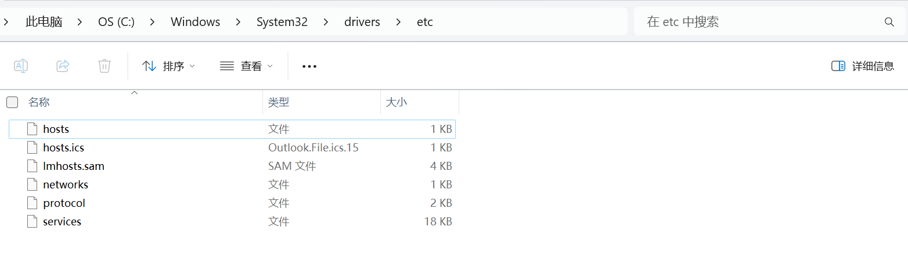
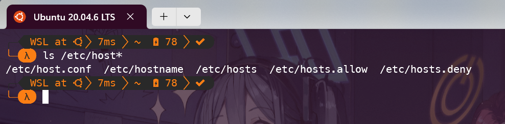

> 已经会魔法的 / 能够稳定访问 GitHub 的朋友，这篇文章对你来说帮助不大，本文面向刚开始接触 GitHub 的新朋友。
>
> 本人不精通计算机网络知识，用语难免不严谨。本文只是分享一些自己的经验，如果有错误，欢迎指正。

## 1. Introduction

无论你是先从 GitHub 上的 OpenAuto 找到了这里，还是先从这里知道了 OpenAuto，并且想要进一步使用里面的资源，你都需要能够稳定地访问 GitHub。

HITSZ OpenAuto 的资源基于 GitHub 托管，导致许多人问我们的第一个问题就是：

> 为什么 GitHub 进不去啊？

许多人在没有科学上网的情况下，访问 GitHub 会遇到各种各样的困难，比如：

- GitHub 网页打不开
- 偶然能访问 GitHub 上的仓库，但里面的文件无法下载
- GitHub 仓库无法克隆
- 从本地推送到 GitHub 仓库失败，例如经典的报错 `Failed to connect to github.com port 443: Timed out`

解决这些问题的办法很多，一种是使用魔法，有魔法你就成功了 90%。
但不是所有人都能获取到好用的代理，本文也没办法教你😶，抱歉。

但是，有一个好消息，那就是如果只是为了访问 GitHub，那么在不使用自建魔法的前提下难度并不高。

## 2. 软件和网站？

有许多免费的软件可以直接帮助我们访问 GitHub，这里只介绍一个我曾经用过的。

- [Watt Toolkit](https://steampp.net/)：原名 Steam++，一个开源跨平台的多功能 Steam 工具箱，并且可以加速 GitHub 的访问。
  目前已支持 Windows、macOS、Linux 和 Android，属于开箱即用的软件。

如果需要下载/克隆 GitHub 上的文件，可以使用本站提供的代理服务：

- [HOA's Github Proxy](https://gh.hoa.moe/)

## 3. 通过修改 hosts 文件访问 GitHub

上面所述的使用软件，本质上还是使用别人帮我们设置好的代理上网，速度有时并不理想；
而使用镜像站点下载文件，前提是知道 GitHub 上文件的地址；为了获取地址，你通常还是直接访问 GitHub。最重要的是，**这些工具随时可能失效**。

所以本文的核心内容不是分享软件和网站，而是教大家如何通过**自己的操作**连接 GitHub。

### 3.1 基础知识

先介绍几个常用的命令。
这些命令是在终端（Windows cmd / Powershell，Linux Bash）下运行的指令。

- `ping`：测试网络连接是否正常，例如 `ping github.com`。这个命令在 Windows 和 Linux 下都可以使用。
  
- `ipconfig`：（仅限在 Windows 下）查看本机的 IP 地址。
- `ifconfig`：（仅限在 Linux 下）查看本机的 IP 地址。需要安装 `net-tools`。

### 3.2 获取 GitHub 的 IP 地址

首先保证使用 3.1 中的 `ping` 命令能够成功连接到 GitHub。
如果你的 ping 返回的是 `Request timed out`，那么说明你所处的网络环境有问题，这个不是本文能够解决的，因此不深入讨论。

下一步，查询 GitHub 的 IP 地址。
提供 IP 查询的网站很多，这里给大家介绍 [IP Address](https://www.ipaddress.com/)。

进入网站，选择其中的 `IP Address Lookup` 功能（或直接点击这个链接：<https://www.ipaddress.com/ip-lookup>）。


在搜索框中输入 `github.com`，点击 `Lookup` 就可以在结果中看到 GitHub 的 IP 地址了。

我们查询这 4 个网站的 IP 地址，把它们记下来：

- github.com
- api.github.com
- github.global.ssl.fastly.net
- codeload.Github.com

这 4 个网站足够我们访问 GitHub、推送/拉取 GitHub 仓库、使用 GitHub 的 API（包括 GitHub Copilot）了。

### 3.3 修改 hosts 文件

hosts 文件是一个没有扩展名的文本文件，用于将 IP 地址映射到域名。

Windows 中，hosts 文件位于 `C:\Windows\System32\drivers\etc` 目录下。



Linux 中，hosts 文件位于 `/etc` 目录下。



需要注意，无论是 Windows 还是 Linux，修改 hosts 文件都需要管理员权限。

#### 3.3.1 Windows

如果使用记事本直接编辑 hosts 文件，系统会提示无法保存，因为没有管理员权限。
解决的办法有两个。

1. 把原有的 hosts 文件复制一份到系统目录外，编辑后再复制回去。
  复制回去时只需临时提供管理员权限即可成功。
  这个方法比较保险，相当于给 hosts 文件做了一个备份。

2. 打开**管理员**终端，输入命令 `notepad C:\Windows\System32\drivers\etc\hosts`，这样就可以直接在记事本中编辑 hosts 文件了。

在 hosts 文件的最下方，按如下格式添加在步骤 3.2 查询到的 IP 地址：

```text
# GitHub
140.82.113.3 github.com
140.82.113.5 api.github.com
146.75.77.194 github.global.ssl.fastly.net
140.82.114.9 codeload.Github.com
```

（把上面的 IP 地址换成你查询到的地址）

#### 3.3.2 Linux

Linux 下修改 hosts 文件的方法和 Windows 下类似，只是需要使用 `sudo` 命令。
不熟悉 `vim` 的朋友可以使用 `nano` 编辑器。

```bash
sudo nano /etc/hosts
```

然后在 hosts 文件的最下方，按照同样的格式添加内容。

### 3.4 测试

修改完 hosts 文件后，我们就可以尝试访问 GitHub 了。

## 4. 总结

本文为大家介绍了一种通过修改 hosts 文件访问 GitHub 的方法。
这种方法不依赖任何第三方的工具（查询 IP 的网站不至于炸掉吧😶），因此不限设备、任何时间都可以使用。

但是这种方法还是存在两个缺点：

1. 网站的 IP 地址是不固定的，因此 hosts 文件需要时常更新。如果某一天你发现你又连接不上 GitHub 了，那么就需要重新查询一下 GitHub 的 IP 地址了。
2. 纯手工操作，每次更新会比较麻烦。

如果你不是活跃在 GitHub 上的开发者，只是偶尔需要获取 GitHub 上的资源，那么这种方法已经足够了。

😉

> 参考资料：
> [GitHub push失败-Failed to connect to github.com port 443: Timed > out - CSDN](http://t.csdnimg.cn/eFTpg)
