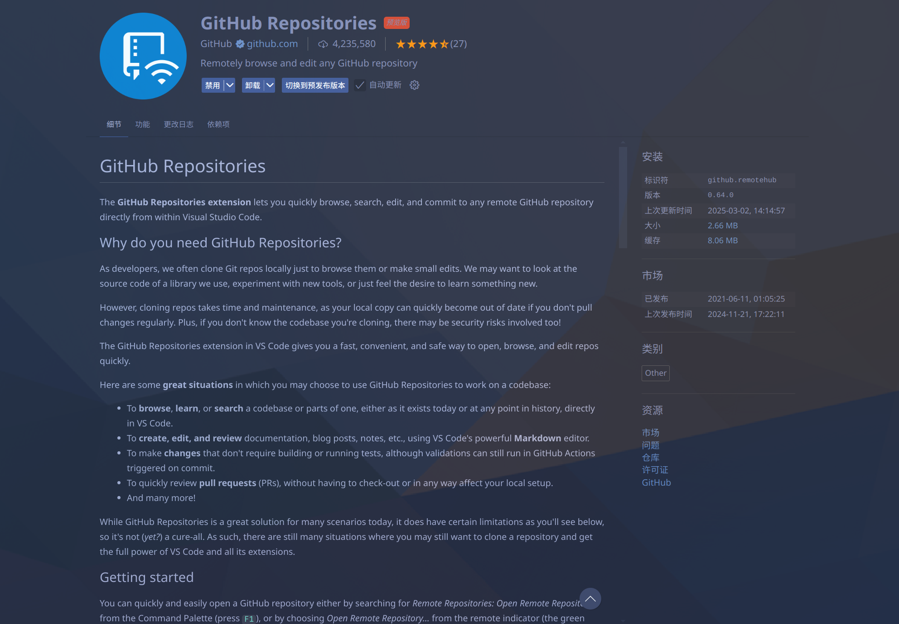

title: 远程编辑hoa.moe

date: 2025-03-03

description: 更加简单的远程操作

authors:
  - name: 潜伏
  
  - [仓库原址](https://github.com/capoo-fan/hoa-moe)

  

  - [作者主页](https://github.com/capoo-fan)
  
excludeSearch: false
---

#  前言
对于github的其他仓库,本身体积不大,可以直接clone到本地进行编辑并且推送上去,但是hoa.moe的仓库体积比较大,如果直接clone到本地,不仅需要花费大量的时间,而且还需要大量的磁盘空间,所以我们需要一种更加简单的方法来编辑hoa.moe的仓库

前面已经介绍了一种codespaces的方法,这里有一种依赖一个插件,直接在vsc上编辑的方法,此方法打开hoa.moe的速度大概在三四秒左右(魔法状态下),然后可以直接编辑,编辑完成后直接push到远程仓库,不需要任何其他操作.

# 操作流程

1. 将仓库fork到自己的github账号下

2. 下载GitHub Repositories插件

3. 打开GitHub Repositories插件,并登录自己的帐号,打开对应的仓库
   
  

虽然markdown preview enhanced插件在远程仓库中无法使用,但是此时只需要CTRL+SHIFT+V打开vscode内置的markdown预览即可,所以不需要担心预览的问题

4. 编辑完成后,就可以在vsc上进行push,然后就可以回到github帐号下进行pr了
   

# 总结

这个方法是笔者在读[vscode官方文档](https://code.visualstudio.com/docs)时发现出来的方法,很简便且易于操作,在这里分享给大家.同时也推荐大家多读官方文档或者github下面的REAMED.md,往往会有意想不到的收获!