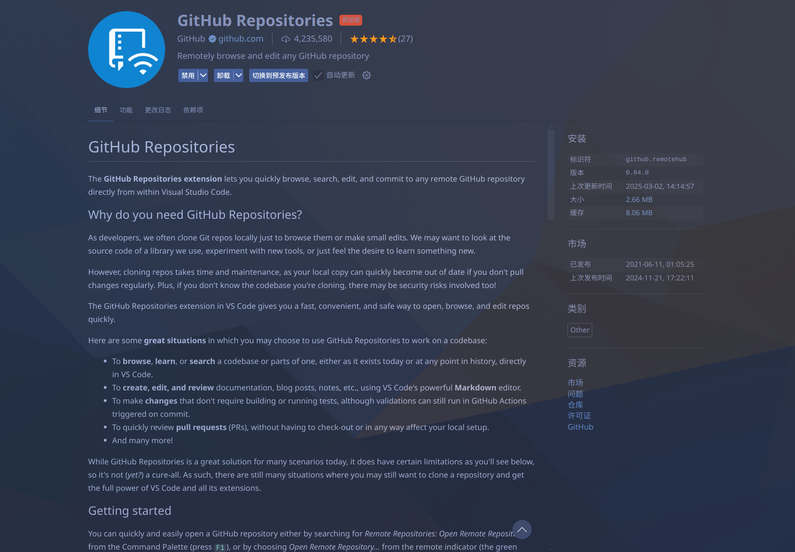
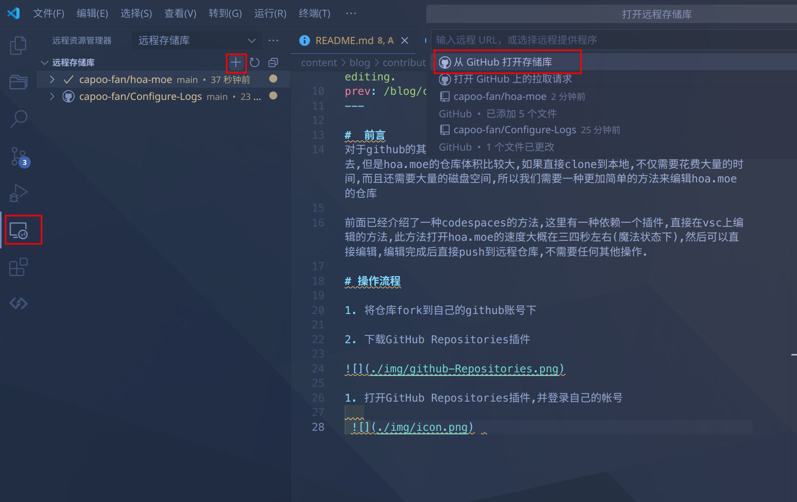

# 前言

对于 HOA 的其它课程仓库，本身体积并不大，可以直接 clone 到本地进行编辑修改后再推送上去，但是网页仓库 `hoa-moe` 体积比较大，如果直接 clone 到本地，不仅需要花费大量的时间，而且还需要大量的磁盘空间。有没有更加简单的方法来对 hoa-moe 仓库进行编辑修改？

前面已经介绍了一种使用 codespaces 的方法。除此之外，笔者还发现一种依赖一个插件，直接在 VSCode 上编辑的方法。使用此方法打开 hoa-moe 仓库的速度大概在三四秒左右(魔法状态下)，可以直接对仓库内容进行编辑，编辑完成后直接将修改 push 到远程仓库，不需要任何其他操作，非常方便。

# 操作流程

1. 将仓库 fork 到自己的 GitHub 账号下

2. 下载并安装 [GitHub Repositories](https://marketplace.visualstudio.com/items?itemName=GitHub.remotehub) 插件

3. 打开 [GitHub Repositories](https://marketplace.visualstudio.com/items?itemName=GitHub.remotehub) 插件，并登录自己的 GitHub 帐号，打开对应仓库
   
  

虽然 Markdown-Preview-Enhanced 插件在远程仓库中无法使用，但是此时只需要 `Ctrl+Shift+V` 打开 VSCode 内置的 Markdown 预览即可，所以不需要担心预览的问题

4. 编辑完成后，就可以直接在 VSCode 上进行 push，最后回到 GitHub 帐号下提交 PR 了
   

# 总结

这个方法是笔者在读 [VSCode官方文档](https://code.visualstudio.com/docs) 时发现的方法，很简便且易于操作，在这里分享给大家。同时也推荐大家多读官方文档或者 GitHub 原作者的 README，往往会有意想不到的收获！
