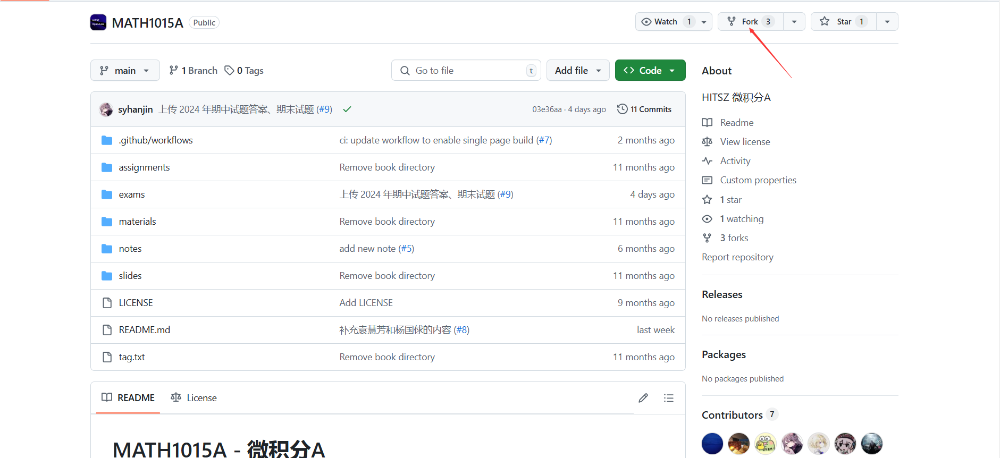
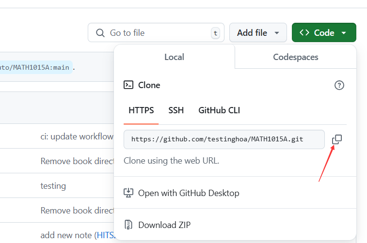

我们介绍的正规方法需要一些 Git 基础，这是 GitHub 界面功能不足导致的。

如果你没有 Git 相关知识，可以查看 HITSZ 开源技术协会同学编写的 [Git 教程](https://wiki.osa.moe/guide-for-beginner/git-tutorial/)。

## Git 本地编辑

### git clone

首先将仓库 Fork 到自己名下，

然后进入自己的仓库，找到仓库链接、复制下来，

在命令行运行
`git clone <你刚刚复制的仓库链接>`
这样，**仓库就已经成为你的`本地文件`**；在本地，你就可以随心所欲地进行各种修改，包括文档修改和文件上传。
> 还记得`本地`的概念吗？`本地文件`指的是你存在自己电脑上、想要提交到我们的仓库里的文件。

### commit & push

确认所有改进都完成后，我们就可以把`本地文件`推送到`远程仓库`了；这时候，`远程仓库`还是你自己的，而非 HOA 的。（从自己的`远程仓库`，通过*Pull Request*，才能把内容推送到 HOA 的`远程仓库`）

在命令行中，逐行执行以下命令：
```bash
git add .                           # 将当前目录下所有修改部分提交至暂存区
git commit -m "commit message"      # 提交 commit message，需要遵守公约
git push                            # 将本地修改同步到远端仓库
```


如果在 push 时遇到以"fatal: unable to access"开头的错误，例如：

```bash
fatal: unable to access 'https://github.com/<username>/AUTO3005.git/': OpenSSL SSL_connect: SSL_ERROR_SYSCALL in connection to github.com:443
```

可能是因为你的网络环境无法访问 Github，可以尝试使用 VPN 或者参考 [《新人指南：不使用第三方工具访问 GitHub》](https://hoa.moe/blog/access-github/#3-通过修改-hosts-文件访问-github) 中修改 Host 文件的方法。



### 发起 Pull Request

参考 [单文档的情况](/blog/contribution-guide/edit-single-file-and-upload-file/#发起-pull-request-1) 即可。
