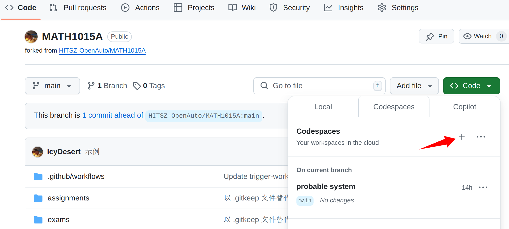
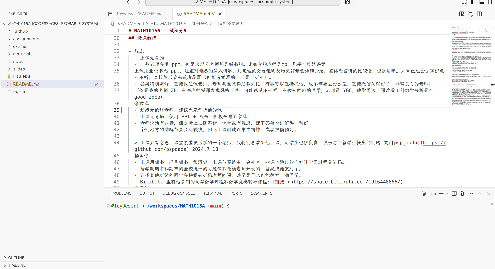
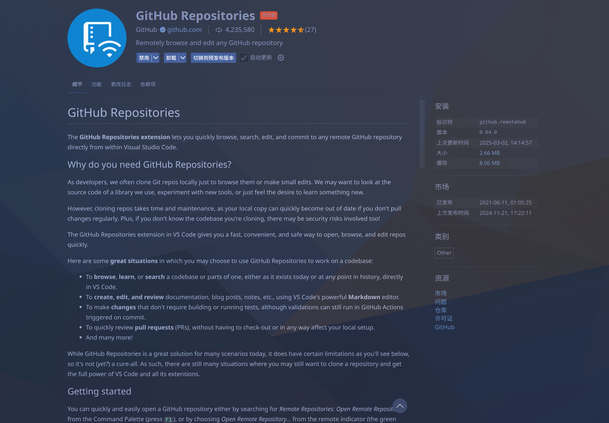
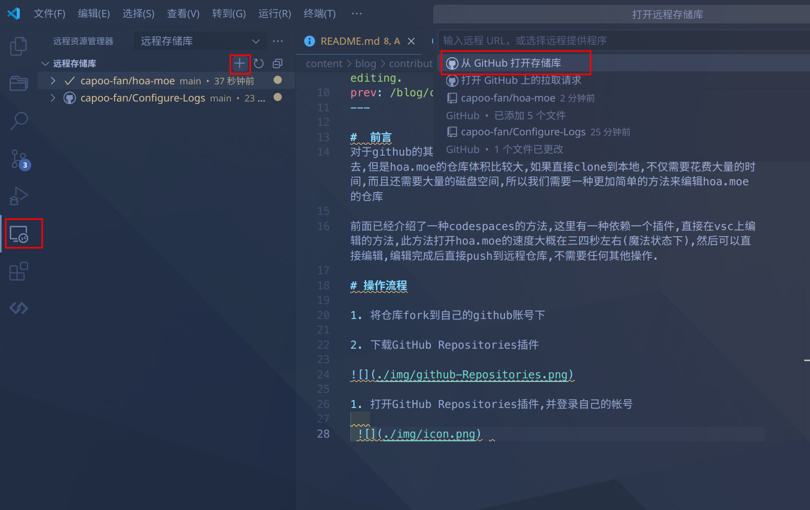

> [!IMPORTANT]  
> 本文是系列教程中的一篇，该系列教程始于 [0. 预备知识](/blog/contribution-guide/prerequisites)。若有疑惑，请先阅读该文。

下面介绍的两种方法需要一些 Git 基础以便理解，这是 GitHub 界面功能不足导致的。如果你没有 Git 相关知识，可以查看 HITSZ 开源技术协会同学编写的 [Git 教程](https://wiki.osa.moe/guide-for-beginner/git-tutorial/)。

## Git 本地编辑

### git clone

首先将仓库 Fork 到自己名下，

然后进入自己的仓库，找到仓库链接、复制下来，

打开一个文件夹，在命令行运行
`git clone <你刚刚复制的仓库链接>`
这样，**仓库就已经成为你的`本地文件`**；在本地，你就可以随心所欲地进行各种修改，包括文档修改和文件上传。

> 还记得`本地`的概念吗？`本地文件`指的是你存在自己电脑上、想要提交到我们的仓库里的文件。

### commit & push

确认所有修改都完成后，我们就可以把`本地文件`推送到`远程仓库`了；这时候，`远程仓库`还是你自己的，而非 HOA 的。（从自己的`远程仓库`通过 *Pull Request* 才能把内容推送到 HOA 的`远程仓库`）

在命令行中，逐行执行以下命令：
```bash
git add .                           # 将当前目录下所有修改部分提交至暂存区
git commit -m "commit message"      # 提交更改， message 需要遵守公约
git push                            # 将本地修改同步到远端仓库
```


如果在 push 时遇到以"fatal: unable to access"开头的错误，例如：

```bash
fatal: unable to access 'https://github.com/<username>/AUTO3005.git/': OpenSSL SSL_connect: SSL_ERROR_SYSCALL in connection to github.com:443
```

可能是因为你的网络环境无法访问 Github，可以尝试使用 VPN 或者参考 [《新人指南：不使用第三方工具访问 GitHub》](https://hoa.moe/blog/access-github/#3-通过修改-hosts-文件访问-github) 中修改 Host 文件的方法。



### 发起 Pull Request

参考 [单文档的情况](/blog/contribution-guide/edit-single-file-and-upload-file/#发起-pull-request-1) 即可。

## （选修）Codespaces

本方法对体积较大仓库尤为适用。

### Fork & Create
第一步仍然是 Fork 仓库到自己名下，如前文所述。

然后在**你的仓库**里如图新建 Codespaces，等待页面跳转、加载。可能要等一段时间。


*<center>这一步是 Codespaces 应对超大文件的方法。等待的时间里，GitHub 将创建云端虚拟机并把文件通过网络发送上去，如此，文件便成为云端（服务器）的`本地文件`，从而规避了`本地磁盘`的 Git LFS 问题。你可以理解为文件放在网盘上。</center>*

### 开始修改

跳转完成后你将看到如下界面：


若你使用过 Visual Studio Code，那么你可以无缝融入 Codespaces 工作流中——书写你独创的内容吧！

若你未使用过，别担心，我们会详细讲解操作。

- 左侧边栏是文件管理器，可以浏览文件或文件夹（后者带 `>`）；点击文件可以浏览内容，拖拽`本地文件`到对应文件夹实现指定路径上传。
- 右侧上部大块的白色区域是浏览、编辑区。
- 右侧下部小块的灰色区域是命令行，接下来我们会在这里执行 Git 指令。

在编辑区编辑文件；在文件管理器上传`本地文件`。

### commit & push
确认所有想要修改的地方都已完成后，单击命令行区域，逐行执行以下命令：
```bash
git add .                           # 将当前目录下所有修改部分提交至暂存区
git commit -m "commit message"      # 提交更改， message 需要遵守公约
git push                            # 将本地修改同步到远端仓库
```

### 发起 Pull Request

参考 [单文档的情况](/blog/contribution-guide/edit-single-file-and-upload-file/#发起-pull-request-1) 即可。

## （选修）在本地直接编辑远程仓库

本方法对体积较大仓库尤为适用。

为解决 `git clone` 因仓库体积过大而失败的问题，前面已经介绍了一种使用 Codespaces 的方法。除此之外，[潜伏](https://github.com/capoo-fan) 还发现一种依赖一个插件，直接在 **VS Code** 上编辑的方法。使用此方法打开 `hoa-moe` 仓库仅需几秒（魔法状态下）；无需 `本地文件` 即可编辑仓库，并可直接将修改 push 到远程仓库，非常方便。

### Fork

将仓库 fork 到自己的 GitHub 账号下，如前文所述。

### 插件安装及登陆

下载并安装 [GitHub Repositories](https://marketplace.visualstudio.com/items?itemName=GitHub.remotehub) 插件。当然，你也可以在 VS Code 的插件市场搜索。



打开 [GitHub Repositories](https://marketplace.visualstudio.com/items?itemName=GitHub.remotehub) 插件，并登录自己的 GitHub 帐号，打开对应仓库



### 修改文件

虽然 [Markdown-Preview-Enhanced](https://marketplace.visualstudio.com/items?itemName=shd101wyy.markdown-preview-enhanced) 插件在远程仓库中无法使用，但是此时只需要 `Ctrl+Shift+V` 打开 VS Code 内置的 Markdown 预览即可，所以不需要担心没法预览的问题。不过要再次提醒，其 Markdown 预览渲染和 hoa.moe 使用的 Hugo 渲染效果不同，仅供参考。

### push & PR

编辑完成后，就可以直接在 VS Code 上将修改 push 到远端仓库，最后回到 GitHub 远端仓库的网页下提交 PR 了。

这个方法是笔者在读 [VS Code 官方文档](https://code.visualstudio.com/docs) 时发现的方法，很简便且易于操作，在这里分享给大家。同时也推荐大家多读官方文档或者 GitHub 原作者的 README，往往会有意想不到的收获！
