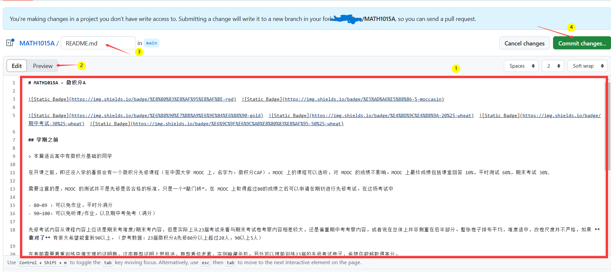
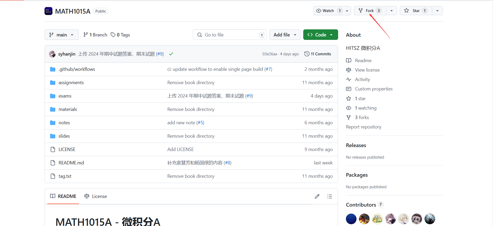
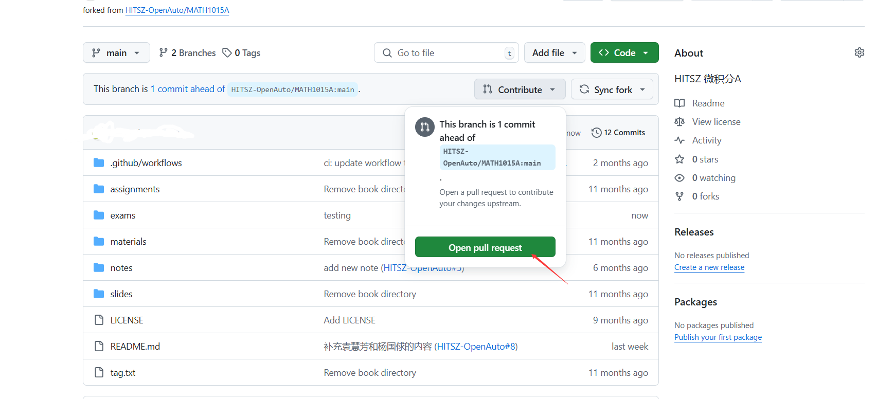

## 单文档修改-课程文档为例

课程文档修改应该是单文档修改的绝大部分情况了。从整体上看，可以分为两步：

### 在分支仓库修改文档
我们的课程文档界面实际上已经做好了入口，

由于只有 HOA 团队成员具有直接写入权限，因此贡献者一般需要先创建 **分支仓库，即Fork**。点击按钮，创建仓库在自己账号下的分支/fork，

就可以在 GitHub 的网页编辑器修改内容，如下图所示：

①：编辑器，使用 Markdown 语言进行写作。
②：预览 Markdown 渲染效果。注意，**HOA 使用的渲染器和此渲染器不同，预览效果仅供参考。**
③：修改此文件路径。用..表示跳到上一级文件夹。一般不需要修改。
④：提交你的修改。

#### 公约
注意，④需要填写 commit message，也就是用简短的话语描述你的修改。需要遵守以下公约：

1. 确保 commit message 和 PR 的 title 清晰而明确。除非是 hoa.moe 中代码相关的修改，否则都应该使用全中文以提升可读性和观感。

2. 写清楚自己修改的内容。例如：
> 添加 XXX 老师的上课情况
> 补充 XX 课程的学习建议

### 发起 Pull Request
> Pull Request 是指把 *你的仓库里新的内容* 合并进 *我们已过时的仓库内容* 的过程。

点击按钮，GitHub 会要求你填写 PR 的描述。我们已经做好了这份描述的自解释工作，因此只需要按照指引填写即可。

## 单文件夹上传文件
> 这个板块本来叫 单文件上传，但是 GitHub 提供的功能实际上部分支持 多文件上传 ——但这些文件的*目标*文件夹必须是 **同一个**，所以叫「单文件夹上传」

使用场景如：
> 上传某年某课程试卷和/或其答案，同属 exams 文件夹

### 手动 Fork 仓库
由于我们的仓库设置了文件上传保护，需要手动创建自己的仓库分支。

### 在自己的仓库上传文件
在自己的仓库总页面点击你想上传的文件夹，然后点如图按钮；在上传界面拖拽文件即可。这一步支持多文件上传。

注意，填写 commit message 仍然需要遵守 [公约](#公约)

### 发起 Pull Request
再次回到自己的仓库，主界面会发现显眼的标注

然后就是和上文一样的流程。