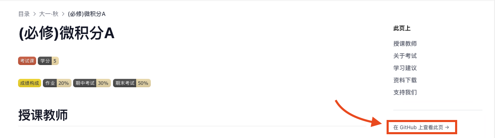
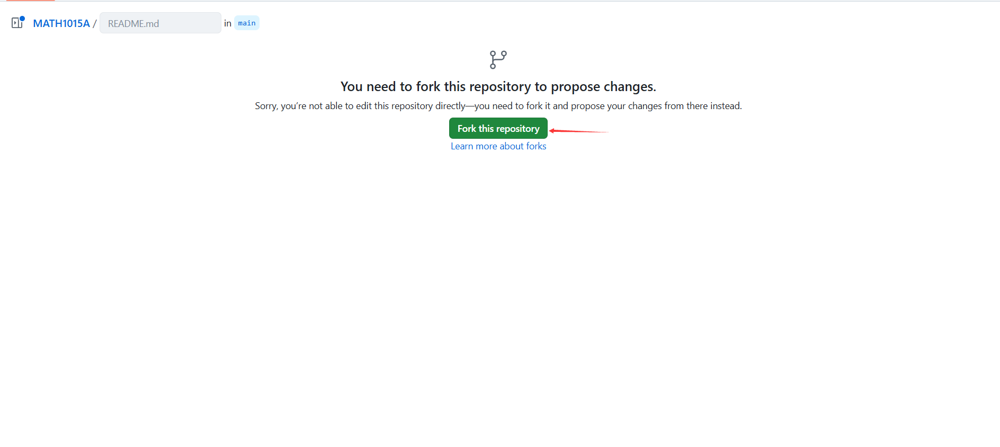
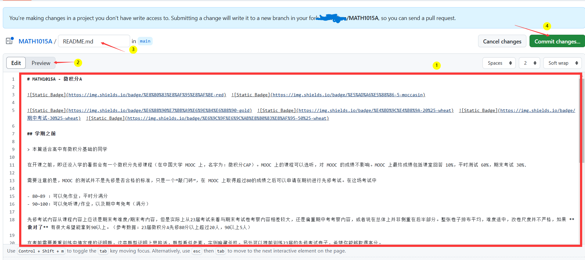
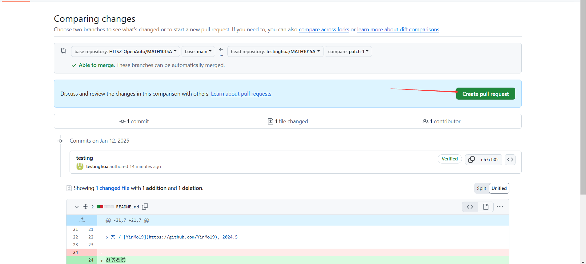
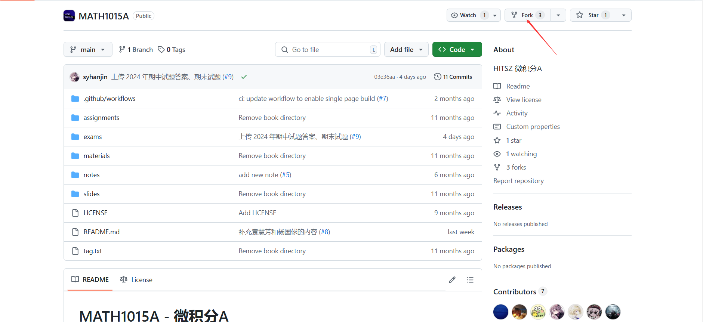
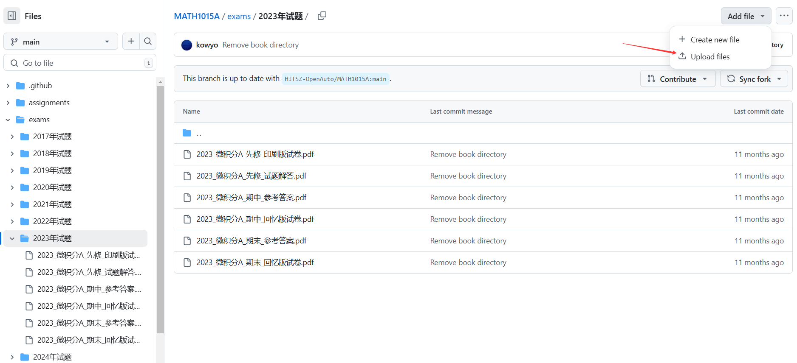
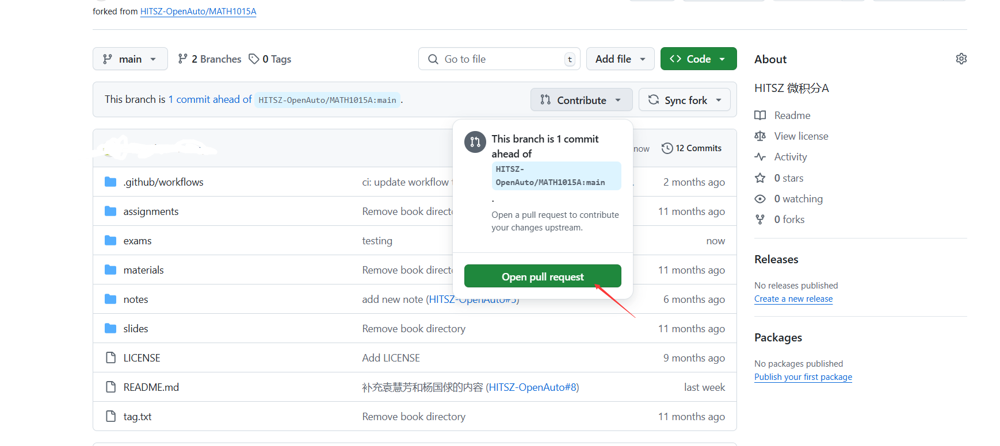

## 单文档修改：以课程文档为例

对课程文档进行修改应该是`单文档修改`的主要情况。HITSZ OpenAuto 的课程文档大致可分为以下几部分，如果你发现其中任一项有缺失/与实际情况不符，或是你有自己的理解与体会，都可以增补。

- 课程名
- 课程性质：必修/限选/选修；考试课/考查课；学分/学时；成绩构成
- 教材与参考书
- 授课教师及授课风格
- 授课内容/课程建议/备考策略

从整体上看，修改文档可以分为两步：

### 在分支仓库修改文档

我们的课程文档界面实际上已经做好了入口，

由于只有 HOA 团队成员具有直接写入权限，因此贡献者一般需要先创建**分支仓库（Fork）**。点击按钮，创建仓库在自己账号下的分支（fork），

就可以在 GitHub 的网页编辑器修改内容，如下图所示：

图示：
1. 编辑器，使用 Markdown 语言进行写作。

2. 预览 Markdown 渲染效果。注意，**HOA 使用的渲染器和此渲染器不同，预览效果仅供参考。**

3. 修改此文件路径。用 `..` 表示跳到上一级文件夹。一般不需要修改。

4. 提交你的修改。关于 commit message 的填写，详见下文公约。

### 发起 Pull Request

> Pull Request 是指把*你的仓库里新的内容*合并进*我们已过时的仓库内容*的过程。

点击按钮，GitHub 会要求你填写 PR 的描述。我们给这份描述添加了一些指引，因此只需要按照指引填写即可。



如果有疑问，可以先看看 [单文件夹上传文件](#单文件夹上传文件) 的教程，因为这两者的流程是一致的



## 单文件夹上传文件

GitHub 提供的功能实际上支持多文件上传，但这些文件必须上传到**同一个目标文件夹**，因此称为「单文件夹上传」。

使用场景如：上传某课程试卷和/或其答案，同属 exams 文件夹

### 手动 Fork 仓库

由于我们的仓库设置了文件上传保护，需要手动创建自己的仓库分支。


### 在自己的仓库上传文件

在自己的仓库总页面，点击你想上传的文件夹，然后点如图按钮；在上传界面拖拽文件即可。这一步支持多文件上传。



注意，填写 commit message 仍然需要遵守 [公约](#公约)



### 发起 Pull Request

再次回到自己的仓库，主界面会发现显眼的标注

然后就是和上文一样的流程。

## 公约

对文档的修改需要遵守以下公约：

1. 不要随意删除/修改他人的评价、建议

2. 在提出某项意见/评价时请按格式署名（不一定要真实姓名）、标注时间，放在你所修改部分的**最末尾**。例如：
   
  ```markdown
  > 文 / [IcyDesert](https://github.com/IcyDesert), 2025.1
  ```
3. commit message 和 PR 的标题，不要只写「增加/修改/删除一些内容」，而要明确写清：「增加 **xx 教师的信息及评价**」、「更新**课程大纲**」、「增加**课程建议**」、「修改**学分学时安排**」等

4. 中文排版应按照 [中文文案排版指北](https://github.com/sparanoid/chinese-copywriting-guidelines/blob/master/README.zh-Hans.md) 的规范进行

5. 我们的初心是分享学习经验，坚决反对抄袭/盗版，以下是**不宜上传**的文件：

   - 盗版电子书，盗版软件以及一切和盗版有关的东西
   - 未经老师同意上传的教学课件
   - 不推荐上传与成绩考核相关的作业答案与实验代码，但鼓励上传作业中的难题思路和大实验的代码思路。
