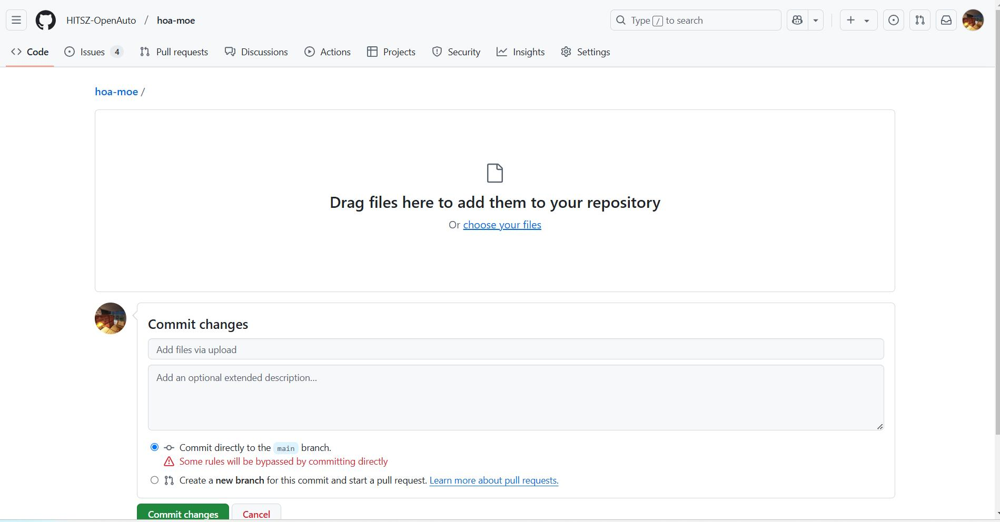
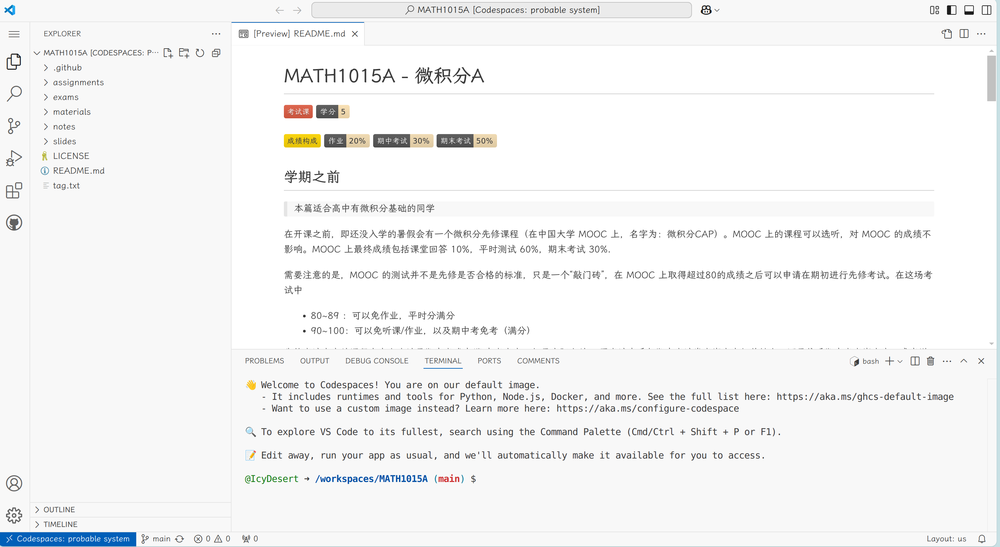

带 \* 号表示选修。在后续文章中，我们将默认各位参与者已完成必修知识的学习。

## \*Git

选修并不代表 Git 不重要——恰恰相反，有 Git 基础才能更好理解 GitHub 的工作原理。

但限于篇幅，本系列文章重点介绍 Git 的**实际操作方法**，不深入探讨命令的含义；如有学习需要，可以查阅 HITSZ 开源技术协会同学编写的 [Git 教程](https://wiki.osa.moe/guide-for-beginner/git-tutorial/)，也可移步互联网。

## 稳定连接到 GitHub

> 如果你已有合法访问国际互联网途径，或者能确保 GitHub 的稳定访问，可跳过。

参见本站博客 [《新人指南：不使用第三方工具访问 GitHub》](https://hoa.moe/blog/access-github/)，无论何种方法，达到标题目的即可。

## Markdown

Markdown 是一种**轻量级**标记语言，通过简单易读的纯文本格式即可组织起文章结构；其文件扩展名为 `.md`。我们的内容页面几乎都是 Markdown 写成的。

有多轻量级呢？不消半个小时，你也能学会！你可以在本站文章
[在 Typora 中快速上手 Markdown](https://hoa.moe/blog/markdown-and-latex/getting-started-with-markdown-in-typora/) 中找到详尽教程（不必安装 Typora），也可以使用 [Markdown 速查表](https://www.markdownguide.org/cheat-sheet/)（英文）。

编写 Markdown 工作流：先确定此处所需要的文章结构（如标题/列表），再添加对应的标记。

## `本地`和`远程`

一般来说，**本地（local）**文件指你的电脑磁盘上的文件，而 **远程（remote）**文件指存储在服务器上的数据文件。在 HOA 的语境下，`本地文件`指你保存在自己电脑上、想要提交到我们的`远程仓库`里的文件，而 `远程仓库`是我们在 GitHub 上的 [各个仓库](https://github.com/HITSZ-OpenAuto)。

提交文件，是通过 GitHub 提供的方法将`本地文件`提交到`远程仓库`的过程；后续指南的介绍重点也将是这些方法。当然，如果你只是想修改课程描述的文字，暂时用不到这两个概念。

## \*GitHub Codespaces

### GitHub 网页端局限

如上文所述，

> 所谓贡献文件，就是通过 <ins>GitHub 提供的方法</ins>将`本地文件`提交到`远程仓库`的过程

可惜的是，网页端存在两个局限：

1. **路径管理缺失**  
   支持批量拖拽上传文件，但无法直接调整文件路径。所有文件默认堆积在根目录，需花费额外的步骤（即 Git 中 **commit**）手动归类到文件夹。
   
   _
批量拖拽界面；我们会单独讲解多文件夹的上传，无需着急。
_

2. **多文档修改割裂**  
   每次仅支持编辑单个文档。例如，某更新需改动 5 个文件，逻辑上应一步完成，但采用网页端会被强制拆分为多个独立步骤（commit），导致仓库的提交历史冗余零散。

### Git 的解决方法及缺陷

如果你曾使用过 Git，上述问题的解决方法显而易见：

1. 将`远程仓库` clone/pull 到`本地文件`
2. 使用 Git，在一步（commit）中修改完所有`本地文件`
3. 将`本地文件` push 到`远程仓库`

看似完美，但仍有不足：若一个仓库中有超大文件，将触发 Git LFS(**L**arge **F**ile **S**troage) 问题，导致 `git clone` 失败。包括 HOA 的部分仓库在内，GitHub 上的许多仓库都存在这个问题。（参见 [此 issue](https://github.com/HITSZ-OpenAuto/MATH1002/issues/13)）

为此，GitHub 官方推出了一款在线编辑器——

### GitHub Codespaces（下文简称 Codespaces）

Codespaces 同时具备上述两个方法的优点：

- 直接在浏览器网页端操作
  - 避开 Git LFS 问题
- 支持复杂文件操作

其界面如下图所示：

没错，它的界面和 ~~宇宙级编辑器~~ Visual Studio Code 几乎完全一致！如果你曾使用过 Visual Studio Code，那么恭喜，你已经学会了大部分 Codespaces 的用法。

如果你未使用过，界面左侧灰色区是文件管理器，可增、删、改文件，右侧白色区是文件编辑、Markdown 预览区。我们会在用到 Codespaces 时针对性介绍功能。

---

## 题外话

我们的入门文档命名为「参与指南」，而不是「贡献指南」。这是因为，「参与」的内涵更广泛，每一位读者都能以任何形式「参与」社区的建设，无论是实质性的「贡献」文档代码，还是反馈问题、提出建议；我们希望 HOA 的门槛低一些，无论技能水平如何，你都能参与进来，这是一件稀松平常的事情。

「参与」理念亦见于前维护者 [Kowyo](https://github.com/Kowyo) 的 [HOA 一周年纪念文章](https://hoa.moe/news/1st-anniversary/kowyo/#%e5%88%9b%e4%b8%9a%e5%85%ac%e5%8f%b8%e7%9a%84%e6%93%8d%e5%bf%83)。
