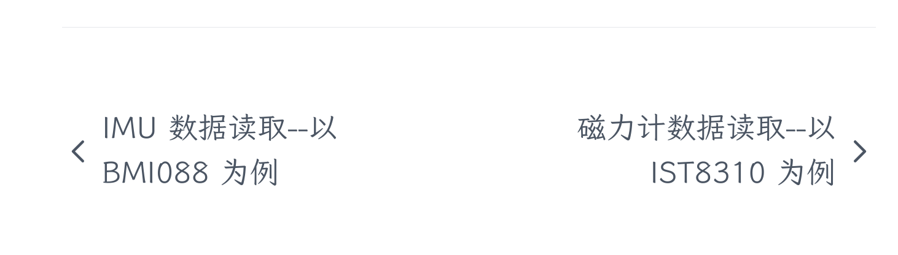

> [!IMPORTANT]  
> 本文是系列教程中的一篇，该系列教程始于 [0. 预备知识](/blog/contribution-guide/prerequisites)。若有疑惑，请先阅读该文。

> 我没看到博客仓库/新建博客入口啊？

确实，博客并没有属于自己的仓库。课程信息页面右侧 `在 GitHub 上编辑` 的各课程仓库入口是我们做的特殊处理。

博客实际上在我们的主仓库 [hoa-moe](https://github.com/HITSZ-OpenAuto/hoa-moe) 里，它和课程仓库的主要差别是文件夹排列。比如你现在阅读的这篇文章，相对主仓库的路径就是 `./content/blog/contribution-guide/write-blogs/index.zh-cn.md`。

博客是「多文件夹上传文件」的一类特殊情况。因此，你可以选用 Git 本地编辑或 Codespaces 编写；因为仓库并不大，本地编辑或许更好一些。

## 文件树

博客的最小文件结构示例如下：

```bash
.
└── content
    └── blog
        └── <your-blog-name>
            └── index.zh-cn.md # 博客本体，承载内容
```

当然，一篇博客可以包含很多文章，也可以有额外的文件夹，比如这样：

```bash
.
├── content
│   ├── blog
│   │   ├── auto-survival-guide
│   │   │   ├── embedded
│   │   │   │   └── index.zh-cn.md
│   │   │   ├── imu
│   │   │   │   ├── bmi088
│   │   │   │   │   └── index.zh.md
│   │   │   │   ├── _index.zh-cn.md
│   │   │   │   ├── ist8310
│   │   │   │   │   ├── index.zh-cn.md
│   │   │   │   └── overview
│   │   │   │       └── index.zh-cn.md
│   │   │   ├── _index.zh-cn.md
│   │   │   ├── math
│   │   │   │   ├── index.zh-cn.md
│   │   │   │   └── 卡尔曼滤波公式推导.pdf
│   │   │   ├── overview
│   │   │   │   ├── index.zh-cn.md
│   │   │   │   └── robot.png
│   │   │   └── ros
│   │   │       └── index.zh.md
```

（已删去部分行以便观看）感觉有点眼花缭乱？别着急，我们自顶向下地看：

blog 下的文件夹名是 `auto-survival-guide`，这是博客~~名称~~ 标识符。

此文件夹包含五个文件夹 `embedded imu math overview ros` 和一个文件 `_index.zh-cn.md`。

- 文件夹就是你规划中要写的若干文章
- `_index.zh-cn.md` 是一个索引文件，展示一些元信息，并不包含正文内容；即便写上正文也不会展示出来。

`embedded math overview ros` 文件夹下各有一个 `index.zh-cn.md`，这就是正文啦！

`imu` 下还有若干文件夹以及一个 `_index.zh-cn.md` 索引文件，说明它又是一个专栏，包含若干文章。

可以结合此文件树的 [渲染结果](https://hoa.moe/blog/auto-survival-guide/) 理解。

## 文件内容

博客的正文并无要求，只要切题即可；但元信息部分需要按照下文示例来填写。

`index.zh-cn.md` 的文件示例如下

```markdown
---
title: <标题>
date: <日期>
description: <显示在索引页面的文章简介>
authors:
  <!--支持多作者-->
  - name: <作者名>
    link: <作者主页>
    image: <头像>
  - name: <作者名>
    link: <作者主页>
    image: <头像>
excludeSearch: false
<!-- 以下为多文章博客使用 -->
weight: 1 <!--在索引界面的排列顺序，1 表示排在最前面-->
next: false <!--上一篇，false 表示没有-->
prev: /blog/contribution-guide/edit-single-file-and-upload-file <!--下一篇，false 表示没有-->
---

正 片 开 始
```


_<center>左边是 next，右边是 prev ~~什么反人类参数名~~</center>_

`_index.zh-cn.md` 的文件示例如下

```markdown
---
title: <标题>
date: <日期>
description: <显示在索引页面的文章简介>
---

这里的正文不会被显示，写了也没用
```

参见 [Hextra 英文文档](https://imfing.github.io/hextra/docs/guide/organize-files/)。
