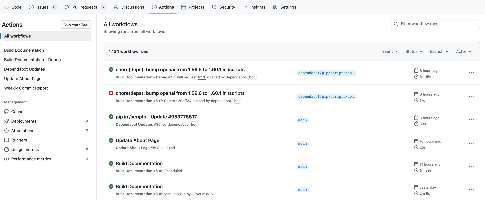
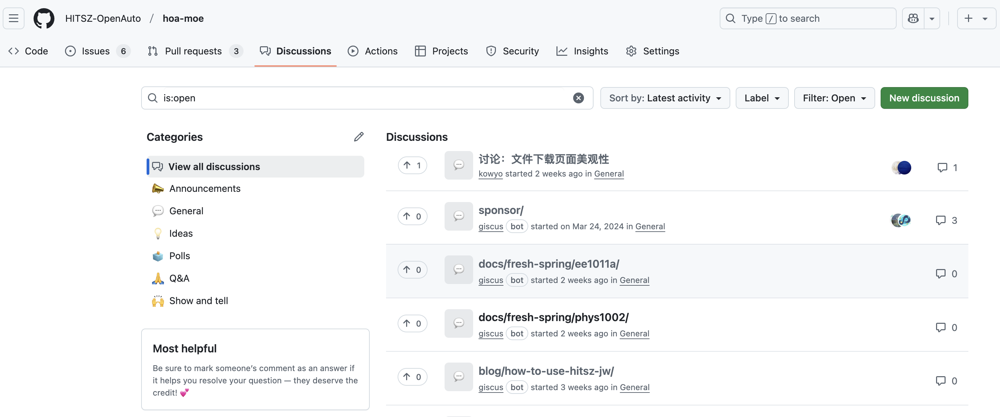
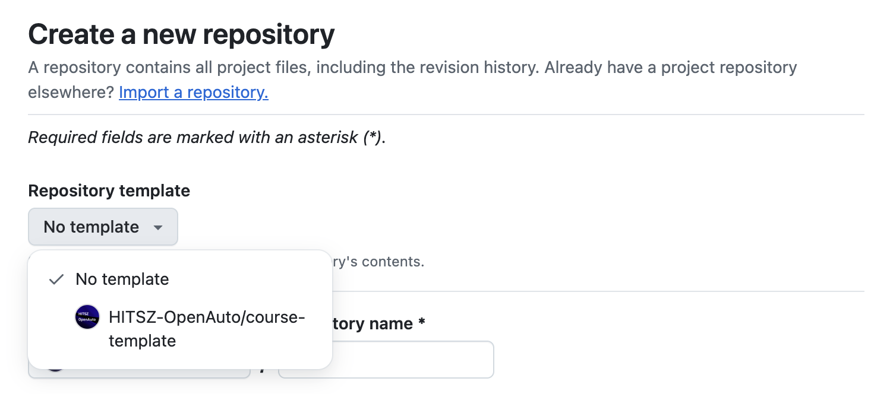
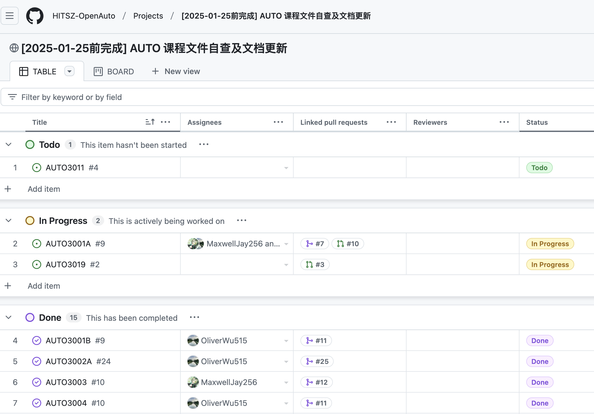

本篇是开发者指南的最后一篇，我们将会从宏观纵览整个 HOA 工作流。

## 😎从一个 PR 开始

1. 当用户往课程仓库提交 PR 被合并后，课程仓库内的 workflow 会被触发：

   ```sh
   curl -X POST \
      -H "Accept: application/vnd.github.v3+json" \
      -H "Authorization: token $GITHUB_TOKEN" \
      https://api.github.com/repos/HITSZ-OpenAuto/hoa-moe/actions/workflows/course.yaml/dispatches \
      -d '{"ref":"main","inputs": {"repo_name": "'"${REPO_NAME}"'"}}'
   ```

   而且，由于主仓库的 workflow 里存在如下设置：

   ```yaml
   workflow_dispatch:
     inputs:
       repo_name:
         description: "Name of the repository"
         required: true
         default: "NOT_ASSIGNED"
   ```

   故主仓库会运行一遍 workflow，从而更新主仓库内的课程文档。

2. 当主仓库有新 commit 提交后，`course.yaml` 里的工作流会被触发，检查网页是否能正常构建。

   ```yaml
   on:
     push:
       paths:
         - "scripts/**"
         - ".github/workflows/course.yaml"
   ```

   并且，由于仓库已经配置好了 netlify bot，bot 会自动创建一个针对 PR 的网页 preview，由此便可以检查前端样式是否正确设置。

3. PR 被合并后，可以到主仓库的 Action 界面看 workflow 日志，有问题方便定位。

   

## 📎其它附属组件

1. HOA 集成了 `giscus` 评论系统，我们可以在仓库的 `Discussions` 界面查看页面评论

   

2. HOA 有一个名为 `course-template` 的私有模板仓库，创建新课程仓库时请选择从该模板仓库生成

   

3. 你可以在组织的 `Projects` 界面内新建任务，方便管理当前某项任务的进度

   

## 🎉完结撒花

看完本系列教程，相信你对 HOA 的功能开发已有一个完整认识。通过逐步学习和实践，你已经掌握了从基础架构到具体功能实现的全过程。

当然，技术学习是一个持续的过程，本文档介绍的内容只是一个起点。希望你能够在项目的日常维护中运用这些知识，并在实践中不断探索和创新，发现更多优秀的开发模式和解决方案。让我们携手共建更好的 HOA！

Talk is cheap, show me the code!🚀
