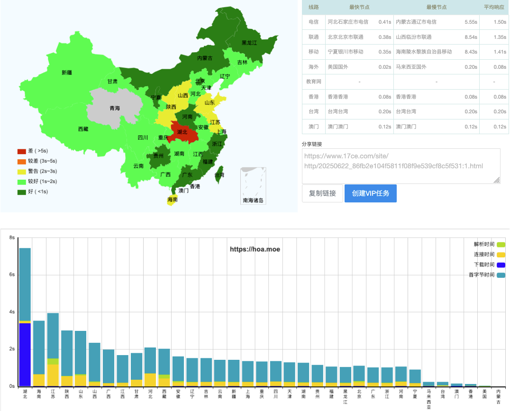

大概从半年前开始，HOA 的维护者社群（HOA Core）就听到了社区关于 HOA 访问速度的反馈，以下是对于我们过去半年相关工作的记录。

## 4 月：GitHub 限制 HTTP 请求头语言

4 月 29 日，国内一些 GitHub 用户表示自己在 GitHub 上托管的代理文件受到并发限制，当日，HOA 的 GitHub 代理下载文件服务也受到了影响。经过团队成员的排查，原因是用户的浏览器请求头中含有 lang=zh-cn（也就是说，浏览器请求的页面内容是中文）。Core 成员 [@Hye](https://github.com/Co-ding-Man) 同学通过修改我们在 Cloudflare 上部署的 Worker，使其将请求头强制改为 en-US，临时解决了此次问题。

```javascript
const reqHdrNew = new Headers(reqHdrRaw);
reqHdrNew.set("Accept-Language", "en"); // Set Accept-Language header to 'en'
```

## 5 月：校园网下载加速服务上线

早在 2024 年，开源技术协会的 [@寒金](https://github.com/syhanjin) 同学就开始着手搭建 OpenCS 和 OpenAuto 的镜像同步项目，将 OpenAuto 的资料同步至开源技术协会在校内的服务器。

在 4 月的事件发生之后，我们决定上线一项新功能，允许连接校园网的同学直接下载内网服务器上的镜像文件，这样不仅摆脱了对 GitHub 托管依赖，增加数据安全，同时借助极高的内网传输速率，文件的下载速度也更上一层楼。该功能同样由 Core 成员 [@寒金](https://github.com/syhanjin) 同学实现。


> ~~注：文件预览功能由于使用 \<a> 超链接直接写入我们的文件树，还未实现校园网加速功能，欢迎有意向的开发者向我们提交 PR，帮助实现此功能。~~ 此功能已经由 [@chenx-dust](https://github.com/chenx-dust) 于 [PR #348](https://github.com/HITSZ-OpenAuto/hoa-moe/pull/348) 实现。

## 6 月：hoa.moe 接入 EdgeOne CDN 加速

EdgeOne（边缘安全加速平台 EO）是腾讯云推出的一款边缘安全加速平台，在 6 月初步上线，维护者 [@Kowyo](https://github.com/kowyo) 同学有幸收到了邀请码，在本文写作
之前的几个小时将 hoa.moe 通过 CNAME 接入了 EdgeOne 上去，尽管由于域名没有备案，无法使用国内的加速服务，但是得益于腾讯云，我们的访问速度还是得到了不错的提升。欢迎同学在最近对我们的服务进行测试和反馈。



## 关于下一步

为了更好兼容国内服务，提高访问速度，hoa.moe 预计会在暑假期间 7 月进行为期 7 天左右的备案，以更好使用 EdgeOne 的加速服务，同时，也方便我们在国内服务器部署更多的服务，例如：统计、状态和文件下载加速。届时，hoa.moe 预计会有短暂时间的不可访问，取决于 DNS 解析切换的时间。
