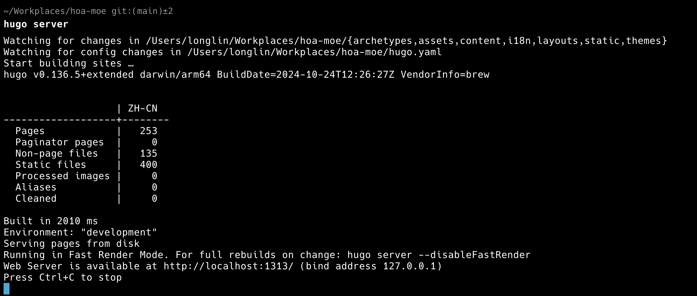

> [!WARNING]
> 如果你尚且不清楚什么是 HTML、CSS 和 JS，可以在 [MDN 官网](https://developer.mozilla.org/zh-CN/) 学习 / 询问 AI 后再来看此篇文章。

本文将从前端角度介绍 HOA 的基础架构，包括：

- 基础架构介绍
- 如何在本地调试前端界面

```sh
tree -L 1 .
# hoa-moe 文件树
.
├── archetypes
├── assets          # 包含自定义的 CSS 样式、JS 脚本
├── content         # 存放 md 文件，Hugo 能自动将其中的 markdown 文件转化成相应 HTML 网页
├── i18n            # 语言相关配置
├── layouts         # 包含自定义的 HTML 框架
├── public          # Hugo 最终构建出的产物（即网站本体），一般不需要做任何改动，也不会被同步到 GitHub 远端仓库中
├── scripts         # 存放 HOA 后端脚本文件
├── static          # 存放网站相关静态文件，如 Logo、缩略图等
├── themes          # Hugo 主题模块文件夹
└── hugo.yaml       # 网站基础配置文件
```

## 🏠基础架构介绍

前端前端，「三大件」总是少不了。先来回顾一下包含 CSS 和 JS 的最小化前端 HTML 是什么样的吧：

```HTML
<!DOCTYPE html>
<html lang="zh">
<head>
    <meta charset="UTF-8">
    <meta name="viewport" content="width=device-width, initial-scale=1.0">
    <title>最小化 HTML</title>
    <link rel="stylesheet" href="styles.css">
</head>
<body>
    <div class="container">
        <h1>H1 标题</h1>
        <p id="message">P 段落</p>
    </div>

    <script src="script.js"></script>
</body>
</html>
```

本项目的架构源于最基础的 HTML 结构，通过模块化扩展而成。虽然项目中仍然保留了传统 HTML 的核心元素 (如 `<head>`、`<body>` 标签) 以及 CSS 和 JavaScript 的引入机制，但我们采用了组件化的管理方式，将这些元素拆分为独立的模块，最终再组装成完整的页面。具体拆分方式例子如下：

- 头部标签 `<head>` 被抽取为 `layouts/partials/head.html` 组件，通过 `{{- partial "head.html" . -}}` 引入
- 样式表引用 `<link rel="stylesheet">` 被抽取为 `layouts/partials/head-css.html` 组件，通过 `{{- partialCached "head-css.html" . -}}` 引入
- 脚本引用 `<script>` 被抽取为 `layouts/partials/scripts.html` 组件，通过 `{{- partial "scripts.html" . -}}` 引入

我们可以从源码中发现，网页内只导入了 `css/compiled/main.css` 和 `css/custom.css` 两份 CSS 文件，如果你直接在 CSS 对应文件夹下新增一份 `.css` ，写入新 CSS 文件的样式是不会被渲染到网页上的。同理，你也可以看到有哪些 JS 脚本被引入了我们网页。

```html
{{- $scripts := slice $jsTheme $jsMenu $jsCodeCopy $jsTabs $jsLang $jsFileTree $jsSidebar $jsBackToTop | resources.Concat "js/main.js" -}}
<script defer src="{{ $scripts.RelPermalink }}" integrity="{{ $scripts.Data.Integrity }}"></script>
```

关于 CSS 相关文件和 `{{- -}}` 类语法我们会在后续章节中继续讨论。

## 📐Hugo 前端框架

> [!NOTE]
> 本部分内容聚焦于如何编写 Hugo 博客主题，而非实现一个类似 Hugo 的博客框架。

我们这里主要讨论 `layouts`, `contents` 与 `assets` 几个文件夹。

### 原模板样式与自定义样式

在项目根目录外，我们可以在 `themes` 里的主题文件夹内找到很多同名文件夹，例如 `layouts` 与 `themes/hextra/layouts`，`assets` 与 `themes/hextra/assets`，这就不得不提及 Hugo 框架的特性了。

Hugo 在渲染 Markdown 文件时遵循特定的文件查找优先级：首先在项目根目录下查找同名文件，若未找到，则使用主题内的相应文件。利用这一机制，我们可以通过在根目录下创建与主题目录内相同路径和名称的文件来覆盖原有内容。这种方法使得 `themes` 可以作为 submodule 保持，而在需要修改样式时，只需将目标样式文件复制到项目根目录，并在根目录下的新文件中进行定制化修改。

### 从 Markdown 到 HTML 网页

比对 `contents` 和 `layouts` 下的文件树目录，可以发现有很多相似之处，那么，Hugo 是怎么让 Markdown 套用我们编写的模板从而渲染成网页的呢？

```sh
├── _default
│   ├── _markup
│   │   ├── render-blockquote-alert.html
│   │   ├── render-blockquote-regular.html
│   │   ├── render-codeblock-mermaid.html
│   │   ├── render-codeblock.html
│   │   ├── render-heading.html
│   │   ├── render-image.html
│   │   └── render-link.html
│   ├── baseof.html
│   ├── list.html
│   ├── list.rss.xml
│   ├── single.html
│   └── wide.html
├── blog
│   ├── list.html
│   └── single.html
├── docs
│   ├── list.html
│   └── single.html
```

`blog` 和 `docs` 文件夹下的 `list.html` 与 `single.html` 分别对应我们「博客」和「文档」版块内的「列表页面模板」与「单页面模板」；`_default/list.html` 与 `_default/single.html` 则对应那些并没有在 `layouts` 下单独设立文件夹的页面，如 `content/faq` 及 `content/sponsor` 页面。此外，`_default/_markup` 这部分内容则是针对 Markdown 内的像 blockquote、codeblock 等具体内容的渲染模板。

总之，Markdown 总是需要能够在 `layouts` 下找到对应模板文件进行渲染，对应模板文件内也可以访问到 md 文件内的 head info 从而为自己所用。

如果你想更进一步了解，推荐访问 [Hugo 官方 template 文档](https://gohugo.io/templates/) 进行学习。

### Hugo 短代码的使用

Hugo 的短代码（Shortcodes）是一种强大的模板机制，允许我们在 Markdown 和 HTML 内容中嵌入动态渲染的代码片段。但同时，它有着非常严格的语法要求，多一个少一个空格都不行：

- Markdown 中使用 `` 的形式，调用 `layouts/shortcodes` 内的模板
- HTML 中使用 `{{- shortcode -}}` 的形式，引入 Hugo 相关语法

我们以一段 HTML 代码（`themes/hextra/layouts/partials/scripts.html`）为例子做简要语法解释：

```HTML
{{- $jsFileTree := resources.Get "js/filetree.js" -}}
{{- $jsSidebar := resources.Get "js/sidebar.js" -}}
{{- $jsBackToTop := resources.Get "js/back-to-top.js" -}}

{{- $scripts := slice $jsTheme $jsMenu $jsCodeCopy $jsTabs $jsLang $jsFileTree $jsSidebar $jsBackToTop | resources.Concat "js/main.js" -}}
{{- if hugo.IsProduction -}}
  {{- $scripts = $scripts | minify | fingerprint -}}
{{- end -}}
<script defer src="{{ $scripts.RelPermalink }}" integrity="{{ $scripts.Data.Integrity }}"></script>


{{/* Search */}}
{{- if (site.Params.search.enable | default true) -}}
  {{- $searchType := site.Params.search.type | default "flexsearch" -}}
  {{- if eq $searchType "flexsearch" -}}
    {{- $jsSearchScript := printf "%s.search.js" .Language.Lang -}}
    {{- $jsSearch := resources.Get "js/flexsearch.js" | resources.ExecuteAsTemplate $jsSearchScript . -}}
    {{- if hugo.IsProduction -}}
      {{- $jsSearch = $jsSearch | minify | fingerprint -}}
    {{- end -}}
    {{- $flexSearchJS := resources.Get "lib/flexsearch/flexsearch.bundle.min.js" | fingerprint -}}
    <script defer src="{{ $flexSearchJS.RelPermalink }}" integrity="{{ $flexSearchJS.Data.Integrity }}"></script>
    <script defer src="{{ $jsSearch.RelPermalink }}" integrity="{{ $jsSearch.Data.Integrity }}"></script>
  {{- else -}}
    {{- warnf `search type "%s" is not supported` $searchType -}}
  {{- end -}}
{{- end -}}
```

前三句比较容易看懂，为变量赋值嘛；再下一句提示了我们该如何使用变量——`$`。

```html
{{- $jsFileTree := resources.Get "js/filetree.js" -}}
{{- $jsSidebar := resources.Get "js/sidebar.js" -}}
{{- $jsBackToTop := resources.Get "js/back-to-top.js" -}}

{{- $scripts := slice $jsTheme $jsMenu $jsCodeCopy $jsTabs $jsLang $jsFileTree $jsSidebar $jsBackToTop | resources.Concat "js/main.js" -}}
```

再接着跟着 `if` 条件判断和 HTML 语句——如果 Hugo 工作在生产环境，则将所有 JS 脚本最小化哈希化，最后导入 HTML 中：

```html
{{- if hugo.IsProduction -}}
  {{- $scripts = $scripts | minify | fingerprint -}}
{{- end -}}
<script defer src="{{ $scripts.RelPermalink }}" integrity="{{ $scripts.Data.Integrity }}"></script>
```

再往后基本是以上语法的重复利用，不过需要注意的一点是变量 `site.Params.search.type` 来自 `hugo.yaml`:

```yaml
params:
  # Search
  # flexsearch is enabled by default
  search:
    enable: true
    type: flexsearch

    flexsearch:
      # index page by: content | summary | heading | title
      index: content
      # full | forward | reverse | strict
      # https://github.com/nextapps-de/flexsearch/#tokenizer-prefix-search
      tokenize: forward
```

其它一些变量后缀这里就不做具体讲解了，想要了解的可以自行 Google 查阅官方文档。

我自己之前也写过一篇关于 Hugo 短代码的博客，放在这里：[Hugo ShortCode | 丰富你的 Markdown](https://www.longlin.tech/shortcode/)

## 🐛如何在本地调试前端界面（Tailwind CSS v4）

克隆本仓库代码后，在本地仓库根目录下运行 `hugo server -D`，你便可以从命令行获得调试端口并在浏览器内打开：



> [!IMPORTANT]
> 主题已升级至 Tailwind CSS v4。v4 采用 CSS-first 架构与新的 PostCSS 插件，无需 `tailwind.config.js` 与 `hugo_stats.json` 扫描配置；类前缀通过 CSS 导入参数实现，构建由 PostCSS 完成。

### 主题如何启用 v4 与前缀

Hextra 使用 v4 的前缀语法，并将 Tailwind 作为 CSS 导入（可在 `themes/hextra/assets/css/styles.css` 中看到）：

```css
@import "tailwindcss" prefix(hx);
```

- 这意味着在模板中使用工具类时，需要写成 `hx:...` 的形式，而不是 v3 的 `hx-...`。例如：

```html
<div class="hx:flex hx:bg-red-500 hx:hover:bg-red-600"></div>
```

参考：Tailwind v4 支持用 `@import "tailwindcss";` 引入框架，并可通过 `prefix(tw)` 之类参数为所有工具类与变量加前缀。

### 在本地让新类名生效

页面最终仅引入 `assets/css/compiled/main.css`（主题编译产物）与 `assets/css/custom.css`（站点自定义）。当你在 `layouts/` 的模板里新增了 `hx:` 工具类，需要重新生成主题的编译 CSS 才能看到效果：

```sh
cd themes/hextra
npm run build:css
```

- 构建使用 `@tailwindcss/postcss` 插件（见 `themes/hextra/postcss.config.mjs`），v4 会自动扫描模板以生成所需样式。
- 想要“边改边看”，可以临时使用 PostCSS 的 watch：

```sh
cd themes/hextra
npx postcss --config postcss.config.mjs --env production assets/css/styles.css -o assets/css/compiled/main.css --watch
```

说明：主题自带的 `dev:theme` 仅用于主题仓库的示例站点开发。站点日常开发请按上面的方式重建 CSS，然后使用 `hugo server -D` 预览即可。

### 在哪里写样式

- 模板样式：在 `layouts/` 的 HTML/模板中直接使用 `hx:` 工具类（如 `hx:flex hx:gap-4`）。
- 站点级覆盖：在根目录 `assets/css/custom.css` 中写“标准 CSS”选择器覆盖（该文件不会经过 Tailwind 处理）。例如覆盖主题变量：

```css
/* v4 下主题变量已带有前缀（与 prefix(hx) 保持一致） */
:root {
  --hx-color-primary-500: hsl(212 100% 50%);
}
```

注意：不要在 `assets/css/custom.css` 里使用 `@apply` 或 `@config` 等需要 Tailwind 参与编译的指令，因为该文件并不会走 PostCSS/Tailwind 流程。如果你确实需要使用 `@apply` 等能力，请在 `themes/hextra/assets/css/` 下的源文件中修改并重新编译。

### 从 v3 到 v4 的常见迁移点（速查）

- 引入方式：`@tailwind base/components/utilities` → `@import "tailwindcss";`
- 类名前缀：`prefix: 'hx-'`（v3）→ `@import "tailwindcss" prefix(hx);`（v4），模板中写 `hx:...` 而非 `hx-...`
- CLI 变化：`npx tailwindcss` → `npx @tailwindcss/cli`
- PostCSS 插件：`tailwindcss` → `@tailwindcss/postcss`（已内置 import、前缀与嵌套处理）
- 个别工具类更名：如 `outline-none` → `outline-hidden`，阴影等尺度有调整（如 `shadow-sm` → `shadow-xs`）。

更多 v4 变更与示例，可查阅 Tailwind v4 升级指南与文档。

如果你想更改组件样式，或添加新组件，则可以在根目录的 `layouts` 文件夹下进行修改！如果涉及对 `themes` 主题文件夹内文件的修改，请按相同路径复制一份到根目录，再在新文件内做修改！
