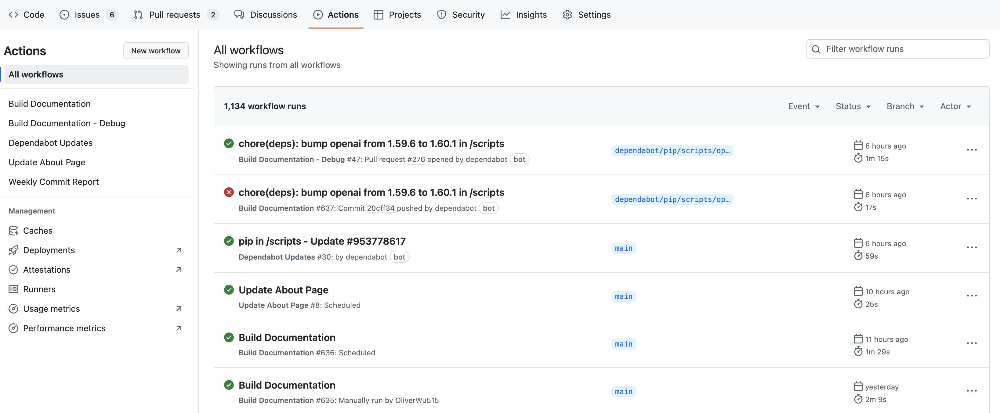

本篇是开发者指南的最后一篇，我们将会从宏观纵览整个 HOA 工作流。

## 😎从一个 PR 开始

1. 当用户往课程仓库提交 PR 被合并后，课程仓库内的 workflow 会被触发：

```sh
curl -X POST \
    -H "Accept: application/vnd.github.v3+json" \
    -H "Authorization: token $GITHUB_TOKEN" \
    https://api.github.com/repos/HITSZ-OpenAuto/hoa-moe/actions/workflows/course.yaml/dispatches \
    -d '{"ref":"main","inputs": {"repo_name": "'"${REPO_NAME}"'"}}'
```

而且，由于主仓库的 workflow 里存在如下设置：

```yaml
  workflow_dispatch:
    inputs:
      repo_name:
        description: "Name of the repository"
        required: true
        default: "NOT_ASSIGNED"
```

故主仓库会运行一遍 workflow，从而更新主仓库内的课程文档。

2. 当主仓库有新 PR 被创建后，会触发 `course-debug.yaml` 里的工作流，检查网页是否能正常构建。

```yaml
on:
  pull_request:
    branches: [main]
```

并且，由于仓库已经配置好了 netlify bot，bot 会自动创建一个针对 PR 的网页 preview，由此便可以检查前端样式是否正确设置。

3. PR 被合并后，可以到主仓库的 Action 界面看 workflow 日志，有问题方便定位。




