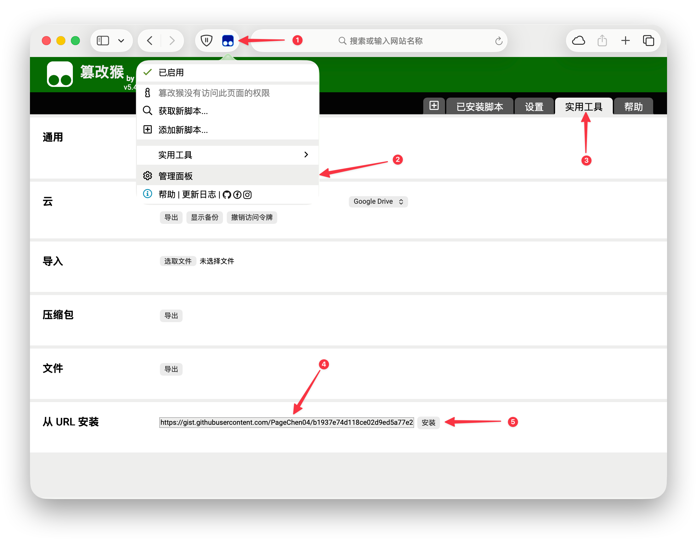
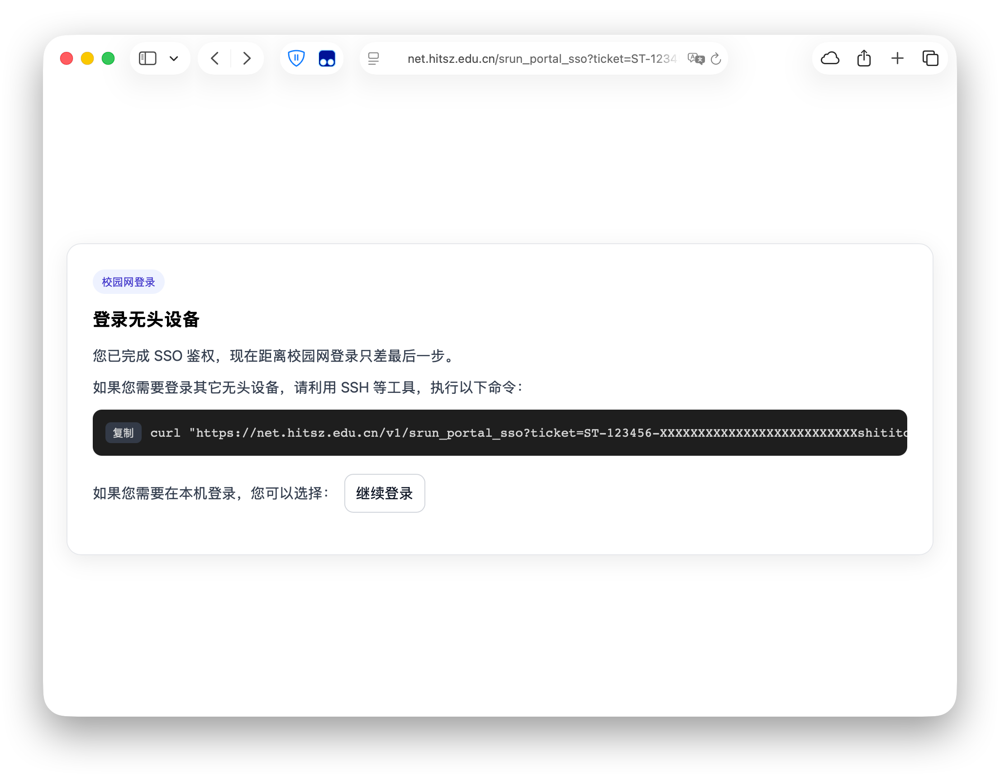

在 HITSZ 的校园网登录接入本部的 SSO 之后，以前无头登录的方法已经不适用了。之前我们曾经给出了一种基于 SSH 代理的通用方案（[新版校园网登录界面如何登录到服务器](/blog/let-your-school-server-connect-to-wifi/)），但这种方式有一定的局限性，操作起来也比较麻烦。笔者在分析了校园网的登录流程后，给出下面更便捷的方案。

## 方案 1 - 截获登录回调

以下给出一种基于笔者提供的脚本截获登录回调的方式。

{}

### 安装 Tampermonkey

首先需要在浏览器中安装 Tampermonkey 插件，请访问 [Tampermonkey](https://www.tampermonkey.net/) 按照官方的指示安装。

> [!NOTE]
> 如果您是 Chrome/Edge 用户，可能需要打开插件开发者选项。

### 安装脚本

直接点击链接进行安装： [安装](https://gist.githubusercontent.com/PageChen04/b1937e74d118ce02d9ed5a77e2ce3c93/raw/hitsz-net-login.user.js)

如果上述方法无法安装，可以手动进入 Tampermonkey 的脚本管理页面，点击 **实用工具** 面板，将下方脚本链接复制到 **从 URL 安装** 输入框中，并点击 **安装** 。

```url
https://gist.githubusercontent.com/PageChen04/b1937e74d118ce02d9ed5a77e2ce3c93/raw/hitsz-net-login.user.js
```



### 登录 SSO

使用待登录的 HIT 账号登录认证平台： [登录](https://ids.hit.edu.cn/authserver/login?service=http%3A%2F%2F10.248.98.2%2Fsrun_portal_sso)

如果脚本工作正常，将会看到以下界面：



### 无头设备登录

只需在无头设备的终端执行上述界面中给出的命令，即可完成登录。

如返回数据中包含 `{"code":0,"message":"success"}` ，则登录成功。

> [!NOTE]
> 已知该方法在登录设备达到上限时无法登录，以及在某些情况下会登录失败，暂未找到原因，请尝试注销 SSO、清理 Cookie 后重试。

{}

## 方案 2 - 鉴权登录一体程序

以下给出一种基于笔者编写的登录程序 [PageChen04/hitsz-srun-login](https://github.com/PageChen04/hitsz-srun-login) 的方式。

{}

### 下载登录程序

前往 [Releases](https://github.com/PageChen04/hitsz-srun-login/releases) 下载最新的登录程序。

> [!NOTE]**版本选择**
> 对于 Linux 系统，在绝大部分较新的 Intel/AMD 处理器上，推荐选择 `hitsz-srun-login-linux-amd64` 版本。

这里我们以 `x86_64` 架构的 Linux 系统为例。请从 [Releases](https://github.com/PageChen04/hitsz-srun-login/releases) 页面下载最新的 `hitsz-srun-login-linux-amd64` 版本，并赋予其执行权限。

```console
# 将 <DOWNLOAD_URL> 替换为从 Releases 页面复制的下载链接
$ wget <DOWNLOAD_URL> -O hitsz-srun-login-linux-amd64
$ chmod +x hitsz-srun-login-linux-amd64

### 利用程序登录

执行以下命令，替换为对应的 SSO 的用户名和密码。

```console
$ ./hitsz-srun-login-linux-amd64 -username XXXXXXXXX -password CREDENTIAL
SSO Authenticated.
Ticket: ST-000000-XXXXXXXXXXXXXXXXXXXXXXXX-XXhitito-idsauth00
Login Result: {"code":0,"message":"success","user_name":"XXXXXXXXX","data":[]}
```

> [!WARNING]**常见问题**
> 如果无法登录，可能是发生了以下问题：
>
> - 需要滑动验证，可以在他处（例如 [这里](https://ids.hit.edu.cn/authserver/login) ）人工登录后再进行尝试
> - 账号风控（**登录累计并行会话数 > 10 或 IP 数 ≥ 10，账号将被冻结 3 分钟**）

{}
