## 前言

我的自我定位大概是本科自动化学生的中层，最多再偏上一点点。随着大伙考研上岸和春招拿到好 offer，我的定位还有不小的下滑空间。

为避免我误人子弟，任何自我定位或预期定位比我强的同学都可以把我这篇东西当作在放屁。

鉴于自动化本科太过拉跨，读研的性价比相对来说还是很高的，无论是老师还是学长，相信都会给大家灌输自动化必须读研的概念。但是这个研总归不是任何同学都能顺利读上的，建议大家多考虑一下。

十分建议考研的同学在秋招时投递一些点击就送保底的岗位，不会花去太多的时间，但效果会比考研失败了春招再投要好些。而且一般企业考上研了是可以无条件违约的，不用交违约金。

## 一些前提和共识

校招 / 秋招 / 春招：[点我](https://www.zhihu.com/question/287147025)

税前 / 税后 / 五险一金：[点我](https://zhuanlan.zhihu.com/p/272876941)

白菜价：普通档的薪资水平；

sp：special 的 offer，就是特别的薪资档位，比普通的薪资待遇更好；

ssp：super special，就是比 sp 又要更好上一级的薪资待遇。

三方：学校、企业、学生三方签订的就业协议，意在确保学生毕业之后能够到该企业工作。理论上这个确保是双向的，学生不能鸽企业，企业也不能鸽学生，但是个人和企业的体量完全不能相比，通常来说三方只能限制住学生。三方填写需要在广东大学生就业创业小程序进行，需要两级审核后，企业通过，才算你正式申请完了三方，如果中间被任意一方打回，则视为没填过三方（比如刚填了三方但是有更好的 of 来了，还没审核完的话可以联系辅导员截止）。

两方：企业、学生方签订的就业协议，没什么用，一般来说学生可以随便违，所以来两方就大胆放心签。

## 点击就送

列举一下仅仅是我知道的知名的点击就送的企业，大家可以参考一下能拿到什么价位。

### 1. TP-LINK

_关于 TP 详情可参考《TP——从秋招到离职的一条龙服务》，在转码交流群群文件可获得_

#### 基本情况

- 做路由器等产品的纯纯学历厂，不点白不点。属于制造业，分为内销的普联和外销的联洲，两家独立招聘，岗位基本相同，建议都投递。

##### 优势

- 门槛低点击就送，基础薪资高。本科白菜价是 17k，硕士 21k。

##### 劣势

- 有一定的加班强度，工作时间为 995.5 或 996，工作日加班到 9 点之前算 1 次加班，周末加班 4 个小时算 2 次，加班没有加班费，只有 30 块餐补，并且加班次数会有排名，工作日上限 1 次，周末上限 2 次。
- 普联存在试用期结束卡转正的问题（联洲 22 届的转正率为 95%，考虑到自己跑路的存在，可以认为基本不卡转正）。
- 往年普联的年终都会给够 4 个月，但 24 年出现了波动，即个人年终可能在 0~10 个月波动，大概是最后 10% 的人无年终，引发声讨。截至 24 年，主打海外市场的联洲效益不错，所以不论是开的薪资，转正，年终都会显得比普联更好，但是据网上爆料，两家公司根底上的文化是相同的，也就是当效益褪去，联洲很可能就会跟普联一样卡转正，裁员，不给年终。
- 可能学不到技术，跳槽认可度不足，跳槽可能涨薪困难，甚至低于在 TP 的薪资。

#### 个人投递情况

6 月投递普联提前批（那时候不知道还有联洲），系统设计硬件工程师岗位，共三面，三面均问技术，面试时长均在 30 分钟左右，面试内容我已经忘了。

8 月份开奖，电话告知薪资等级为 +5，即 sp + 5，在白菜价的工资上 +5k，签两方。

9 月投递联洲正式批，系统设计硬件工程师岗位，共三面，三面均问技术，面试时长均在 10 分钟左右，基本是我介绍一遍我的项目，面试就结束了，非常快，快的离谱，非常简单，简单的离谱。

10 月联洲正式批开奖，电话告知薪资 23k\*16，推算为 sp+6。提前批只告知薪资等级的，具体薪资提前批和正式批都会在 10 月份开出来，可以参考 offershow 上往年的白菜价格，24 届和往年的白菜价格一样，为 17k\*16。据说三面就有 sp，只有二面就是白菜。

#### 个人想法

普联不考虑，联洲的我认为完全可以接，他开的实在是太高了，其他家面试基本都是被拷打还开的低，在联洲面试官表示出了对我的认可和期待我的加入 (泪目)。而且企业知名度高，暗坑少，基本就两点，加班和学不到技术。
关于加班，据学长称他所在一个比较好的部门软件每月平均加班次数为 13 次，且硬件略大于软件，我个人推算为加班 20 - 25 次左右，也就是 995.5 左右，我认为这个强度在制造业还算正常，双休还是有的。

我拿到手的 of 基本都是这个强度，而联洲是其中开的最高的，遥遥领先，怎么选已经很明显了。事实上我已经心动得填了三方，因为学院迟迟没审批所以后来又有变数（，最终没去。

### 2. 信步科技

#### 基本情况

- 只校招 985 的重度学历歧视患者，做主板的。具体情况可以找找在里面的电信学长问，我了解不多。

##### 优势

- 无技术笔试，难度点就送，薪资开的尚可，估计在 20W - 25W。

##### 劣势

- 老板个人风格浓郁，采用了笔试写小作文的考察方式，老板可能不喜欢你的小作文就一票否决你的 of。
  
- 是电信的点送但不一定是自动化的点送，他们更偏向于收电信的学生，自又输，但是在秋招人还没招满的时候，自动化去蹭口饭吃应该也没问题，春招就基本只要电信的了。
- 不交公积金，但提供 60W 的无息贷款，也就是宣称校招员工都能深圳买房的原因。

#### 个人投递情况

9 月多投递，9.27 发了笔试题，我一看都是小作文就不想写，并且 HR 在中秋国庆放假期间打电话询问我的情况（期望薪资，岗位，以及一些 HR 面的问题，表示她们相比于嵌软更缺硬件，我很合适），并催促我完成笔试。我问她不放假吗，她回答调休过了，然后过了几天还在国庆假期又打了一次电话催促笔试。

HR 态度还是很好的，就是放假打电话和小作文有点难绷，最终没提交笔试，HR 也没有后续。

#### 个人想法

这家估计是真不看技术，学历和文字对胃口就行了，而且开的不算低，建议技术差的点一下。

### 3. 比亚迪

#### 基本情况

- C9 传统工科最后的荣光，具体我了解不多，可以找在里面的学长问问。

##### 优势

- 点送，薪资明确，F 类专业不止这些，范围很广，大数据、光电肯定也算 F 类，感觉跟车沾点边，泛工科的都算。
- 把你当什么都不会的招进去培养，不用担心你不能胜任工作
  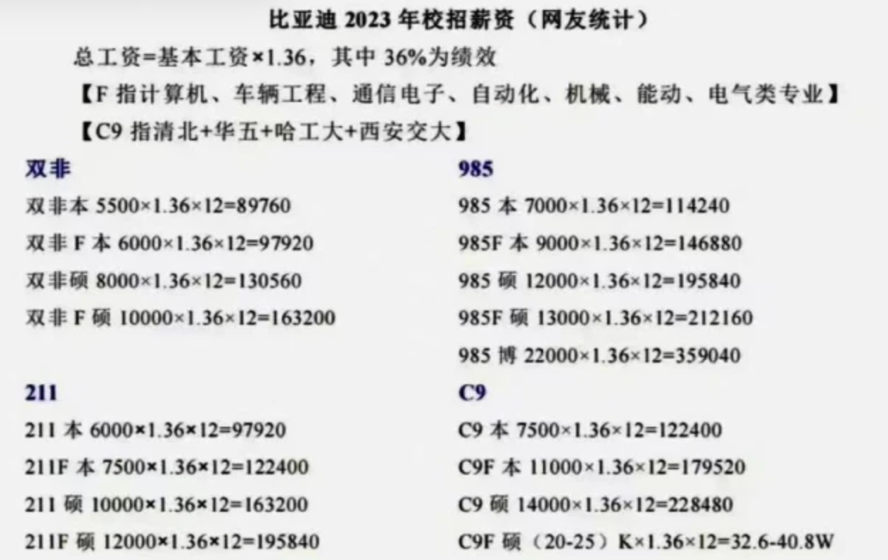

##### 劣势

- 管理混乱，岗位不是你选的是他分的，可能分到你完全不想去的岗位。
- 涨薪慢，本科生干三年肯定涨不到研究生起薪。薪资对于硕士来说很香，对于本科生来说基本是底线了。
- 氛围，待遇等各个部门不同，与小部门和领导强相关，有的部门绩效不是 36% 而会更高，有的部门 8 小时完全不加班，6 点人就走完了。
- 24 届招聘人数收缩，不再是投递就发 of，可能在简历池里泡死了都没捞起来，但是捞起来的人拿 of 的难度还是很低，难度上依旧是点送，只是比起 23 届（即 19 级）招的人少了，需要多一点点运气。
- 宿舍四人间，能拿每个月几百房补，可申请单人间但是很少，住单人间每个月交几百块。不住宿舍外面租房拿 1k 房补。（这条不知道算优势劣势，反正放着吧）
- 24 年 BYD 进行了一些改革，包括但不限于削减补贴，降低绩效，强制至少一个人要被打低分之类的。建议去其他渠道了解清楚。迪子或许已经不是那么淳朴的点送了，悲。
- 关于 BYD 认不认一年硕，23 届以前是认的。认的话一年硕拿到迪子的硕士价还是很香的。24 届刚开始也是认的，但是招着招着突然不认了，一刀切了所有一年硕的招聘流程，全部送进人才库。但是后来春招快结束的时候，它又认一年硕了，又问你还来不来……总之就是一个管理混乱，朝令夕改，大伙悠着点吧。

#### 个人投递情况

在 BYD 到学校宣讲前投递就好，迪子是每到一个学校就处理那个学校的简历，所以宣讲过后再投递有可能简历就不会被捞起来了，但是你可以尝试联系 HR 捞一下。

迪子安排在学校教室进行线下面试，HR 面和技术面连着，捞我面试的部门是系统开发部门，技术面面试官看起来是做软件的，试图问我一些简单的八股，比如会不会 C++，知不知道智能指针之类的，我说都不会，我想要硬件岗，然后面试官就只能问我项目了，然后他也不是很能 get 到我的点，但是看的出来他在努力理解我做了什么。

后面又来了一个电话，询问情况，项目之类的，我理解为电话加面。最后开的岗是 Layout 工程师，负责高速板的绘制。没去签约会所以不知道具体 of 情况。

#### 个人想法

本科开的低还是 Layout 岗，没必要去。考研的建议点一下，也就花半天时间在学校教室面一下，就算阿巴阿巴跟面试官没接上线也还是过了。

### 4. 南方电网 / 广东电网

#### 基本情况

- 985 提前批免笔试，仅需一面即可收获老家垄断国企的 of。待遇整体次于国家电网。除了关系户，大体上按学历分配。
- [南网招聘官网](https://zhaopin.csg.cn)，官方 APP“南网微招聘”。

##### 优势

- 无需笔试，投入精力非常小。
- 垄断国企，稳定，没有裁员危机，待遇相比其他国企来说较高，而且可回老家。

##### 劣势

- 非常不透明，薪资保密，岗位要等到二批招完才分配，直到你入职后统一培训完也就是入职 3 个月后才告诉你分配地点和岗位，也就是在你不知道你的岗位、薪资、工作地点、工作内容的时候就要跟它签 3 方，纯纯赌命。
- 不同地区、不同岗位差距较大，需要很细化的了解情况。
- 工作内容与所学毫无关系，可能杂活多，电气的得去砍树爬杆子（配电应该？），非电的不知道要不要爬。
- 新入职要爬岗，一开始工资很低，逐渐上涨，一般讨论的都是满岗后的待遇。
- 人员退三进一，新进去的小东西干活是少不了的。
- 子弟多，关系户多，没关系的难晋升，有钱又有闲的岗位都被子弟占据，普通人基本上躺一辈子（能躺一辈子真好）。
- 电气的点送，不一定是自动化的点送，自又输。
- 三方违约金 1w5，是最高的，而且考上研，考上公都不能免违约金（一般其他企业考上研和考上公是可以无条件违约的）。解除三方的日期是到 6 月 30 日，也就是基本不给你解约的机会。

#### 个人投递情况

一开始没想过国企，国庆的时候突然想起来有个广东电网，网上搜到了提前批投递方式和邮箱，在截止前投递了，投递时间应该是 9 月多到国庆。

（电网不会来我们学校校招，而电网这招聘方式非常传统而原始，提前批以线下去 985 学校宣讲为主，我记得我是搜到了哪个学校的通知，里面有投递方式，我这才投递的了，看我们学校的就业公众号是没有的。）

（广州供电局和深圳供电局独立招聘，待遇也是这俩最好，我们学校电气本科据说点送深供，自大输特输。那个时候我都不知道广深独立招聘，没投，知道的时候提前批时间已经过了。。）

电网下面子公司很多，直属中心机构什么的，我都不太了解，一般说的电网狭义上可认为是各地供电局，当时不了解各个供电局和直属机构，投递好像能填 3 个志愿，我乱选的几个供电局，印象里是惠州，佛山，珠海。
我投的非电的信息通信岗（顾名思义，计科和通信的岗位，笔试题都是计科和通信的专业课，也就是提前批免笔试，自才能蹭一口）。

10.12 一面，只有一面，提前两天短信通知（注意！电网这 b 所有通知都是用短信发的，注意短信！）。

面试要穿正装，双机位，面试前先进一个腾讯会议检查机位等，等叫号进真正的面试间。面试官很多，包含 HR 和技术，但是面试时间很短，HR 问意向的城市，为什么，意向的岗位，为什么，对它有什么认知之类的。
技术问了两个问题，什么是面向对象和什么是差分放大（和私企的技术面疯狂拷打形成鲜明对比，泪目）。

电气类的第二天也就是 13 号就会通知 of，非电类的可能得一个多月以后才出，电话通知 of。
我是只收到了惠州供电局（老家）的 of，电话中告知待遇保密，可视同当地公务员，地点和岗位入职后统一分配，但是提前批大概率市局（统一说法，是否画饼难说）。给半个小时考虑，回电是否接下 of。

我的签约过程有点搞，广东电网是我秋招经历的最烂的招聘。HR 以为我是本部的，把我按哈工大的签约流程走，但事实上我是广东的，得按广东的流程走，我反复说她都没听懂，一个劲的说我是哈工大的，按她说的准没错。
然后就出错了……而且只能跟 HR 座机电话沟通，非常难以沟通，听不懂人话就算了，打过去要么占线要么不接，并且下午 4 点以后就不再接电话了……（哥你两点才上班啊 TAT）（行政岗是真轻松啊 TAT）

（另外 HR 没权决定你的 of，当时电话说了要接 of 应该就不会被鸽，所以可以接了 of 然后拖着不签三方？）

个人了解到的情况：

- 所有东西都保密，只能互联网上搜到零散的信息，能找到在电网的学长直接问就再好不过了。
  信通岗如果分配在主网 / 市局的话可能是调度中心和信息中心，但是名额很有限，都是个位数的。如果在配网/区局，那么专业和岗位都无所谓，配电和营销是个人都能干，所以直接无视你的专业和投的信通岗。变电岗就是传说中的上二休四，不过只有电气才有去。
  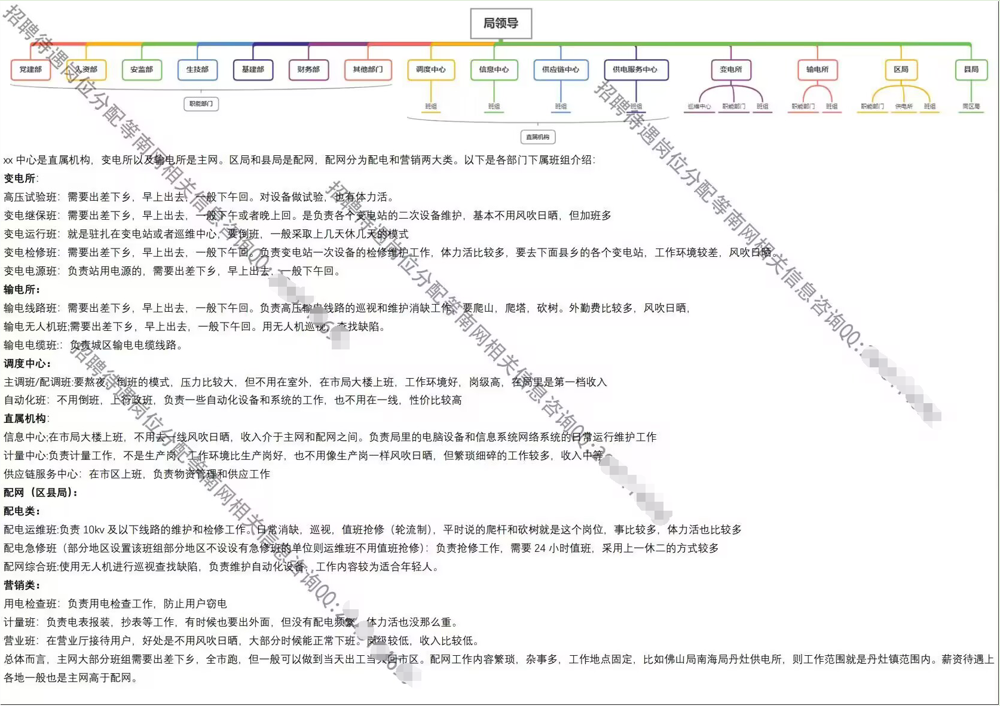
- 电网以岗定薪，本科爬岗两年，一年考中作一年考高作。前期集中培训 3 个月，统一月薪 3k。培训结束后分配，开始有绩效工资，可能 4 - 6k，看具体的情况。一年后可能 8、9k。
  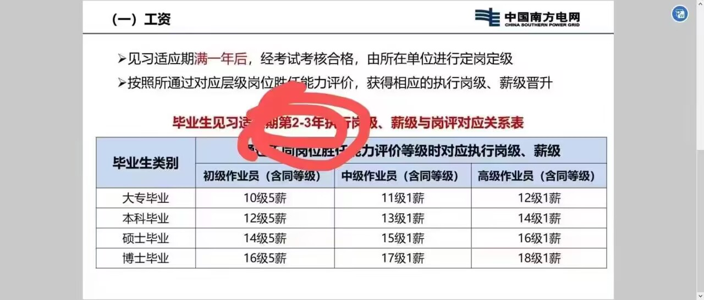
- 电网一般是年终多，月薪少。以惠州供电局为例，满岗后大概主网 16W，配网 14W（按不同岗位和学历浮动，数字只是大概）。网上看的佛供 18W，广供 20W+，深供 30W+，珠三角大于非珠。满岗后薪资基本不涨了，但是还是在涨的（公积金）。
  （电网谈薪只谈纯到手，即税后打到卡里完完全全拿在手里能支配的（没把公积金算进来，算进来更高），因为月薪低和不可描述的原因，年收入也可以用公积金指代，电网的公积金是真实年收入的双边 12%，不是按的基本工资）
- 公司有食堂，几块钱自助。深供提供 8 年单人宿舍，惠供我忘了几年了。
- 电网基本按学历分配，但是电网学历太卷了，双 9 硕才能拿到一些入场卷，比如电科院等。往年广供难进的很，但 24 届好像招的人比较多，本科也能进，但是肯定分配不了什么好地方了，会到郊区比较偏僻的地方去。像惠州这样的珠三角里靠后的，学历还不是那么卷，双 9 硕比较少，单 9 硕比较多，本 9 电气也稳进主网，非电不好说，视乎当年的竞争情况。再下来非珠三角地区的待遇更差，非电本 9 也能进主网了。这样看下来除了广深，基本只有回老家才有性价比。
- 以下是某区级供电所配网的情况，可以当作下限来看能不能接受：工作时间 8.30-12.00，2.00-5.30，营销准时下班，但是要直面用户。配电可能经常加班，半夜起来查线抢修。凌晨工作第二天上午可以不去，其他加班的都得正常上班。营销月底月头周末要加班。配电要值班，以某所为例，6 天一轮，值班当天要全天在辖区内（过年也要值班）。

### 5. 中广核

#### 基本情况

- 核电工程公司，了解不多。宣讲待遇为本科总包 19W+20W 安家费分五年发放。硕士为 21W 总包。

##### 优势

- 点送
- 稳定，没有裁员危机，待遇还行。
- 海景房住宿，独立单人间，水电全包，有餐补，等等各种福利补贴。基地内各种设施齐全。

##### 劣势

- 远离人间。基地一般在很偏僻的地方，离市区远，下了班没什么地方好去（所以基地设施齐全，就在基地里放松娱乐。）拍拖很难，除非跟同公司的，不然一周五天都难见到人，就周末能出去放风。（在深圳就还好？）
- 工作内容未知，反正跟专业毫无关系，进去重新学。进去了估计就跳不出来了，跳其他核电公司可能还行，但是其他核电公司还有比中广核待遇好的吗？
- 养鱼大户，可能会一直让你面试，体检，到最后却没有 of 发出来。
- 宣称的总包计入了乱七八糟的福利，水分可能比较大。

#### 个人投递情况

9.24 微信公众号投递，会一直等到来学校宣讲才会处理一个学校的简历，所以不用急，慢慢等。

10.1 7 来学校宣讲，10.19 通知 10.21 到某酒店一面，一面形式为群面，面试时间为 1 个小时，一共有 10 个还是 12 个人，材料为一张纸，里面有 10 条举措，讨论出 5 条最有用的举措。
（有些人穿了正装，我纯休闲，甚至都没了解过群面怎么准备，反正轮到我就阿巴阿巴发言一下，只有两三个看起来是熟悉群面的在带节奏，大部分人都是阿巴阿巴，感觉只要多发言一两次超过大部分人就行）。

10.22 23:05 通知 10.23 9:30 在酒店二面（nmd，时间这么紧），二面为 HR 面和~~技术面~~主管面一起面，三个面试官，问我如何看待中广核的工作作风“严、慎、细、实”，我说跟我们校训差不多，联系一下瞎扯了一通。
然后问 PID 是什么，HR 问意向的公司和岗位（前面投递的时候填的不作数，HR 会在面试的时候重新确定意向），我说我都不了解，这些岗位都语焉不详的不知道到底干什么，希望跟专业相关一点。

10.26 晚通知 10.27 早上去南科大医院体检，免费，但也没有体检报告到手里。（对色盲要求好像很严格，在酒店的时候就当场测过）。

10.29 电话通知 of，惠州公司的维修岗，半个小时考虑，拒了。可以看出来，中广核会在宣讲后的一段时间集中完成面试体检发 of 全过程，需要这几天投入比较多的时间。
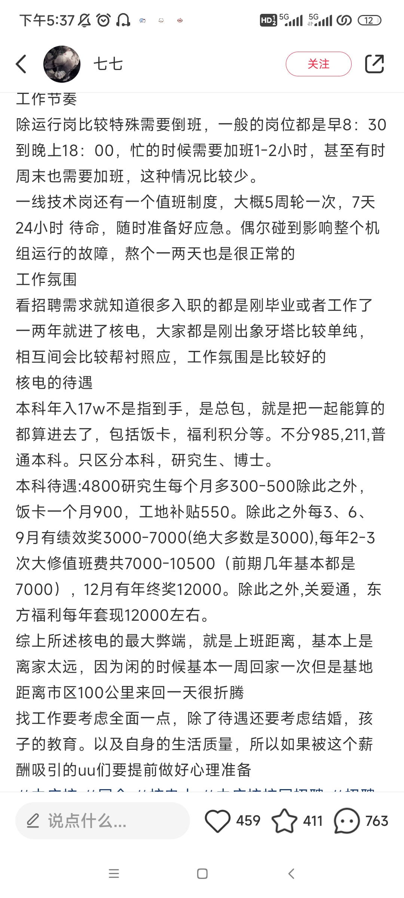

#### 个人了解到的情况

待遇还是按学历来的，网上很多是双非的待遇不可全信，按某位在不是深圳的工程公司的本科学长的说法，我们本科进去总包 20W 左右，月薪和年终大概占 15W，运行岗会更高总包 22W。
月薪的话，税后运行岗 11k，其他岗 10k，不过运行要倒班。总工时小于 964.5。

## 个人秋招

秉持着分享不能只有大佬的分享，也需要看看一般的情况，所以还是斗胆给大家看看我情况吧，仅供参考。

### 个人基本情况

- 简历：
  - 学分绩 84.9 33%
  - 竞赛：智能车国三，电赛电源题省二
  - 实习：TI FAE（现场技术应用工程师）
  - 外语：六级 429（擦边过，反正也没被卡）
  - 技术栈：单片机裸机开发，一点硬件基础，一点电源基础
  - 求职意向：硬件、电源
- 个人时间表：
  - 3 月左右开始投暑期实习
  - 7-8 月实习
  - 9 月开投秋招（太晚了）
  - 10 月国庆回来面试集中爆发
- Offer：
  - 古瑞瓦特：12k 深圳 硬件工程师
  - 比亚迪：17.9w 深圳坪山 Layout 工程师
  - 雷赛智能：14k\*15 深圳南山 硬件工程师
  - 海浦蒙特：16k\*15 深圳南山 硬件工程师
  - 汇川 - 联合动力：(16+0.7)k\*16 苏州 控制硬件工程师
  - 禾望电气：(16+2)k\*16 深圳南山 电力电子软件工程师
  - TP-LINK 普联：22k\*16 深圳南山 系统设计硬件工程师
  - TP-LINK 联洲：23k\*16 深圳南山 系统设计硬件工程师
  - 道通科技 - 新能源：25k\*14 深圳南山 电力电子硬件工程师
  - 深南电路：14.5w 深圳 硬件开发岗
  - 中广核：年包 19w+20w 安家费分 5 年 惠州惠东 维修岗
  - 广东电网惠州供电局 待遇保密 岗位未知

（k 为单位的是月薪，w 为单位是年薪，例如 23k\*16，意思是 23k 的税前月薪，16 个月的薪水，超过 12 个月的部分为年终奖）

### 随便唠唠

在就业的同学里面我的学分绩应该算高的，一般这个分段的同学都会选择考研或者一年硕或者冲一个竞赛加分，按 20 级的情况，我加 3 分大概也许或者有可能能蹭到保研的边边。

我是竞赛寄了就不想保了，考研也觉得自己考不上，润又没钱，只好头铁冲秋招。
事实证明头确实很铁，还算凑活的学分绩对于秋招来说没有意义。

我又是很摆的人，大概是大三上决定要秋招，说是说决定，其实更像是逃避考研，又懒得转码，竞赛里做的硬件部分，所以就想找个硬件方向的工作，但是又没准备好含金量足够的硬件项目。
总之就是基本没怎么准备，两手空空冲秋招，大家千万不要学我，大三上开始转码肯定是来得及的，大三下边转码边投实习一直到秋招也是来得及的。

虽然我是非典型自动化人（死活不转码，一点代码相关不会，倒是往硬件和电源学了点），但是感觉有相当一部分人技术栈跟我差不多，因为课程和参加过一下比赛，所以会一点点单片机裸机开发，但是多的也不会了，也没用过 FreeRTOS，不会 Linux，没学过 408。
这种情况如果不读研或者考研失败的话相当被动，只能点一下点送的私企或者国企，私企的话大概率也只能单片机的嵌入式，除非另有机缘或者个人有其他方面的技能。

我个人的求职目标不高，在秋招前的认知和目标大概是拿 24w 左右，希望有 28w，最低不能低于迪子。
最后的结果也基本符合，大部分 of 在 20w+，少数的风评比较差的厂（TP 和道通）开到了 30w+。
我在自动化就业里绝对算不上优秀，同样是硬件岗，同一届自动化有去了拓竹的，建议大家目标放高放远，别学我摆烂。

我个人认知里本科薪资粗略的划分 (指在深圳)：

- 倒数水平：比亚迪常数（17.9w）以下；
- 普通水平：20w-30w
- 优秀水平：30w 以上
- 顶尖水平：40w 以上

出于某种集邮的心态和为了写这段话，我参加了从实习（上一届春招）到秋招的所有在学校举办的大型招聘会，并且尽量参加了有相关岗位的企业宣讲（有硬件岗的都是制造业，而且有硬件岗的企业大概率也招嵌软）。

我明确下个结论：

- 对我来说招聘会就是没用。
  1. 招聘会是什么企业可以来报名参加的，所以出现的企业良莠不齐，很多都是深圳本地或者附近的没听过的待遇很差的小厂。
  2. 有一些中厂和大厂也会摆摊，但是它们都需要通过网申通道申请，你去摊位询问，他们也是让你去网申，基本线下留份简历在那里没用，甚至有网申通道没开启但是来摆摊的和不招人但是来摆摊的。
  3. 基本只有 HR 来摆摊，非常少的情况会有技术在，有技术在的也基本是没听过的待遇差的小厂，跟 HR 没什么好聊的，基本没什么有效信息获取。
     招聘会的打开方式应该就是前一天对着参会企业名录看看有没有感兴趣的企业，有就去看一下，加个 HR 微信之类的，没有就不用浪费时间去逛了，没东西。
     （其他专业和其他方向可能情况不一样，比如说一些国企之类的可能真能谈谈？但是我破本科硬件也没有研究所国企之类的好去）
     （我真的去投了那些查不到什么信息的小厂，甚至线下去参观，拿了 of，所以可以下结论确实是没听过的待遇很差的小厂。）
- 企业宣讲还是有点用，虽然很多情况都是来成为抽奖的分母。
  企业来宣讲还是会做一些准备，一般 HR 和技术都会来，还有些小礼品抽个奖之类的。大厂基本不会有当场笔试和面试的机会，但是来加个微信、获取一些信息也算是好的。
  有一些中小厂可能会有当场面试，比如海浦蒙特、古瑞瓦特、禾望都是当场面试，TI 是当场笔试。
  - [就业网](https://job.hitsz.edu.cn/zhxy-szxszyfzpt/)上的日历可以看什么时候有企业宣讲，还可以。学校的就业处微信公众号有点拉，建议同时加一下本部的、华科的、华工的等等 985 工科的就业公众号。

### 细说一下

#### 实习

我大概是大三下开学开始投实习，硬件的实习其实挺少的，大厂更少，我能过简历的更少，总之就是只投了几个小厂和 TI 和华子。华子头铁投的电源岗，直接笔试挂了 TAT，还有几个小厂钱不多强度还大，感觉意义不大，就拒了。

TI (德州仪器) 是 3 月底就来学校宣讲，当场笔试，现场投递，（可以后面再补上线上投递）。

AE（应用工程师）招的很少，基本都是 FAE 和 TSE（FAE 可以姑且理解为售前和售后，一般认为半技术半销售，作为 AE 等和客户之间的桥梁（传话筒），不过 TI 的 FAE 应该更偏销售了，TSE 就是纯销售）。
没信心拿下 AE 所以投了 FAE（模拟方向）（大伙可以投递嵌入式方向的 FAE，模拟要大杂烩什么都学，嵌入式只要专精一个芯片就行，相对来说更技术，没那么销售），大概一周内打电话告知通过笔试，约线下面（要穿正装）。

只有一面，面试官就是入职后的主管，包含技术面和主管面的成分，以拷打简历上的东西为主，大概 40 分钟。
TI 很喜欢刨根问底，抓着一个点问到你回答不出来为止，不能问上两层的东西就尽量别写简历上了。

介绍项目的时候让我画出框图，介绍每一部分，逐一拷打，问做的过程遇到了哪些困难怎么解决的；问了电源基础（LDO、DC / DC）；问对 FAE 有怎样的认知；问我为什么不考研，除了 TI 还投了哪些，华子和 TI 都给我实习 of 我去哪（我事后觉得，问这个应该就是要我的意思，只是当时我没反应过来）。

最后让我用英文介绍家乡，我直说我没准备不会说，他问我过四级没，我说过了，就作罢。

一周后发 of 吧。对了，虽然我已经做了线下笔试，但是补线上投递的话还是会发线上笔试，然后我就又做了一次（这次的成绩应该不作数？）。

TI 的笔试（模拟方向）很有意思，题量非常大，涵盖电路、模电、数电、自控、电力电子、通信协议、信号链等内容，以小题为主，只有一个小时，只能会写什么写什么。
不过 FAE 的笔试成绩应该要求不高，AE 要求应该高很多（同一套卷）。

TI 在中国的大本营在上海，不多的研发岗基本在北京和上海，成都制造为主，深圳销售为主，有不多的 AE 在深圳，不一定招 AE，但是 FAE 和 TSE 应该还是挺缺人的，跑路的人也多，跑路原因基本上是国产芯片厂开价更高，强度可能也比 TI 小（TI 还是会给压力的）。

TI 对实习生还是挺重视的，但是具体情况还是得看主管和 mentor(导师) 的安排。
虽然我觉得我什么都不会，但是主管觉得我有做过东西，技术还不错的样子，说“哈工大的产学研做的不错的”，我哭死。

模拟方向 FAE 的一般从电源芯片开始学习（在学校没学过信号链），当然也看安排，同期有一个电气硕的老哥就被安排学习非常多的东西，非常充实。
相对来说我的 mentor 不太管我，所以我整天摸鱼没学到太多东西。

两个月的时间基本上是前一半时间学习电源芯片基础，拿 TI 的 EVM 板子测试，写写实验报告，后一半时间去跟着 mentor 见客户，线上线下给客户 debug，体验一下售前和售后的 FAE 工作流程，也要写写报告。
最后有一个转正答辩，会有大老板来听，决定是否转正。

一般来说实习时间是先定 6 周或者 8 周，因为要安排实习计划和答辩时间。不想答辩了那就中间随时可以跑路。

总的来说，销售岗实习还是对秋招想找技术岗的没什么帮助，也不好把实习经历写成项目，对于技术一般和想走非技术岗的可以投投看。
TI 的销售岗待遇还是相当可以的，也不会歧视本科，本科硕士就底薪差 1k，但是本科还是难进，毕竟本硕同台竞争。

我印象里 FAE 和 TSE 底薪都是 2w，公积金拉满，季度奖金和年终另算。
而且 TI 是有普调的，第二年能涨 10% 还是多少，不记得了，可能记的不准确。

但是 TI 的强度比一般外企要高，虽然说是 965，但很有可能要自主加班。
主要是要跟着客户节奏，客户卷产品迭代快，FAE 就得跟着卷 (然后深圳企业普遍压榨和卷……)，然后因为要跟美国人沟通，所以很可能需要半夜自主加班一会。
不过 TI 出来也好跳，至少国内的芯片厂同岗位应该不难拿下。

另外，我其实觉得自动化本科还挺适合销售岗的，都会一点，也只会一点，靠着这点基础卖东西去。
销售岗可能会经常出差，出多远视乎客户在哪里。适合喜欢到处跑跑，跟人打交道的人吧。

#### 秋招

我是实习结束才 9 月才开始投秋招，有些晚了。
总结一下秋招就是投了大中小厂 70 家，十几家给面，大厂不理我，黑厂开的高。
很多厂的硬件岗要求写着硕士的我就没投，然后我又只投在广东的企业，感觉投到后面已经不知道还能投什么了。
像 OPPO 笔试挂，VIVO 简历挂；中兴过了笔试但一直没给面。

说一下几个上面没提的 of 吧。

##### 古瑞瓦特

12k，新能源企业，来学校宣讲，现场面试，统一打包价 12k，评价为狗都不去。很后面又打电话说嫌少可以再谈，估计是没人理他，来捞人了，懒得理它。

##### 雷赛智能

14k，做运动控制卡的，开的又少又加班，但是 HR 跟我打专业牌，说他家是领域内国内第一，很契合我的专业，在本行业领域就是这个价，不低了哦。我 qnm 的本专业。

##### 海浦蒙特

16k，做电梯的小厂，来学校宣讲，现场面试，10 分钟面完通过，of 发的也快。虽然是个小厂，知乎也有黑料，但是这是第一家开的达到我预期薪资的厂，并且飞快的发 of 速度给了我一个保底的信心，态度很好，非常感谢。

还有就是 HR 小姐姐很可爱，后面也有打电话问我还去不，我哭死。

##### 汇川 - 联合动力

16 + 0.7k，据说汇川是小华为，做工控起家，现在也做新能源，感觉对口机电的所有专业（华子下位替代，钱比华子少，加班应该不少）。

面试拷打的也挺细致，最后就开 16k，真不行吧。

##### 深南电路

14.5w，制作 PCB 的厂，看风评虽是国企但是加班很多，来学校宣讲，感觉我是误入，好像来的都是材料学生。

我看录取名单里都是些普本，哈深是里面最高分的（纯当观察一下别的学校别的专业了，auto 本虽然烂，比材料本还是要好点）。

##### 禾望电气

16 + 2k，新能源企业，风电很厉害，离学校很近。

前面投了简历不处理，直到来学校宣讲才处理，当场 hr 面 + 技术一面。技术面给我拷打麻了，支支吾吾半小时，面完汗流浃背心力交瘁。

面成这样我都没想到还能通过，没多久打电话约线下去公司二面。HR 说技术说我的基础还不错，我说我基础都被拷打麻了还能不错吗。
两个技术总监一起面，主要问自控基础，S 域 Z 域转换，PID 之类的，好多我都忘了，但是总监在纸上直接推导给我看，泪目。
然后他们得出的结论是我可以用，但是需要人带一下。然后带我参观了一下公司。

HR 催我签 of，我说要拖一下，也拖的很顺利。总的来说这家整体招聘流程挺舒服的，都很真诚，技术主管和总监都有一种质朴的深耕技术的感觉。

- 虽然是电力电子软件岗，但可以没有电力电子基础，会自控就行，有考研失败的同学（毕竟考研专业课是自控）春招去面，拿的 of 跟我一样。
- 加班的话理论上是三天 8 点半 2 天 6 点对标理论上的华子，实际上可能还存在一些自主加班吧。

##### 道通科技 - 合创数字能源

25k，道通是深圳四大黑厂之一，做无人机的；合创是做新能源的子公司，做充电桩卖海外，网上风评也不太好，但是据我一个进去的朋友说，换了领导，现在的氛围还好，具体情况可以问问子子学长。

线上一面，对我的毕设（我毕设跟电气）很感兴趣，问我能不能接受加班。

约线下公司二面，也不算二面，感觉就是聊聊天，参观一下公司，对话中的感觉就是已经要了我，甚至商量让我在公司做毕设，问我有什么需求，怎么才能做个优毕出来。

看得出来很缺人，让我早点去实习、做毕设，甚至问我要导师的联系方式，看意思是很想把她学生都打包过来实习 / 就业。其实感觉态度挺好的，对我挺看重的感觉，开的也很高，不过当时囿于网上风评太差，还是拒了，后来我朋友才进去的。

如果是想做新能源的，又不怕加班的，感觉来这里也挺好，起码钱多（我一个非科班半吊子都有 25k，科班我都不敢想）。

---

看这几个 of 应该也能看出来，我试图蹭一口新能源的饭吃，不过最后没蹭上。很多硬件厂比如手机厂比较成熟，招的人少，要求也高，很多都要硕士，新能源还在洗牌，还算是有点机会。

后来还有几家新能源企业拒面了，面到后面感觉面来面去也是小厂，也是差不多的价格，不想面了。

这几个 of 里面真正考虑过的有几个：禾望、道通、TP 联洲、老家电网。

禾望是电源软件 / 电力电子软件，道通是电力电子硬件，都是跳新能源 / 电源混饭吃，禾望相对来说稳定一些，风评好一些，软件方向应该好一些也舒服一些，道通就是开的高但是风险也大些。

TP 联洲就是纯钱多。老家电网就是我必须考虑这是否是我此生仅有的回家工作的机会。

of 大家最后总是会有的，无非是好些坏些，最后选择哪个 of，其实不看是不是多那一两千起薪，更重要的是选择发展的方向和想要的生活，这就因人而异了。
面对同样的选择，大家可能考虑的点不一样，做出不同的选择，所以我就不说我最后去哪了（。

## 硬件方向

### offer 参考

- 以下是某硬件群拿到的 of，里面绝大部分人的本科是没有哈深分高的，大家可以参考一下硬件薪资。[点我跳转](https://www.kdocs.cn/l/clDk2Ia5FgQ7)
- 可以看到硬件本科是比较难的，大部分薪资都不高，基本没有超过 30w，就算是研究生，也就是拿到计科的本科起薪罢了。（当然这也与群友水平比较低有关，能去疆去竹的自然薪资高）
- 建议不是想不开的同学还是不要干硬件（大佬随意了），同公司里一般嵌入式软件的岗位数量，薪资，工作强度都优于硬件。大伙还是尽量力扣启动吧。
- 但是硬件岗的好处就是目前来说招聘的卷度是不如软件的，笔试不用写代码甚至全是选择题（或许会有模电/电力电子计算题），（美团除外，美团硬件岗笔试也得算法题）。但是缺点就是缺少高质量开源资料，缺少免费的培训班和项目，个人很难成长。投入同样的时间精力，在软件上获取的进步和收益应该是比硬件要大的。不少硬件小厂还是保有淳朴的招聘观念：进来再学（反正本来上学也没什么看得过去的硬件项目），所以难度低，点送。但是想进大厂就挺难的吧，不像软件有比较明确的努力路径，所以一般只有依托于竞赛等实验室和课题组有项目的情况才方便找硬件岗。
  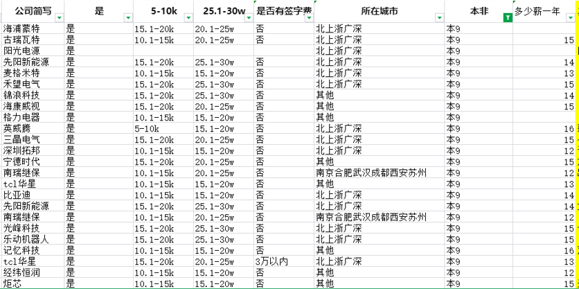
  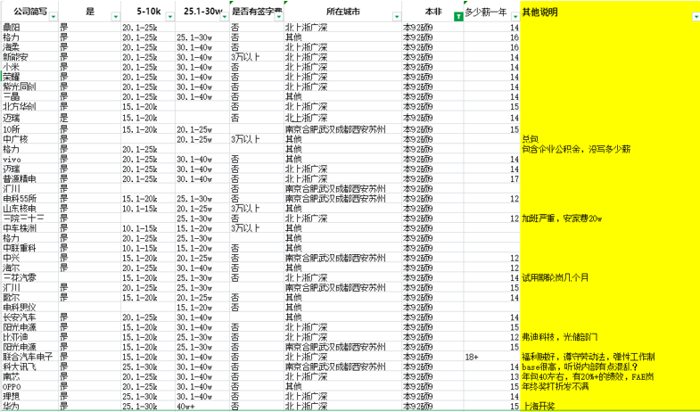

### 方向参考

硬件工程师是一个比较笼统的称呼，很多公司在招聘的时候岗位名称写着硬件，但是工作内容可能差别还挺大的。贴一下 trent 老师（b 站可搜）的分类。
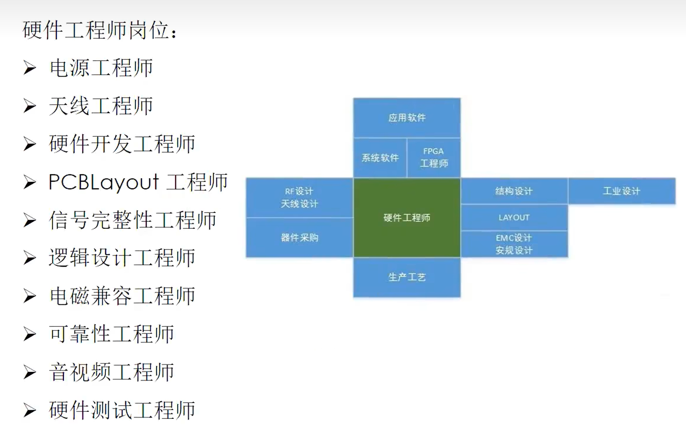

这里的硬件工程师基本都是指板级硬件设计，不包含芯片设计，也基本不包含代码。
我一般指的硬件岗都很狭义，比如 FPGA 岗，写 FPGA 的代码的，我看来这是纯软件岗，画 FPGA 板子的才是硬件岗。

在小公司里，硬件可能只有 1 或者 2 个人，基本就是硬件全栈，所有有关硬件 / PCB 的东西全包，画原理图，画 PCB，采购元器件，写代码，调试板子，call 原厂 AE 和 FAE 救命，PI/SI 仿真，EMC 整改，与客户沟通。

大公司岗位就分的比较开了。（某种意义上说，硬件岗天生就是要干杂活的，不想干杂活的就跑路吧）

与 Layout 工程师 / PCB 工程师对应时，硬件工程师指原理图工程师（只画原理图，Layout 有专人负责或者外包）；
与电子工程师对应时，硬件工程师指涉及高速电路、操作系统、使用高度集成化的芯片的板子的原理图工程师，电子工程师则指不太涉及高速电路，围绕裸机 MCU、分立器件的小硬件全栈工程师。

硬件的方向可以粗略划分为高频高速和功率，很明显，前者通信更对口后者电气更对口，没关系，auto 都能蹭。

射频、天线之类的划到高频高速里。功率的话，就是设计电源，其实电源软件和电源硬件挺近的，很多电源佬都软硬全栈的（。

关于硬件发展，现在芯片的集成度越来越高，硬件（原理图）工程师发挥的余地可以说越来越小，基本就是抄原厂方案，特别是涉及高速高频的芯片，原厂解决一切，有问题就 call 原厂 AE 和 FAE。

硬件岗可能更多地是做方案集成和解决一下信号完整性的问题？而电源一般认为是模拟电路里不容易被取代的一部分，不过现在小功率电源的集成度也是越来越高，也就电感电容不容易继承进芯片。
由于散热等问题，大功率电源集成不了，还是有广阔天地的（或许），所以也有某种说法是做大功率电源比普通的抄图硬件（包括小功率电源）要好，（不过也有说新能源没几年好日子了，大功率电源/电力电子也要不行了，大伙自己判断吧）。

硬件逐渐变成抄图的螺丝钉，所以某人有种说法是硬件（原理图）工程师就是板级装机。
值得注意的是，这种专抄图，做方案集成的螺丝钉，（虽然可替代性比较强但）薪资反而可能会很高，因为是大厂，做的是高附加值产品（也许。而在小厂亲手设计电路，难归难，可能工资还没那么高（主要是大厂可能不会让人设计电路，都是有设计规范，用集成芯片的）。

至于电源，感觉做电源硬件不如做电源软件/电源控制算法，电源的不可替代性强很多，很吃经验，电源厂给应届生很难开到互联网大厂的价格，但（类）互联网大厂却可以给硬件（原理图集成）工程师开出近似于互联网软件岗的价格。

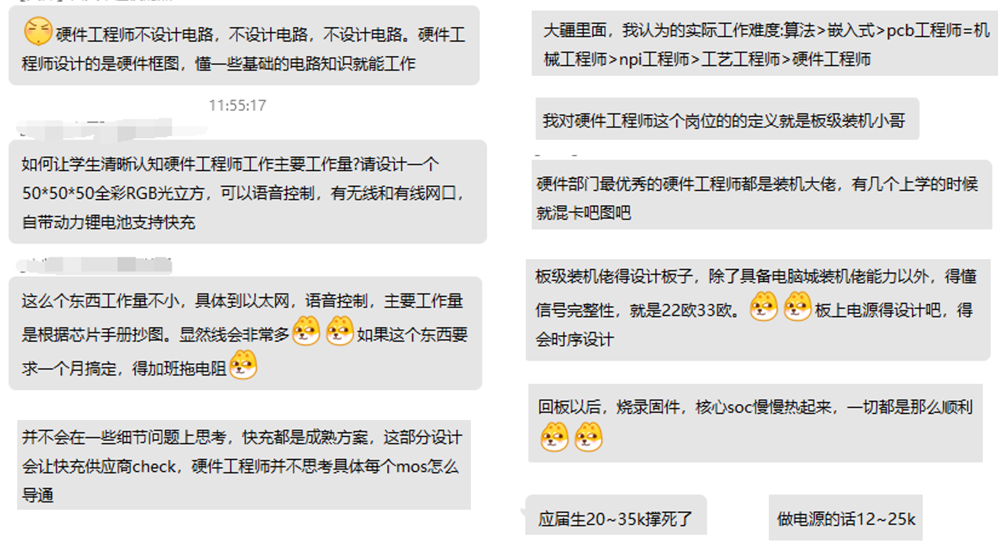

投递公司方向：

1. 手机厂相关，招基带、天线等，基本属于高频高速，很多有硕士学历要求。
2. 新能源企业，光伏风电等：以大功率为主，朝电气蹭就完事。
3. 车企相关，车太大了，高速和功率都有。
4. 其他，医疗，家电，机器人等行业，高速可能没那么高，功率也没那么高，总之技术栈比较杂什么都做。
5. 芯片原厂，投 AE 和 FAE，看会什么投做什么方面芯片的厂。

- [牛客冰洛之城硬件帖子总结](https://www.nowcoder.com/discuss/507679499161501696?sourceSSR=search)

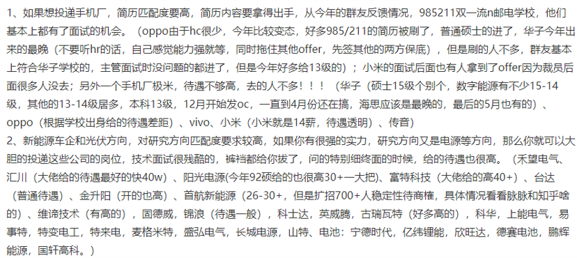

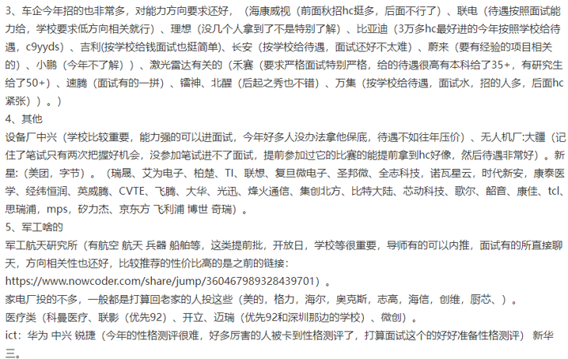

### 招聘要求参考

- 这个应该是华子和大疆的硬件招聘要求，可以看到大疆的要求非常多……我觉得本科应届生能满足几项就不错了

  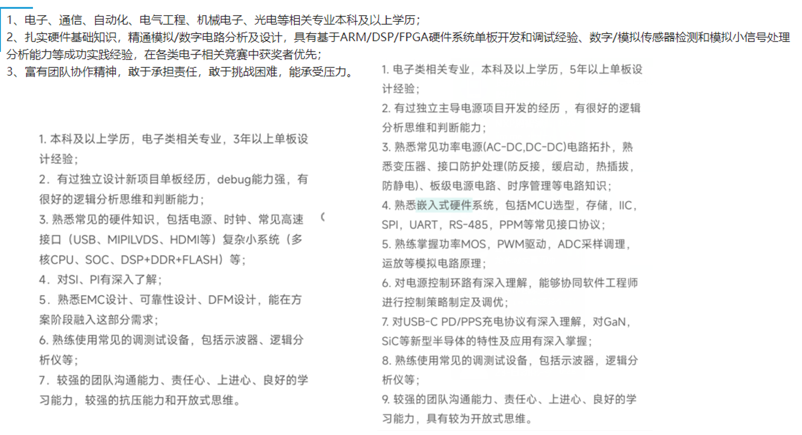

- 这个是 trent 老师视频里写的，基本上就是单板硬件的技术栈了（通用硬件，偏高速方向）。

  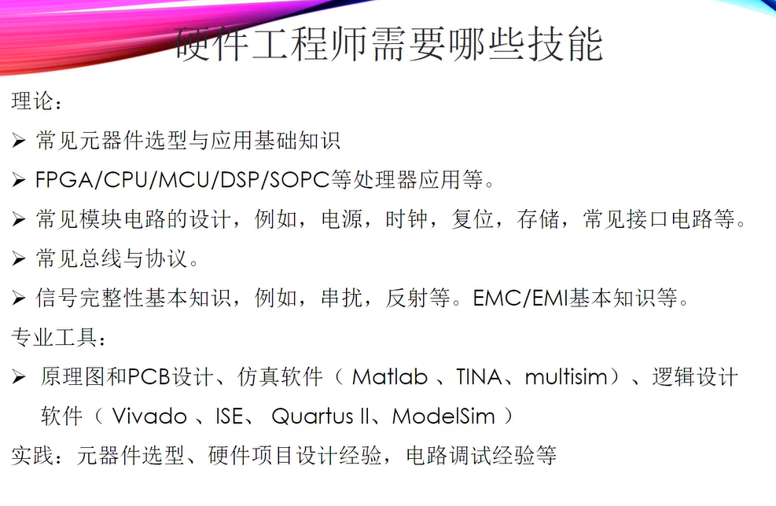

本科生基本没有什么关于信号完整性和 EMC / EMI 的项目吧，看点相关知识（八股）就差不多吧。

感觉普通学生对应准备的话，就画下核心板（从简单的 STM32 到复杂的 FPGA），了解下总线和通信协议，（简单的如 I2C、SPI，复杂的高速协议如 PCIe 等感觉要求有点高了，我没这本事 TAT，大佬可能会吧），学一点电源基础（LDO、DC/DC），然后找相关项目吧（发现找不到）（或许可以去 lzl 老师的课题组薅硬件项目，比如趁大三暑期的那个实习去白嫖项目）。

贴一些链接：

- 硬件基础知识，八股：微信公众号[硬件工程师炼成之路](https://mp.weixin.qq.com/s/ceIV61VPquSYyk9Jh96FDQ)，他有个几百页的 pdf，虽然比较长但是说人话，可以当字典查。
- 硬件基础知识，电源基础知识：微信公众号[硬件十万个为什么](https://mp.weixin.qq.com/mp/wappoc_appmsgcaptcha?poc_token=HLOiqmajongB9pAaVMmcmmJAJtEkKQBRTm9AV9k9&target_url=https%3A%2F%2Fmp.weixin.qq.com%2Fs%2Fj3fbpVKElAaFl1Pzoz6e2g)，文章和书写的不错（特别是电源篇我觉得非常好）。培训课没买过不懂。
- 硬件项目：[立创开源硬件平台](https://oshwhub.com/)，现在日子好了，立创开源上有不少挺好的项目了，搞了个星火计划可以看看。但是完全没有硬件项目基础的话，可能会无从下手，可以先找个简单的核心板抄，然后再去找难一些的项目抄。（想往数字、高速方面学的，可以去尝试复刻一下各种派，香橙派，香蕉派什么之类的；想往电源发展的，可以去做一下电赛历年电源题或者 TI 官网的参考项目）
- 网盘：[嘘](https://pan.baidu.com/s/1p9ULizCGuMW0Sncnbf4ikQ?pwd=shit)，提取码：shit
