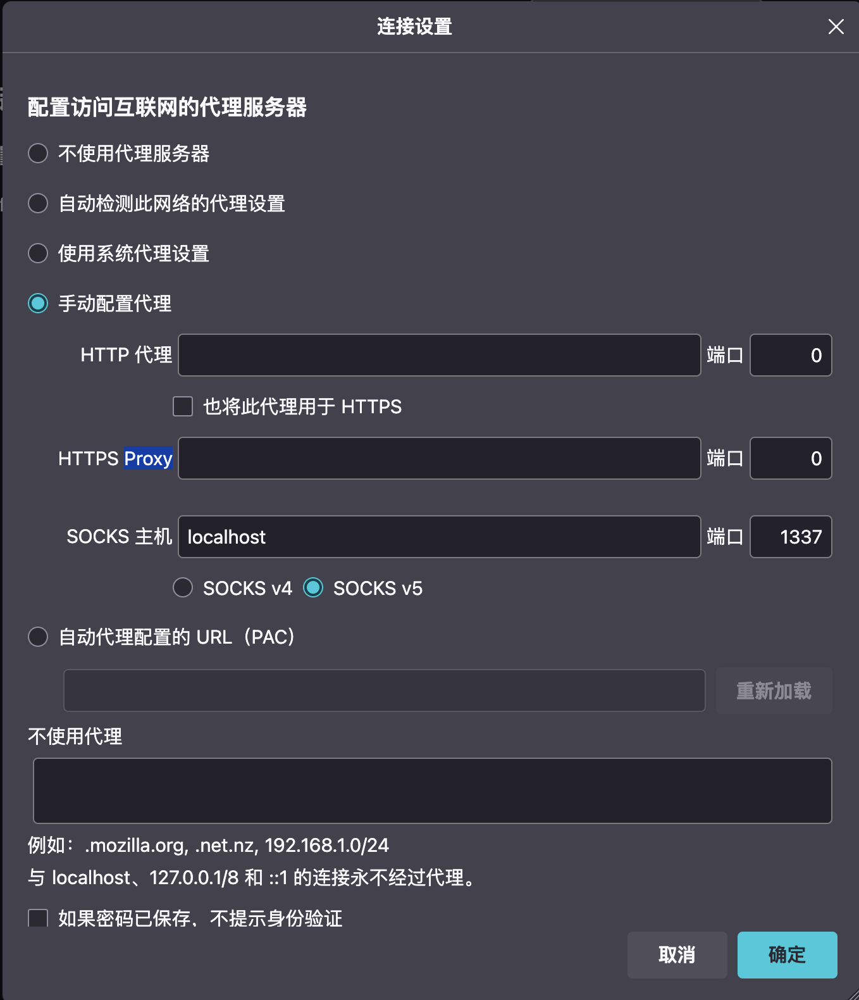

## ssh 连接到服务器

```shell
ssh -D 端口号（随便） username@ip
eg: ssh -D 1337 aha@10.249.250.240
```

## 找一个可以自己配置代理的浏览器

打开浏览器设置的 Proxy 面板（这里以 Firefox 为例）：



将端口号改成和刚才连接的端口号一样，保存设置重启浏览器，输入10.248.98.2，进行登录就可以了。

{}

### ssh 连接到服务器

```shell
ssh -D 端口号（随便） username@ip
eg: ssh -D 1337 aha@10.249.250.240
```

### 找一个可以自己配置代理的浏览器

打开浏览器设置的 Proxy 面板（这里以 Firefox 为例）：


将端口号改成和刚才连接的端口号一样，保存设置重启浏览器，输入10.248.98.2，进行登录就可以了。

{}