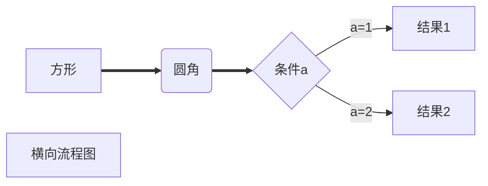
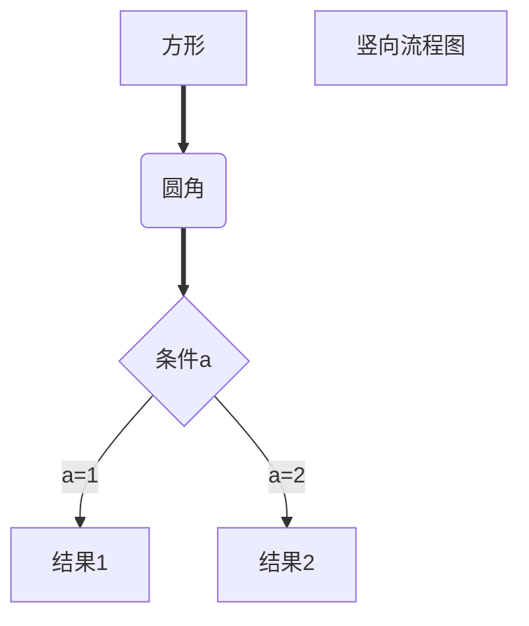

Typora 是一款支持实时预览的 Markdown 文本编辑器。为了保证良好的 Markdown编辑体验，**我们建议您先安装 Typora 后再来阅读之后的教程**。同时，由于 Markdown 语法较为简单，本文不作过多文字性描述，更多时候只提供示例的 Markdown 代码。读者只需要在 Typora 中输入对应的代码，即可看到实时预览的效果。（所有的代码块都可以复制！将鼠标移至代码块上，会发现右上角出现复制图标，点击图标即可复制！）

读者也可将本文档作为 Markdown 语法速查手册使用。

关于在 Markdown 中利用 LaTeX 书写数学公式的教程，请看[这里](../basic-of-latex-with-markdown)。

## 一、标题

语法：# (一级标题)  ## (二级标题)  ### (三级标题) ......

代码：

```markdown
## 这是二级标题
### 这是三级标题
```

效果:  

## 这是二级标题
### 这是三级标题

快捷键:

* Ctrl+数字1~6可以快速将选中的文本调成对应级别的标题
* Ctrl+0可以快速将选中的文本调成普通文本
* Ctrl+加号/减号对标题级别进行加减

## 二、段落

### 1、换行

段落之间空一行，才表示换行。

示例代码:  
```markdown
这是一个段落

这是一个段落
```

效果: 

这是一个段落

这是一个段落

若写为：  
```markdown
单词1
单词2
```

则两单词间仅有空格: 

单词1
单词2

### 2、分割线
语法:  ---或者*** 加上 回车

代码:
```markdown
---
```

或者

```markdown
***
```

效果:

---

## 三、文字显示

### 1、字体

语法:

* 粗体:  用一对双星号包裹
  * 也可用`<b>待加粗的文字</b>`
* 粗斜体：用一对三星号包裹
* 下划线:  用一对u标签包裹
* 斜体:  用一对单星号包裹
  * 也可用`<i>待倾斜的文字</i>`

以下两个功能并非所有编辑器都支持：
* 高亮:  用一对双等号包裹
  * 可以用一对mark标记（HTML语法）来实现高亮。
  * 对于Typora，在设置-Markdown-Markdown扩展语法中勾选“高亮”就可以使用这个语法了。
  
* 删除线:  用一对双飘号包裹（有的并不支持）

代码:
```markdown
**这是粗体**
***这是粗斜体***
~~这是删除线~~
<u>这是下划线</u>
*这是斜体*
<mark>这是高亮</mark>
```

效果:
**这是粗体**
***这是粗斜体***
~~这是删除线~~
<u>这是下划线</u>
*这是斜体*
<mark>这是高亮</mark>

快捷键:（Typora）
* 加粗:  Ctrl+B
* 删除线:  Shift+Alt+5
* 下划线:  Ctrl+U
* 斜体:  Ctrl+I

### 2、上下标
方法1：（不一定对所有编辑器都适用。对于Typora，在设置-Markdown-Markdown扩展语法中勾选“下标”、“上标”就可以使用这个语法了）
```markdown
x^2^
H~2~O
```

方法2：（对所有编辑器都适用）

```markdown
x<sup>2</sup>
H<sub>2</sub>O
```

效果：

x<sup>2</sup>
H<sub>2</sub>O

### 3、特殊字符（转义）

使用转义字符`\`。例如若要输入行内代码分隔符\`，就要使用

```markdown
\`
```

### 4、文本居中

代码

```markdown
<center>内容</center>
```

效果

<center>内容</center>

## 四、列表
### 1、无序列表
语法：*/-/+ (空格) 文字

#### 只有同一级别

```markdown
* 苹果
* 香蕉
* 橘子
```

效果:

* 苹果
* 香蕉
* 橘子

#### 有多个级别

只需在下一级别前添加制表符（Tab）或空格即可。

```markdown
* 一级分类
   * 二级分类 
		* 三级分类
```

效果:

* 一级分类
   * 二级分类 
		* 三级分类

快捷键:  Ctrl+Shift+]（增加缩进级别） 与 Ctrl+Shift+ [（减小缩进级别）

### 2、有序列表
语法：数字+.+空格

代码:
```markdown
1. 第一个标题
2. 第二个标题
3. 第三个标题
	  * 子内容1
	  * 子内容2
4. 第四个标题
```

效果:
1. 第一个标题
2. 第二个标题
3. 第三个标题
	  * 子内容1
	  * 子内容2
4. 第四个标题

快捷键:  Ctrl+Shift+]（增加缩进级别） 与 Ctrl+Shift+ [（减小缩进级别）

### 3、任务列表
代码:
```markdown
- [ ] 吃早餐
- [x] 背单词
```

效果:
- [ ] 吃早餐
- [x] 背单词

## 五、区块显示
语法：>+回车，每多一个>就加一层缩进级别。

代码:
```markdown
>这是最外层区块
>
>>这是内层区块
>
>>>这是最内层区块
```

效果:
>这是最外层区块
>
>>这是内层区块
>
>>>这是最内层区块

## 六、代码显示
### 1、行内代码
代码:
```markdown
`int a=0;`
```

效果:
`int a=0;`

快捷键:  Ctrl+Shift+`

### 2、代码块
以三个\`开头，三个\`结尾。

代码示例1:（C代表代码的语言，会根据它来确定高亮代码的哪些部分）

````markdown
```C
int main(){
  printf("Hello World!");
  return 0;
}
```
````
效果：
```C
int main(){
  printf("Hello World!");
  return 0;
}
```
代码示例2:

````markdown
```python
def hello_world():
  print("hello world!")
```
````

效果：
```python
def hello_world():
  print("hello world!")
```
快捷键:  Ctrl+Shift+K

## 七、链接
代码:

```markdown
www.baidu.com
[百度一下](https://www.baidu.com)
[百度一下](https://www.baidu.com "https://www.baidu.com")
```

效果:
www.baidu.com
[百度一下](https://www.baidu.com)
[百度一下](https://www.baidu.com "https://www.baidu.com")

快捷键:  Ctrl+K

## 八、脚注

说明:  对文本进行解释说明。

使用方法：在需解释的文本后跟上`[^文本]`，下一行接上`[^文本]:脚注内容`即可。

代码：
```markdown
这是一个技术[^①]
[^①]: 这是一个非常好用的框架。
```

效果:
这是一个技术[^①]

[^①]: 这是一个非常好用的框架。

## 九、图片插入
语法：``
示例代码:
```markdown

```

效果：


若要实现缩放，则需借助 HTML 语法。下面代码将上图缩小到原来的33%。
```HTML

```
效果：


快捷键:  Ctrl+Shift+I

## 十、表格

代码:
```markdown
|  1   |  2   |  3   |
| :--- | :--: | ---: |
|  4   |  5   |  6   |
|  7   |  8   |  9   |
|  10  |  11  |  12  |
```

效果:

| 1    |  2   |    3 |
| ---- | :--: | ---: |
| 4    |  5   |    6 |
| 7    |  8   |    9 |
| 10   |  11  |   12 |

若需实现合并单元格等高级特性，则需借助HTML语法。
```HTML
<figure><table>
<thead>
<tr><th>序号</th><th>列1</th><th>列2</th><th>列3</th><th>列4</th><th>列5</th><th>列6</th><th>列7</th></tr></thead>
<tbody>
  <tr><td>1</td><td>A</td><td><a href="https://baidu.com/">百度</a></td><td rowspan='3'>使用rowspan合并这几行的单元格，注意下面几行所对应这一列的单元格不要写！</td><td>3.0</td><td>48</td><td>36</td><td>12</td></tr>
  <tr><td>2</td><td>B</td><td><a href="https://bing.com">必应</a></td><td>3.0</td><td colspan='2'>使用colspan合并这两列的单元格。注意右面几行所对应这一行的单元格不要写！</td><td>48</td></tr>
  <tr><td>3</td><td>C</td><td><a href="https://github.com">GitHub</a></td><td>2.0</td><td colspan='2' rowspan='2'>同时使用rowspan和colspan合并行列</td><td>8</td></tr>
  <tr><td>4</td><td>D</td><td>这格没有链接</td><td>&nbsp;</td><td>2.0</td><td></td></tr>
</tbody>
</table></figure>
```
效果：
<figure><table>
<thead>
<tr><th>序号</th><th>列1</th><th>列2</th><th>列3</th><th>列4</th><th>列5</th><th>列6</th><th>列7</th></tr></thead>
<tbody>
  <tr><td>1</td><td>A</td><td><a href="https://baidu.com/">百度</a></td><td rowspan='3'>使用rowspan合并这几行的单元格，注意下面几行所对应这一列的单元格不要写！</td><td>3.0</td><td>48</td><td>36</td><td>12</td></tr>
  <tr><td>2</td><td>B</td><td><a href="https://bing.com">必应</a></td><td>3.0</td><td colspan='2'>使用colspan合并这两列的单元格。注意右面几行所对应这一行的单元格不要写！</td><td>48</td></tr>
  <tr><td>3</td><td>C</td><td><a href="https://github.com">GitHub</a></td><td>2.0</td><td colspan='2' rowspan='2'>同时使用rowspan和colspan合并行列</td><td>8</td></tr>
  <tr><td>4</td><td>D</td><td>这格没有链接</td><td>&nbsp;</td><td>2.0</td><td></td></tr>
</tbody>
</table></figure>

快捷键:  Ctrl+T

## 十一、流程图

对于Typora，在设置-Markdown-Markdown扩展语法中，勾选“图表”就可以使用这个语法了。

### 1、横向流程图

 代码:

 ````markdown
 ```mermaid
 graph LR
 A[方形]==>B(圆角)
 B==>C{条件a}
 C-->|a=1|D[结果1]
 C-->|a=2|E[结果2]
 F[横向流程图]
 ```
 ````

效果:



### 2、竖向流程图

 代码:

 ````markdown
 ```mermaid
 graph TD
 A[方形]==>B(圆角)
 B==>C{条件a}
 C-->|a=1|D[结果1]
 C-->|a=2|E[结果2]
 F[竖向流程图]
 ```
 ````

效果:



## 十二、其他显示效果

### 1、表情符号（emoji）

代码:

```markdown
:happy:、:cry:、:man:
```
效果：


### 2、快捷键显示

代码:

```markdown
<kbd>内容</kbd>
```

效果:
<kbd>内容</kbd>


### 3、填充的黑色箭头

> 代码：
>
> ```markdown
> &#x27A4;
> ```

> 效果：
> &#x27A4;

## 参考资料
- [【Typora 教程】手把手教你如何用Typora撰写笔记](https://www.bilibili.com/video/BV1h84y1Y7nn/)
