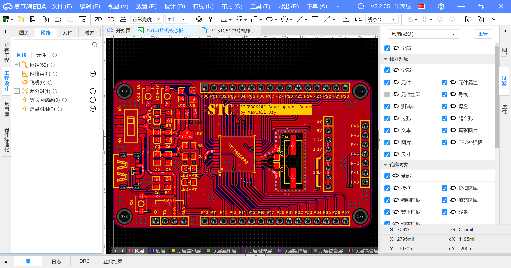

之所以水这么一篇文档，主要是因为自己和许多同学一样，经历了

1. 因为某门课需要，安装了某个大型软件；
2. 课程结束后卸载了该软件；
3. 后来在其他课程或个人需要，不得不重新安装该软件

的过程。
这些软件要么获取困难，要么安装过程繁琐、存储空间占用大，所以或多或少给大家带来了一些麻烦。

所以我想整理一下我在本科期间用到的专业软件，以及它们在哪些课程中被使用。
读者可以参考这篇文章，在开课前提前寻找相应的资源并安装，以及做出要不要卸载的决定。

> [!NOTE]
> Visual Studio, Visual Studio Code, Jetbrains 系列等泛用的开发工具不在本文的讨论范围。

> [!WARNING]
> 本文只列举必修课程会使用的软件，不作其他推荐。

> [!TIP]
>
> 1. 即使你不在自己的计算机上安装这些软件，学校多半会在对应实验室的计算机上提供它们。
> 2. 大多数时候，你只需要在这些软件上进行一些基础的操作，就能满足课程要求了，并不需要精通它们。

## Arduino IDE

- 可能用到的课程
  - 自动化认识与实践（如果有的话）
- 官网：[Arduino IDE](https://www.arduino.cc/en/software)
- 免费

Arduino IDE 是 Arduino 官方的集成开发环境，用于编写、编译和上传代码到 Arduino 单片机开发板。

2.0 版本以后的 Arduino IDE 其实就是 Visual Studio Code 套壳。
相比之下我更推荐使用 VS Code + Arduino 插件进行开发。
但如果你在这之前从来没用过 VS Code，那你最好还是用 Arduino IDE。

## AutoCAD

- 可能用到的课程
  - 机械制图
  - 金工实习
- 官网：[AutoCAD](https://www.autodesk.com.cn/products/autocad/overview)
- 收费，但是可以申请学生许可证，参见我们的另一篇博客：[你的学生邮箱能薅到哪些羊毛？](https://hoa.moe/blog/privileges-with-edu-email/)

著名的 CAD 软件，用于绘制 2D 和 3D 工程图，但简易程度不如 SolidWorks。

## Cadence 系列

也许你会在电路系列的实验课里听到 OrCAD Capture、PSpice、Cadence、Allegro 等名词，但它们的关系到底是什么？

1. 软件的开发商叫 [Cadence](https://www.cadence.com/zh_CN/home.html)。所以教学大纲等文件中诸如“使用 Cadence 完成电路仿真”的表达是不准确的。
2. Cadence 的产品包括
   [OrCAD](https://www.cadence.com/zh_CN/home/tools/pcb-design-and-analysis/orcad/orcad-capture.html),
   [Allegro](https://www.cadence.com/zh_CN/home/tools/pcb-design-and-analysis/allegro-x-design-platform.html)
   和 [PSpice](https://www.cadence.com/en_US/home/tools/pcb-design-and-analysis/analog-mixed-signal-simulation/pspice.html)。其中 OrCAD 和 PSpice 产品线是收购来的，Allegro 是自家开发的。
3. OrCAD 和 Allegro 都是绘制原理图和设计 PCB 的 EDA 软件。Allegro 更适合企业场景。
4. PSpice 用于电路系统的模拟和混合信号仿真。

Cadence 产品线的更多历史可以阅读吴川斌的这篇博客：[不要用阿狸狗画 PCB，不专业！用 Cadence！](https://www.mr-wu.cn/difference-between-cadence-allegro-and-orcad/)

Cadence 在一众 EDA 软件中的地位类似 Adobe 之于设计软件，其功能强大而复杂。

### OrCAD Capture

- 可能用到的课程
  - 电路实验 / 模拟电子技术实验 / 电路与电子技术实验
  - 电子工艺实习

OrCAD 和嘉立创 EDA、Altium Designer 同属于 PCB 设计工具，但 Candence 系的产品整体更全面复杂。

OrCAD Capture 用来绘制电路原理图，原理图可以用于 PSpice 仿真，以及导入到 OrCAD PCB Editor 绘制 PCB（对，原理图和 PCB 要用这两个软件分开处理）。

### PSpice

- 可能用到的课程
  - 电路实验 / 模拟电子技术实验 / 电路与电子技术实验
  - 电子工艺实习

PSpice 在学校内用来进行模拟电路仿真。
基于 SPICE 的电路仿真软件还有免费的 [LTspice](https://www.analog.com/cn/resources/design-tools-and-calculators/ltspice-simulator.html)。

PSpice 并不能独立运行，你必须在 OrCAD Capture 中绘制电路原理图，然后在 Capture 中调用 PSpice。

## Code::Blocks

- 可能用到的课程
  - 高级语言程序设计
- 官网：[Code::Blocks](http://www.codeblocks.org/) | 民间的汉化版：[codeblocks-cn](https://anbangli.github.io/codeblocks-cn/)
- 免费开源

虽然 CodeBlocks 在今天已经显得非常过时，但它开箱即用，不需要自己配置开发环境，因此它仍是学校里 C 语言课程的指定工具。

这大概是同学们在大学期间第一个要求使用的专业软件，用来对付作业和课内实验就够了，课外完全没有必要使用。

## 嘉立创 EDA

- 可能用到的课程
  - 自动控制实践实验
  - 电子工艺实习
  - 需要设计 PCB 的竞赛
- 官网：[嘉立创 EDA](https://lceda.cn/)
- 免费

国产的 PCB 设计软件，使用方便，很适合初学者。

就个人经验而言，嘉立创 EDA 最大的功劳是将 EDA 软件与**国内的**元器件供应商对接，同时省去了自己动手准备原理图库和封装库（绝大多数）的流程。

## MATLAB / Simulink

- 可能用到的课程
  - 大学物理实验
  - 信号分析与处理 / 信号与系统 / 数字信号处理
  - 自动控制原理
  - 自动控制实践
  - 自动控制实践实验
  - 系统建模与仿真
- 官网：[MATLAB - MathWorks](https://ww2.mathworks.cn/products/matlab.html)
- 收费

MATLAB 是一个用于算法开发、数据可视化、数据分析以及数值计算的高级技术计算语言和交互式环境。
它还带有 Simulink 等工具箱，用于建模、仿真和分析动态系统。
不用多说，控制专业的唯一真神。

MATLAB 每年会发行 2 个版本，例如 2023 年有 R2023a 和 R2023b。

学校的计算机房安装有被美国制裁前的 MATLAB R2015b。
如果你在个人电脑上使用较新版本的 MATLAB，可能出现个别 API 和 2015 年不兼容的情况。

学校机房中也装有国产的 [MWorks](https://www.tongyuan.cc/product/MWorks)，功能与 MATLAB 类似。

## Multisim

- 可能用到的课程
  - 数字电子技术实验 / 电路与电子技术实验
  - 自动控制实践实验
- 官网：[Multisim - NI](https://www.ni.com/zh-cn/shop/product/multisim.html)
- 收费

Multisim 是美国 National Instrments 开发的电子电路仿真软件。
学校里一般用它来仿真数字电路。

## Proteus

- 可能用到的课程
  - 自动控制实践实验
- 官网：[Proteus - Labcenter Electronics](https://www.labcenter.com/)
- 收费

Proteus 也属于 EDA 软件，但它的特点在于一个软件集成了原理图、PCB 设计和仿真三个功能，以及支持 Arduino 和 51 单片机的仿真。

学校本没有任何指定使用 Proteus 的场合，但是笔者在最近结束的**自动控制实践实验**中被要求制作一个直流电机驱动
L298N 的仿真电路，然而 Multisim 中没有 L298N 的仿真模型，不得不临时使用带有 L298N 元件的 Proteus。
所以还是把 Proteus 放进了本文。

## SolidWorks

- 可能用到的课程
  - 工程制图
  - 自动化认识与实践
  - 金工实习
  - 需要设计机械的竞赛
- 官网：[SolidWorks](https://www.solidworks.com/)
- 收费

SolidWorks 是基于特征的三维实体建模软件，也是我们学校自动化、机械等专业，以及各大小机器人竞赛队伍的必备工具。

SolidWorks 每年会出一个版本，但其实 2015 年后的 SolidWorks 大同小异。
低版本 SolidWorks 创建的文件在高版本中可以被打开，但反之不能。
一般来说，不需要刻意安装最新版本的 SolidWorks，并且 SolidWorks 一直存在卸载不彻底的问题，切换版本比较麻烦。

学校实验室安装的 SolidWorks 版本是 2018 教育版。
如果想加入校内的机器人战队的机械组，建议先了解队伍内指定的 SolidWorks 版本再安装。

## Vivado

- 可能用到的课程
  - 数字电子技术实验 / 电路与电子技术实验 / 数字逻辑设计
- 官网：[Vivado 概述 - AMD](https://www.amd.com/zh-cn/products/software/adaptive-socs-and-fpgas/vivado.html)
- 免费（标准版），OSA 网盘中有历史版本安装包。

Vivado 是 Xilinx 公司的 FPGA 开发工具，用于设计、仿真和综合 FPGA 电路。
2022 年 Xilinx 被 AMD 收购，Vivado 也被整合到 AMD 的工具链中。

---

如果你在学习过程中课程与专业软件的对应关系发生了变动，请在文末评论区中指出，笔者会及时更新。
