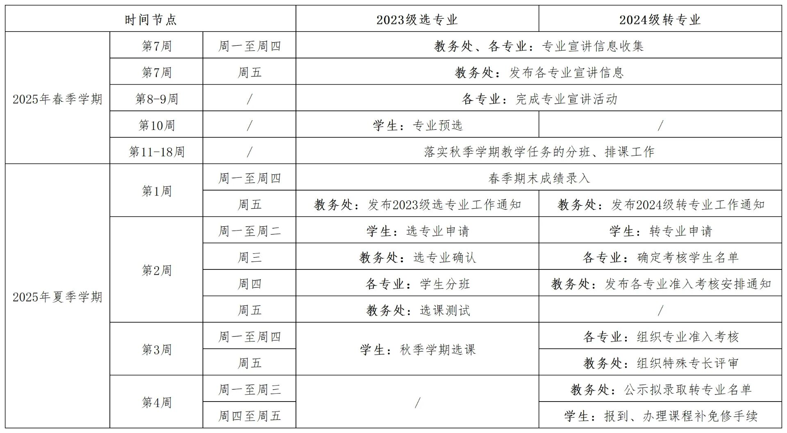
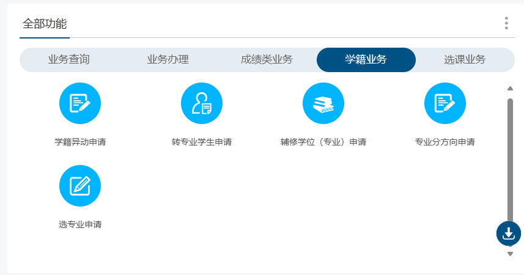
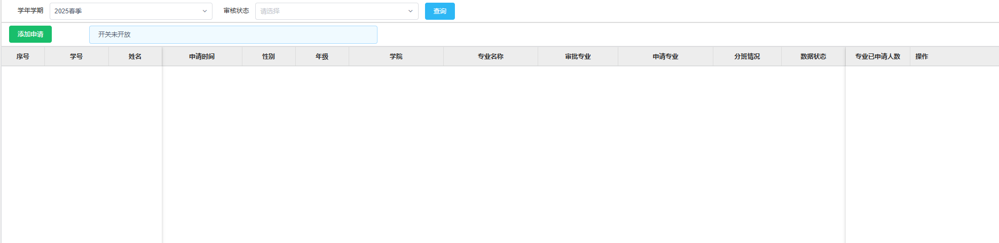
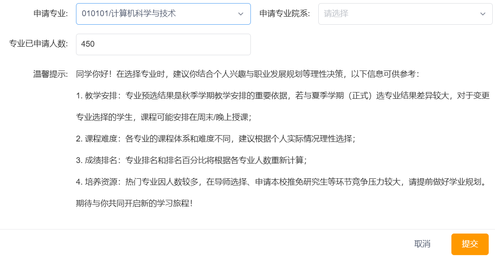
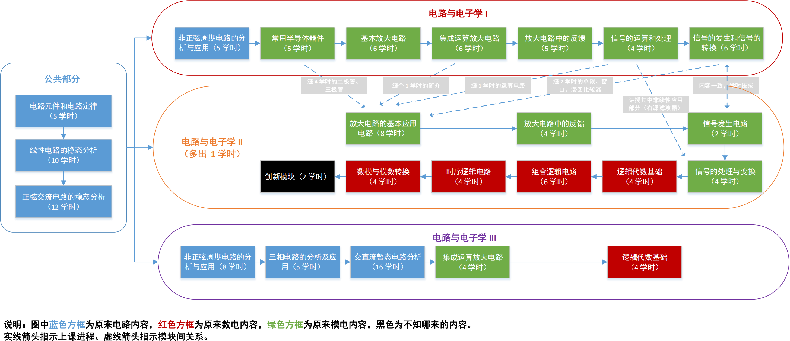

笔者 2023 年入学，作为 HITSZ 第一届大类招生学生以及课改元年的第一批学生，在大二专业预分流后思绪万千，藉此写下此篇文章，扼要介绍 HITSZ 大类招生以及高校课程改革的相关信息和现状，期冀能给后人留下一点点的个人经验之谈。

## 大类招生

2023 年起，全国高等院校招生采用大类招生，即招生以专业集群为单元，将相同或相近学科门类，通常是同院系的专业合并，按一个大类招生。学生入校后，经过 1 - 2 年的基础培养，再根据兴趣和双向选择原则进行专业分流。大类招生的初衷是让高中毕业的学生不必马上面临选专业的问题，可以在入学对专业相关课程有一定学习后再进行专业选择，减少选专业的盲目性，同时提高学校教学效率，平衡热门专业与冷门专业。

HITSZ 23 级的专业分流工作时间安排如下：

对于集群内专业，不设置专业门槛，不按成绩分流，学生自由选择专业。选课具体过程如下：登录`本研教学平台`，选择`学籍业务`，选择`选专业申请`，点`添加申请`，选择`申请专业`和`申请专业院系`，然后点确定即可在`查询`中看到申请记录。预选后可以在正式选专业时修改专业选择，但可能面临大三排课在晚上和周末的问题。

但是许多专业大类设置的都不合理。*HITSZ 23 级的计科、通信、光电、大数据在同一个集群内，有的学校的计科和土木在一个集群内，不胜枚举。*相比与其他学校，HITSZ 的大类招生的优势是集群内专业任选，没有按成绩分流，不用担心被分流到比较不好的专业；劣势是大二分流，分流过晚导致大一大二的课程设置不合理，专业课安排过晚影响正常学习进度。

大二夏季学期分流带来的是大二各集群都必须学习一些不是自己专业的专业课程。*例如：23 级计信集群的必修课有《信号与系统》和《数据结构与算法》，对于计科同学《信号与系统》非必要，对于通信、光电同学《数据结构与算法》非必要。*学习一些对本专业帮助较小的课程会增加学习压力以及压缩专业课学习精力，将更多时间放到不相关的课程上。

此外，将一些不太好安排的课程放入限选 n 选一中。n 选一课程和必修课在同一时间选课，且放在`限选`目录之下。对于此类课程，没有限定选课门数上限，学生可以多选，如果选择了非分流后专业的必修课程，分流后认定为跨专业课程学分。此类限选课不计入后续培养方案限选课要求的学分中，应将其当做必修课看待，n 选一本质是对大类招生的无法合理处理冲突课程安排的一种妥协。

<table border="1" cellspacing="10">
<tr>
  <th align="center">专业年级</th>
  <th align="center">课程</th>
  <th align="center">对应专业</th>
</tr>
<tr>
  <td rowspan="2" align="center">23 级自电集群大二下</td>
  <td>电磁场</td>
  <td>电气工程及其自动化</td>
</tr>
<tr>
  <td>控制理论中的代数基础</td>
  <td>自动化</td>
</tr>

<tr>
  <td rowspan="4" align="center">23 级机器人集群大二下</td>
  <td>传感与测试基础</td>
  <td>机器人工程</td>
</tr>
<tr>
  <td>机械工程测试技术基础</td>
  <td>机械设计制造及其自动化</td>
</tr>
<tr>
  <td>工程热力学</td>
  <td>能源与动力工程</td>
</tr>
<tr>
  <td>微电子制造技术</td>
  <td>电子封装</td>
</tr>

<tr>
  <td rowspan="3" align="center">23 级计信集群大二上</td>
  <td>数字逻辑设计</td>
  <td>计算机科学与技术</td>
</tr>
<tr>
  <td>数字逻辑电路设计</td>
  <td>通信工程、光电信息科学与工程</td>
</tr>
<tr>
  <td>高等代数</td>
  <td>数据科学与大数据技术</td>
</tr>

<tr>
  <td rowspan="4" align="center">23 级计信集群大二下</td>
  <td>计算机组成原理</td>
  <td>计算机科学与技术</td>
</tr>
<tr>
  <td>通信电子电路</td>
  <td>通信工程</td>
</tr>
<tr>
  <td>电磁场与电磁波</td>
  <td>光电信息科学与工程</td>
</tr>
<tr>
  <td>数学分析原理</td>
  <td>数据科学与大数据技术</td>
</tr>
</table>

## 课程改革

2023 年，伴随着大类招生而来的，还有课程改革。课程改革的初衷是改善落后的旧课程，根据时代发展特点和学生教评反映的意见对课程不完善部分去芜存菁，提高课程教学质量，增强学科建设。但是在课程改革中部分改革也产生了一些问题。

其一是必修课程学时内容被压缩。必修课程学时的压缩对于课程正常的教学是不利的，学时的压缩导致课程进度的起飞，相比原课程删减了一部分必要的知识，这些知识是后续学习相关专业课的必备知识，贸然删除会影响知识体系的构建。

其二是部分课程顺序设置混乱。最明显的就是部分实验课超前理论课，导致做实验的时候并不明白实验原理，失去了实验课原本应达到加强对知识理解的目标。部分课程顺序的混乱带来的前后知识缺失导致知识理解上的障碍，影响学生正常对知识结构逻辑的学习，影响了知识的前后连贯性。

其三是考核要求改革。如今“一校三区”联考是大趋势，加上这两年在进行学科建设评估，试卷结构、题型、出题风格都有一定的变化，部分课程还出现了更换教材的情况。在此种情况下，一味相信往年参考资料很难获得高分，对知识的理解与掌握提出了更高的要求。

> 拟定教学大纲的人应该明白，“学时计划”不仅仅是一个数字，而是代表着教师与学生互动交流的时间。[Oliver Wu](https://github.com/OliverWu)
> 
> 像臊子一样被剁碎的，不止学时，还有很多本来用来组成一个“课堂”的东西。 [Maxwell Jay](https://github.com/MaxwellJay256/)

## 个人建议

在互联网技术日渐成熟的当下，互联网资源带来的其中一个正面帮助就是轻易获取大量优质的视频教学视频。比如 bilibili 和中国大学 MOOC 上大量的优质的网课，这些课程之间并没有绝对的好坏，不同的人对网课有不同的需求和感受，需要选择最适合自己的网课。此外，通过一些方法能够访问哈深的课程回放，由于学校的大多数课程并不会和网课上课内容完全一致，课程回放和PPT的结合可以帮助你回忆上课内容，更有针对性地进行学习和复习。回放和网课的最大好处是可以自由控制进度条，倍速、跳过、暂停等能使教学更符合我们自己学习速度的个性化需求，在疑难点处停下能帮助理解。

人工智能革命带来的大语言模型（Large Language Model），如 Chat-GPT，文心一言，DeepSeek 等，颠覆着传统学习路径。LLM 的出现极大减少了资料查找搜集的繁琐，能够帮助解决绝大多数学习中遇到的问题和困惑，同时能帮忙完成一些简单的小任务。在 LLM 的帮助下，能够更高效地获得所需的东西，更高效进行学习。建立动态适应能力，培养人机协同能力，才能在 AI 飞速发展的当下跟上时代脚步。

参考各校的课程体系设置以及 HITSZ 往届专业培养方案的课程体系设置，可以适当进行自学，比如三电类课程，我个人建议按照电路模电数电的顺序分开学习，模电放在电路之后学习。计科学生建议提前自学数据结构和算法部分内容。由于培养方案的修改，部分课程合并、部分课程删除，但是有些删除或者合并的课程对于本专业的具有重要作用，对于此类课程建议自行学习掌握。

不要局限在课内所学，也不要局限在一本教材。不同教材交叉互补，从不同角度进行说明可以帮助你以更全面丰富的视角理解问题，内化知识。也可以在不同教材中选择最适合自己学习的一本教材进行学习，不要局限在课堂要求的教材，课堂也未必是按照一本教材进行教学，考试范围以老师所说以及 PPT 为准。

随着 HITSZ 高考分数线的不断上涨，学分绩 cGPA 在逐年上涨。当然，随着联考的到来，23 级的学分绩上涨趋势被抑制。在内卷日渐严重的当下，相互攀比、焦虑内耗成为许多人的常态，特别是在一些群聊中往往会出现发泄焦虑的情况。面对一两次的分数不理想不必为此焦虑担忧，应该做好的是准备下一科考试，而不是在已经结束的科目上自怨自艾，在过去的失败中沉沦。面对许多也许是遥不可及的同学，放平心态，他们并不是你的对手，你的对手永远是你自己。

在学分绩外，也鼓励大家参加各种竞赛和各种项目丰富经验。学分绩并不是大学生活的全部，只有在工程实践中应用所学知识解决实际问题，才是真正学会了相关知识。在项目开发中能迅速提升面向需求学习解决问题的能力，迅速提升自身能力。对于读研、就业，项目经历和竞赛经历都是能体现个人能力的很重要的加分项。

-------

在不断推进的大类招生和课程改革进程下，无论其合理与否，无论是否符合你内心所想，都希望你能够找到合适的方式平和地面对它们，请记住，不要因为某些不合理的改革而丧失对知识的热爱与追求，愿你我在追求知识与真理的大道上相逢！
