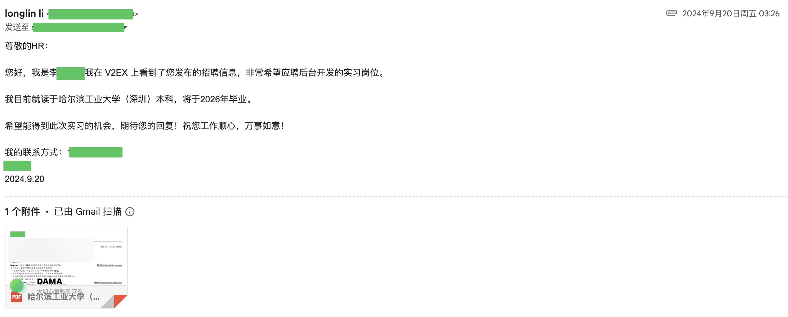
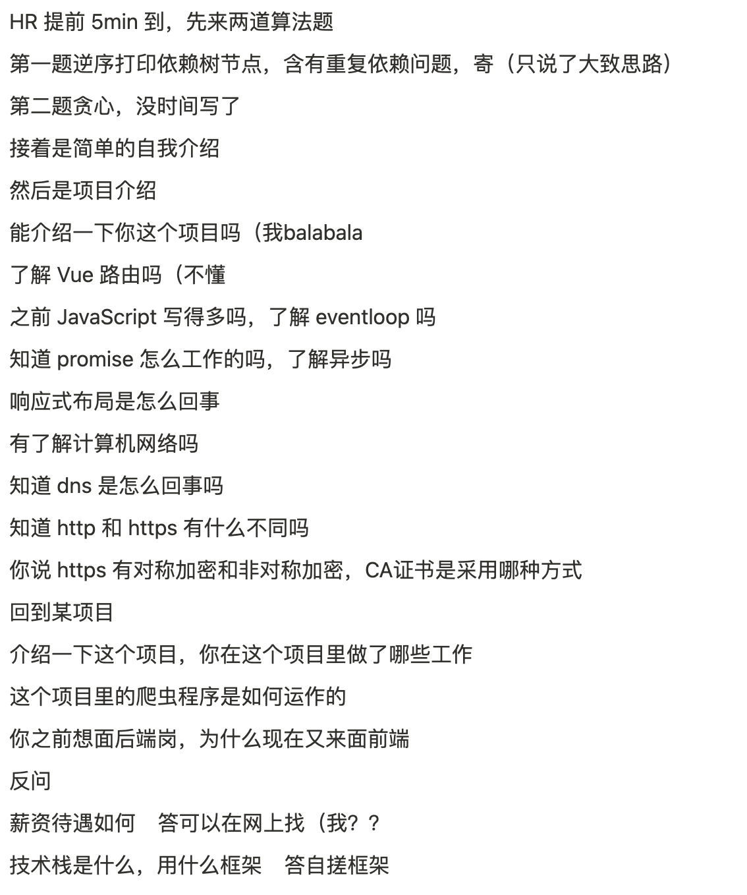

本文亦见于 [longlin 的个人博客](https://blog.longlin.tech/posts/summer-intern/)

## 引言

首先套用秋春招的说法，暑期实习也有所谓「金三银四」的概念，即大部分公司都会选择在每年的三月四月大规模地对候选人发起面试，并决定是否录取，到五月后基本只有零零散散的少数岗位还在继续招人，因此，越早投递简历，获得面试的机会才越大，入围的概率才会越大。当然，也不能排除后来者捡漏的情况出现。

此外，所谓「非通过性测试」是指，即使你在笔试、面试都发挥得非常好，面试官的所有提问都答上来了，也无法保证通过面试。有可能是你在非知识性考察的地方有所失误，也有可能公司已经找到了更好的人选，甚至可能是最坏的情况——你遇到了 KPI 面（即该职位实际已经没有 hc【人头数，岗位待招聘人数】了，面试官仍然还在为完成招聘指标进行面试，最终结果就是候选人面完就被秒挂，无论你答得有多好）。这种测试和我们以前熟悉的应试考试有所不同，过去我们可能考得越高，答得越好，就可以通过测试，击败其他候选人；但公司面试并不只是单纯划线，会对候选人做「综合性」考察。

下面将会简单介绍一下关于暑期实习的二三事，当然，本文仅仅是我的一家之言，很多东西我了解的也不够全面，所以也无法做出百分百的保证，还请读者海涵。

## 大致流程与规划

### 面试前

面试之前大概有以下需要提前完成的东西：

- 简历
- 确定公司及岗位
- 公司测评（看公司的具体面试流程）
- 笔试（某些公司可能没有该环节）

所谓越早投递机会越多，我们需要事先就调研好在我们想投递的「愿望单」上有哪些靠谱的公司，然后尽可能的去针对公司给出的 JD【Job Description，即应聘要求】写好简历。关于如何写好一份简历这里就不做过多展开了，网上其实有很多简历模板，可以对照着不同模板对简历进行修改，写完之后甚至可以让 AI 给简历进行润色。有一点需要注意的是，简历上的项目并不是越多越好，而是要尽可能贴合你正在面试的这个岗位。

如果过了简历关的话，规模比较大的公司可能还会有测评环节，注意定期检查邮箱和手机短信不要遗漏。测评一般需要花半小时以上去回答一些性格测试问题 or 智力题（找规律或图表题），有些题目是没有正确答案的。测评的目的是看你的性格是否是符合公司想要的理想性格（不同公司的理想性格不同）。目前为止我还没有听说过测评环节挂掉的，正常答题就好，少选一些负面情绪相关的，也不要敷衍了事。这一环节其实比较花费时间，尤其是当你海投的时候，因为公司会有要求在限定收到邮件的几天之内完成，而海投则可能会在短时间内一次性收到大量类似邮件，每场测评都要花费不少时间。

填完测评后，如果公司有笔试环节，你会收到一封笔试邀请的邮件。部分公司的笔试平台选择的是牛客，推荐提前到牛客网上找公司往年笔试题先熟悉一下（尤其是输入输出），少数是自己搭的平台（这里点名批评一下某 H 厂，参加过该厂机试的人都被这烂 IDE 坑惨了）。笔试题的类型和公司及岗位有关，有的会有较多考察计算机基础知识的选择题（比如淘天），有的则是直接手撕算法（比如携程），但一般笔试里手撕都占最大头。关于如何提升算法能力，推荐做好以下准备：

1. 确定好自己用什么语言做笔试，保证对这门语言的各种语法和常见数据结构比较熟悉
2. 去网上找下别人整理好的该门语言刷题总结（典型例题 + 详细解答）
3. 了解例题后多去做一些类似题型巩固
4. 定期刷题，保证题感还在

暑期实习的话，算法难度基本控制在 LeetCode 的 Easy / Medium 难度，不需要刻意去刷一些偏难怪题，企业本身也并不是只根据算法水平决定是否录用。

有很多人可能不太理解，刷算法题的意义何在，正式工作后反正都是打螺丝，写 CRUD【create, read, update, delete，指没什么技术含量的脏活累活】，根本用不上这么多复杂算法。我之前看到一种比较有道理的说法是：

> 公司不敢招连算法都不会的人。

说白了，在当前环境下，大部分简单乃至中等难度的算法都能依靠刷题的方式掌握，公司面试时出的算法题有时候甚至就是 LeetCode 原题。做出某道算法题，要么证明了你确实脑袋比较灵光，要么证明了你之前有为找工作「努力刷题」过，这就是目前公司出算法题考核的原因。

当然，也不是所有公司都按这些流程来，有些初创企业/开源企业乃至大厂往往会省略其中一些步骤，整个流程也会相应地简单化针对化。

### 面试

面试也分不同类型，有的是技术面，有的是 HR 面，有的是群面。按面试方式分还有线上面和线下面还有电话面等。（目前大部分都是线上面了，同城的话有可能会有线下）

目前国内规模比较大的厂基本都有三轮面试，部分大厂如 BAT【字节阿里腾讯，以前指百度阿里腾讯】的面试流程会更长，如腾讯的核心业务部门往往会面五轮甚至更多。初创公司的流程一般就不会那么多，可能只有一面，也不会像大厂一样拷打项目八股，往往是去评估你是否有一进来就能开始上手干活的能力，考察方式也可能因人而异。

面试时长也各有不同，技术面一般在半小时以上，我面过最久的一次是 90min。HR 面则一般在 15min 到 30min 内。

关于面试技巧网上其实应该有很多总结，这里就只说一些我个人认为可能需要注意的点：

- 可以把话题尽量往你擅长的东西上引；
- 技术面介绍项目的时候背景可以一笔带过，面试官更注重你这个项目里使用了什么技术，为什么这样用，有哪些技术难点；非技术面如果涉及到项目介绍，则是重点突出你做该项目的原因，是想解决什么难点，或是出于什么兴趣？
- 事先了解好你面试的这个岗位，公司是用的什么技术栈？有没有转正 hc？base 地【即工作地点】在哪？

至于项目八股，这和面试的岗位强相关，可以多到牛客/知乎上去看关于这个岗位的面经。不过，别人的面经固然有用，但最有用的面经肯定还是自己的，所以每次面完后的复盘时间非常重要。遇到的各种不会的知识点要第一时间去补，多思考下次遇到同样问题的时候该怎么回答。

## 我的暑期流程

先大概介绍下我的个人背景和技术栈。我是 22 级自动化本科生，学分绩后 50%，比较拿得出手的项目其实只有 HOA 一个，其他写在简历上的都是我个人的玩具项目。获奖的话有个 RoboMaster 团体奖，数模省三，数竞三等奖，但和我要面试的岗位没有什么关系，甚至可以说是减分项。技术栈比较杂，C/C++ 和 Python 大一大二写得多，做过 Qt6、PyQt 这种 GUI 框架；前端方向能写 Vue 和 React，基础三件套，由于之前折腾博客所以对于一些博客框架如 Hugo 和 Astro 也算是了解些。大部分项目其实都还是 Web 端样式。接触过一点微信小程序开发，用过 nodejs（面某厂的时候面试官直言我简历单薄，项目都比较简单，没什么好问的）。和其他自动化专业的同学不同，我的技术栈基本和本专业无关，但是和真正的计算机科班相比也差了很多，比如操作系统和数据库基本就没怎么接触过，Java 也不会，是处于一个非常尴尬的境地。

我大一结束后就不打算走保研这条路了，所以把卷学分绩的时间花在了一些奇奇怪怪的技术栈的学习上；真正开始准备找实习是大三上学期开学，确定技术方向也是那时候，其实已经算比较晚了，如果是锚定本科就业的话。

以下的经历为隐私保护做了些许模糊处理，还请见谅。

### 壹

最开始的时候，我也是奔着「后端」岗位投的简历。去年九月，大三刚开学那会逛论坛看到了某厂的日常招聘帖子，加上看到当时秋招的惨烈，想着该找个实习丰富下简历了，于是连夜改了版简历投递。

一天后，我收到面试官的电话，说我的简历更适合投递前端岗位，问我是否考虑转岗。犹豫了一天后最终还是决定试试，不过同期我也投递了另一个厂的后端岗位，当时的想法是两个岗位都面着试试，然后找到更适合自己的那个。由于是第一次投简历，还出了岔子，投错了部门，好在后面面试官把我简历转过去了。9 月 26 号，交出了人生第一面后，理所应当的挂了。

现在看来，问的问题其实不难，但是由于第一次面非常紧张，很多问题都没答好。算法题更是一题都没写出来，反问也踩雷，属实是来搞笑的。

另一家厂面试约在国庆后，其实本来应该趁国庆期间刷刷算法练练题感的，不过由于家里有事回了趟老家，所以也没怎么认真准备，面试自然也是理所当然的失败了。

不过，根据两次面试的感觉，我发现自己的技术栈确实更适合前端，所以在这之后明确了自己的目标，并在未来一个月内为之做好准备，打算到十一月底再次投递。

### 贰

一个月的空窗，我主要搭了个个人简历网站，补了下 JS 的一些特性，熟悉了下现代前端框架，练了一百多道 LeetCode 题。说来也巧，正在我准备开始再次投递的时候之前拉我面前端的厂（某 T 厂）又把我捞起来了，给我发了一面邀请。前两轮都面得比较顺利，第一次过二面非常激动，说明这一个月的努力确实有所成效。面完三面自我感觉还算良好，正好当时也期末了，学校考试这边也得花时间，就没有继续投递其它公司。结果，三面面完一个星期后，手机收到流程结束短信，整个人心都凉了，横向对比挂了。后面由于还要应付考试，所以面试也没有特别准备，该厂后面还捞了我两次，全部都是一面挂掉。当时面完最后一场，我已经精神恍惚了，很多非常简单的问题都没回答出来。十二月面了一个月，零 Offer 收尾，回家沉淀去了。

### 叁

二月底回到学校，重新开始投递简历。这轮投递的第一面还是 T 厂，2 月 26 号。不得不说 T 厂除了面试流程长和喜欢横向对比外，整个面试体验还是很好的，能从面试中学到很多东西，面完也能针对性的去补自己还未掌握好的知识点。

投 A 系大厂部门直接简历挂，而 B 厂则由于很看面评，当时还没准备好，HR 打电话的时候说的是四月底才有时间。其他的投了几家都石沉大海。T 厂这回捞了我两次，面了三个部门，前两个部门都是二面挂。当时心灰意冷，因为面第二个部门的时候和二面面试官聊得挺开心的，结果面完就挂了。从开始投简历将近一个月，我还是零 Offer，看到牛客上许多人都 OC【offer call，即告知 offer 内容的电话】了，心里确实有些难受。尤其是后来面某音乐客户端厂一面的时候，我表现不佳，结果面试官小声嘀咕被我听到了：「你连这个都不知道啊」「别给我扯些有的没的」，匆匆结束面试后我开始严重怀疑自己的能力，整个人都在崩溃边缘。第二天，我抱着「肯定是 KPI 面」的心态面完了下午的 T 厂二面，然后出去外面散心思考未来打算，结果突如其来的电话通知我二面过了，让我明天参加线下三面，这离我面试结束只过了不到三十分钟。2025 年 3 月 26 号，两场决定性面试，中午 J 厂三面，晚上 T 厂三面，幸运的是，之前的努力最终换来了好消息。

## 结尾

整体来说今年就业环境在部分岗位还是有所回暖。最卷的赛道应该是后端，据我了解三月初各大厂开始面人，四月初就基本没有 hc 了，完全是地狱难度。前端和客户端今年有所扩招，有时候你投的是后端岗 HR 也会打电话来问你有没有面前端的意向。

另外，今年开始几家大厂如腾讯，字节可以无限复活，即使挂了一次也能被别的部门给捞上来。当然，面试是会留面评的，面试官在面你之前一般也会看看你之前面的怎么样。

说完好消息再来说说坏消息，现在有些厂有硬性学历门槛了。比如 A 厂，这次我投递了几个部门都没过简历关，不知道是卡了专业还是卡了学历。再就是面试流程越来越长，面个实习都要走好几场面试，难度也提升不少，而且大厂都喜欢进行横向对比，不到最后一刻结果出来都无法预料自己是不是会被其他人比下去。

暑期实习作为春秋招的预演尚且如此，目前来看竞争压力只会越来越大。如果有类似目标打算的读者，还请提前制定好目标，做好准备。
