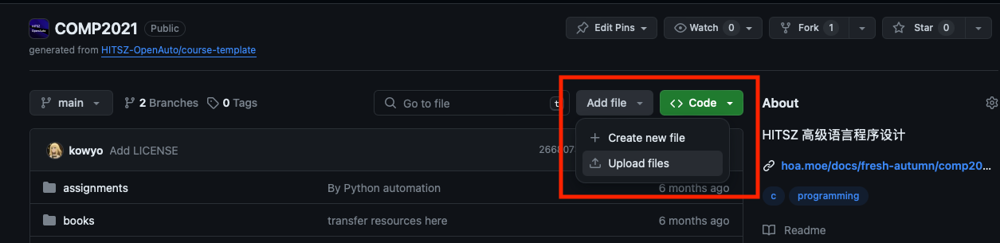

## 内容公约

我们目前的内容有以下板块：

- 课程文档：每门课老师的授课风格、学习经验分享、作业参考答案、实验指南以及考试复习题
- 博客：保研，留学，考研和技术分享
- 信息聚合：校内热门群聊，常用站点

我们的初心是分享学习经验，坚决反对抄袭/盗版，以下是不宜上传的内容：

- 盗版电子书，盗版软件以及一切和盗版有关的东西
- 未经老师同意上传的教学课件
- 代码，因为它们的抄袭成本明显低于借鉴成本

## 格式公约

### 编写文档时

1. **不要随意删除/修改 他人的评价、建议**

2. 在提出某项意见/评价时请按格式署名（不一定要真实姓名）、标注时间，放在你所修改部分的最末尾。例如：

   > 文 / [IcyDesert](https://github.com/IcyDesert), 2024.5

3. 记得写清楚 commit 信息和 PR 的标题 。例如，不要只写「增加/修改/删除一些内容」，而要明确写清：「增加**xx教师的信息及评价**」、「更新**课程大纲**」、「增加**课程建议**」、「修改**学分学时安排**」等。
   （可参考： 「[约定式提交](https://www.conventionalcommits.org/zh-hans/v1.0.0/)」和「[向一个项目贡献](https://git-scm.com/book/zh/v2/%E5%88%86%E5%B8%83%E5%BC%8F-Git-%E5%90%91%E4%B8%80%E4%B8%AA%E9%A1%B9%E7%9B%AE%E8%B4%A1%E7%8C%AE)」）

4. 中文排版应按照 「 [中文文案排版指北](https://github.com/sparanoid/chinese-copywriting-guidelines) 」的规范进行

### 上传文件时

1. **不要随意 删除/修改 已有文件**
2. 请在创建 PR 的时候填写我们的 [检查清单](https://github.com/HITSZ-OpenAuto/.github/blob/main/pull_request_template.md?plain=1)

#### 关于提交信息（commit message）

1. 确保 commit message 和 PR 的 title 清晰而明确。除非是 [hoa.moe](https://github.com/HITSZ-OpenAuto/hoa.moe) 中代码相关的修改，否则都应该使用全中文以提升可读性和观感。

2. 对于上传/修改/删除文件，写清楚上传了什么文件或是对已有的文件进行了什么修改。

   示例：增加了 2024 年度考试题及答案；增加了一个新版本笔记；修改了 WJD 笔记中的一些错误；删除了 WJD 作业文件夹中的部分内容；等等

3. 对于整理文件夹：写清楚具体操作。比如，将试题按年度整理；等等。

#### 关于 tag.txt

tag.txt 记录的是课程类别（category）、课程名称（name）、开课学期（semester）和模块（module，对于限选课）。通常只有在培养方案发生变动时，此文件内容才会发生变化。它会直接影响该课程在网页前端的显示情况，所以对于这个文件的修改一定要根据当年的培养方案慎重处理。

- tag.txt 变量说明：
  - category: 必修；限选；跨专业选修；研究生阶段课程；文理通识；归档
  - module: 实践课程体系；控制理论与控制工程；机器人与智能系统；智能检测（注意：仅有限选课有此字段）
  - semester: 第x学年x季（示例：第一学年秋季 / 第一学年春季）【不同学期用斜杠分开，需保留斜杠前后的空格】
- name: （示例）大学物理实验
- 提交信息示例：更改课程类别为「归档」，更改课程开课学期为「大三·秋」

## 操作指引

如果你无法访问 GitHub，请参考 [《新人指南：不使用第三方工具访问 GitHub》](https://hoa.moe/blog/access-github/) 这篇文章，这里笔者更推荐使用 [修改 Host 文件](https://hoa.moe/blog/access-github/#3-通过修改-hosts-文件访问-github) 的方法。

### 如何编写课程文档？

HITSZ OpenAuto 的课程文档大致可分为以下几部分，你如果发现其中任一项有缺失/与实际情况不符，或是你有自己的理解与体会，都可以增补。

- 课程名。
- 课程性质：必修/限选/选修；考试课/考查课；学分/学时；成绩构成。
- 教材与参考书；
- 授课教师及授课风格；
- 授课内容/课程建议/备考策略。

由于本网站的特殊架构，各个页面实际上是从分属不同仓库的 README.md 文件拉取的，因此对应修改需要定位到对应仓库。网站的页面中已经做好了链接到各仓库的入口，点击即可跳转编辑相关文档：


对文档做完修改后，点击图示绿色的 commit 按钮提交更改。


填写好 commit message，确保选择的是创建 patch-branch（而不是 Commit directly to the main branch），再点击 Propose changes 就成功创建了 PR。


在发起 PR 时，可以通过 suggest reviewers 邮件通知我们，这样我们就能更快地进行 review 并及时给予回复。然后填写 title 和 description，再点击 Create pull request 就成功将 PR 提交审核啦！🎉


PR 审核通过后，你的更改会被合并进你所修改的仓库，稍后即可在网页上看到你撰写的内容。

### 如何上传文件？

如果你只是想要上传单份文件，可以通过 Upload Files 按钮实现



上传完文件后，填写好 commit message，确保选择的是创建 patch-branch（而不是 Commit directly to the main branch），再点击 commit changes 就成功创建了 PR。之后的流程和上面的更新文档一致。

但是如果你想上传、修改或删除多个文件，我们更建议你在本地 Git 进行操作，如果你没有 Git 相关的知识，请查看开源技术协会同学编写的 [Git 教程](https://wiki.osa.moe/guide-for-beginner/git-tutorial/)。

简易版流程如下：

首先将你想修改的仓库 fork 一份副本至自己名下。


来到自己刚 fork 的仓库中，确保准确无误后将仓库 clone 至本地，仓库 url 可以由图中得知。


你或许已经接触过一些 Git 命令，你也许会认为它很复杂，也难以理解，但如果仅仅是想添加一些文件，修改一下文档，你只需要掌握以下几个命令即可：

```bash
git clone [your-repo-url]           # 将仓库克隆至本地

# 进行各种修改之后

git add .                           # 将当前目录下所有修改部分提交至暂存区
git commit -m "[commit message]"    # 提交 commit message
git push                            # 将本地修改同步到远端仓库

```


如果在 push 时遇到以"fatal: unable to access"开头的错误，例如：

```bash
fatal: unable to access 'https://github.com/<username>/AUTO3005.git/': OpenSSL SSL_connect: SSL_ERROR_SYSCALL in connection to github.com:443
```

可能是因为你的网络环境无法访问 Github，可以尝试使用 VPN 或者参考 [《新人指南：不使用第三方工具访问 GitHub》](https://hoa.moe/blog/access-github/#3-通过修改-hosts-文件访问-github) 中修改 Host 文件的方法。



注意将 [ ] 中内容进行替换——与 Github 上的 commit message 类似，它也遵循 **约定式提交**。

当你完成上述步骤后，来到你的远端仓库，点击 contribute 按钮，你会发现一个大大的 Open pull request 按钮正等着你呢！


同样，在发起 PR 时，填写 title 和 description，选择 suggest reviewers，指定几位审核你 PR 的维护者，再点击 Create pull request，就成功将 PR 提交审核啦！
