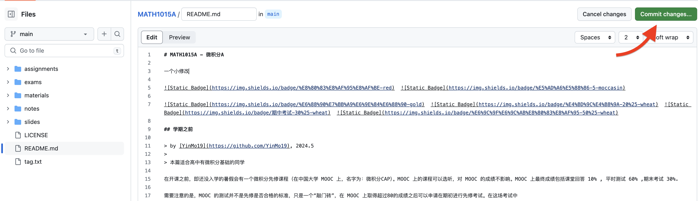
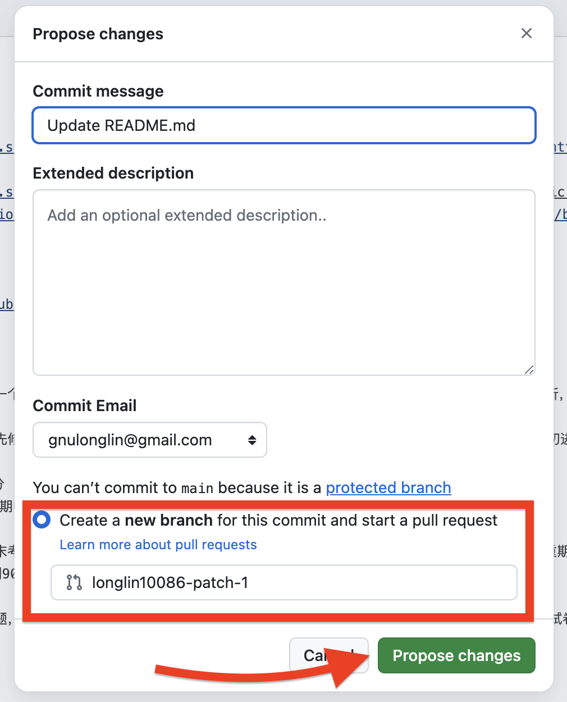
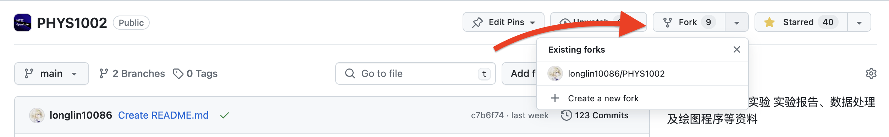
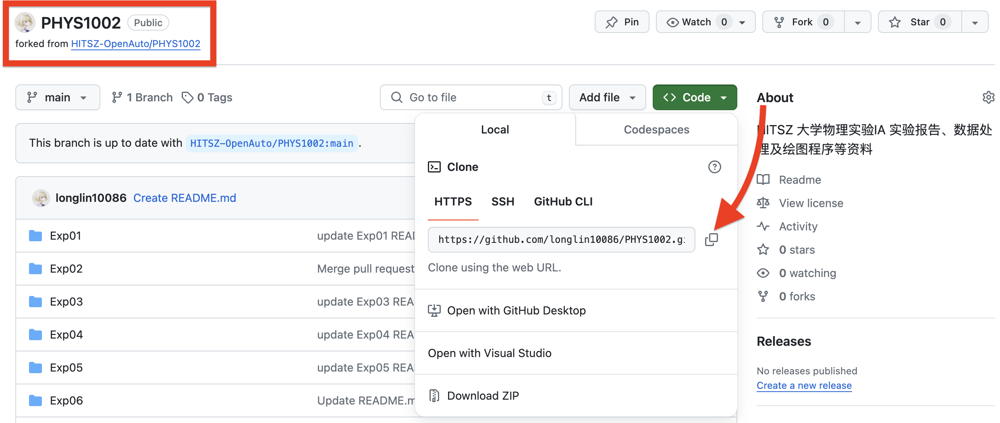
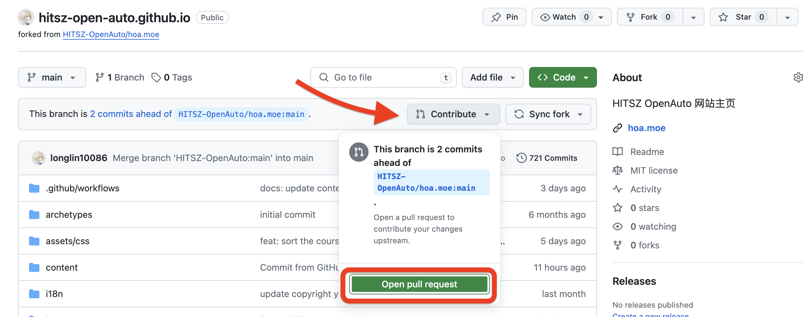
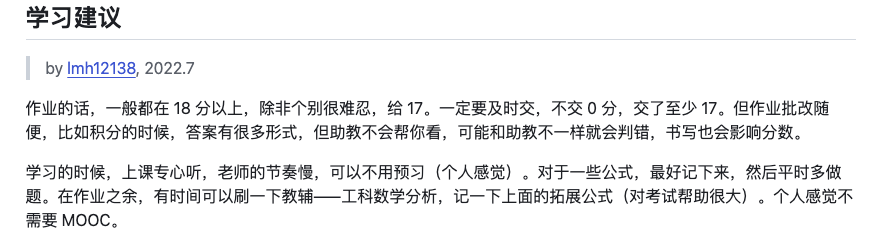

## 💡如何编写课程文档？

由于本网站的特殊架构，各个页面实际上是从分属不同仓库的 README.md 文件拉取的，因此对应修改需要定位到对应仓库。网站的页面中已经做好了链接到各仓库的入口，点击即可跳转编辑相关文档：


对文档做完修改后，点击图示绿色的 commit 按钮提交更改。



确保选择的是创建 patch-branch ，再点击 Propose changes 就成功提交 PR 啦！



编辑完成后点击右上方的"Commit changes"即可提交更改，我们会在收到 PR 的第一时间进行查看。

在发起 PR 时，可以通过 suggest reviewers 邮件通知我们，这样我们就能更快地进行 review 并及时给予回复。


**PS：记得写清楚 commit message 哦（具体 message 要写什么可以参考 「[约定式提交](https://www.conventionalcommits.org/zh-hans/v1.0.0/)」）**

## ❓如何上传文件

如果你只是想要上传单份文件，可以通过 Upload Files 按钮实现


但是如果你想上传多个文件，我们更建议你在本地 Git 进行操作，如果你没有 Git 相关的知识，请查看开源技术协会同学编写的 [Git 教程](https://wiki.osa.moe/guide-for-beginner/git-tutorial/)。

流程如下：

首先将你想修改的仓库 fork 一份副本至自己名下。



来到自己刚 fork 的仓库中，确保准确无误后将仓库 clone 至本地，仓库 url 可以由图中得知。



你或许已经接触过一些 Git 命令，你也许会认为它很复杂，也难以理解，但如果仅仅是想添加一些文件，修改一下文档，你只需要掌握以下几个命令即可：

```bash
git clone [your-repo-url]           # 将仓库克隆至本地

git add .                           # 将当前目录下所有修改部分提交至暂存区
git commit -m "[commit message]"    # 提交 commit message
git push                            # 将本地修改同步到远端仓库

```

注意将 [ ] 中内容进行替换。

当你将上述内容都做完后，来到你的远端仓库，点击 contribute 按钮，你会发现一个大大的 Open pull request 按钮正等着你呢！



**恭喜你成功提交了你在 OpenAuto 的第一个 PR ！🎉**

## ❗️编写时有哪些注意事项？

1. **不要随意删除/修改 已有文件 或 他人的评价、建议**
2. **在提出某项意见/评价时请按格式署名（不一定要真实姓名）、标注时间，例如：**



3. **文档格式尽量按照 「 [中文文案排版指北](https://github.com/sparanoid/chinese-copywriting-guidelines) 」要求编写**


## 写在最后

最后，由衷感谢每位 OpenAuto 项目的贡献者以及屏幕前的你，本项目的成长离不开你们的支持。希望 OpenAuto 能有越来越多的贡献者参与其中，能帮助越来越多的同学！
