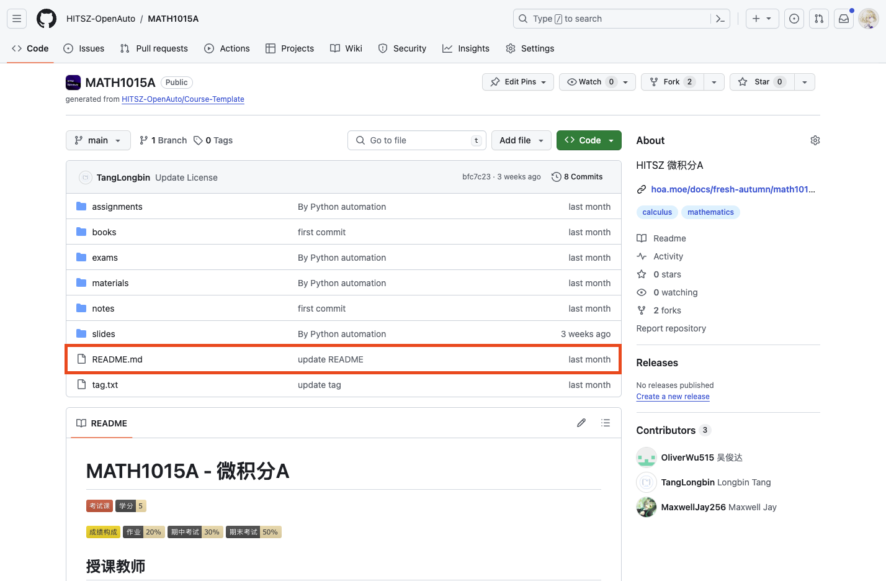
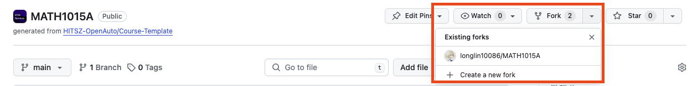

## 💡如何编写 OpenAuto 文档？

由于本网站的特殊架构，各个页面实际上是从分属不同仓库的 README.md 文件拉取的，因此对应修改需要定位到对应仓库。网站的页面中已经做好了链接到各仓库的入口，点击即可跳转：

可以发现，我们的页面 index 实际上是来源于此文件：

由于设置了分支保护，我们不支持你直接在 main 分支进行修改。你可以先将此仓库 fork 出一个自己的分支：

接着就可以在自己分支上进行修改开发，并最终向我们提交 pull request 了。经过我们审核通过后，你修改的部分就会被展示在网页上了！（关于 git 的具体操作这里就不展开讲了，有兴趣的可以阅读 [git 官方手册](https://git-scm.com/book/zh/v2)）

## ❗️编写时有哪些注意事项？

1. **不要随意删除/修改 已有文件 或 他人的评价、建议**
2. **在提出某项意见/评价时请按格式署名（不一定要真实姓名）、标注时间，例如：**

3. **文档格式尽量按照 「 [中文文案排版指北](https://github.com/sparanoid/chinese-copywriting-guidelines) 」要求编写**

## 写在最后

最后，由衷感谢每位 OpenAuto 项目的贡献者以及屏幕前的你，没有你们的支持就没有本项目。希望 OpenAuto 能有越来越多的贡献者参与其中，能帮助越来越多的同学！
