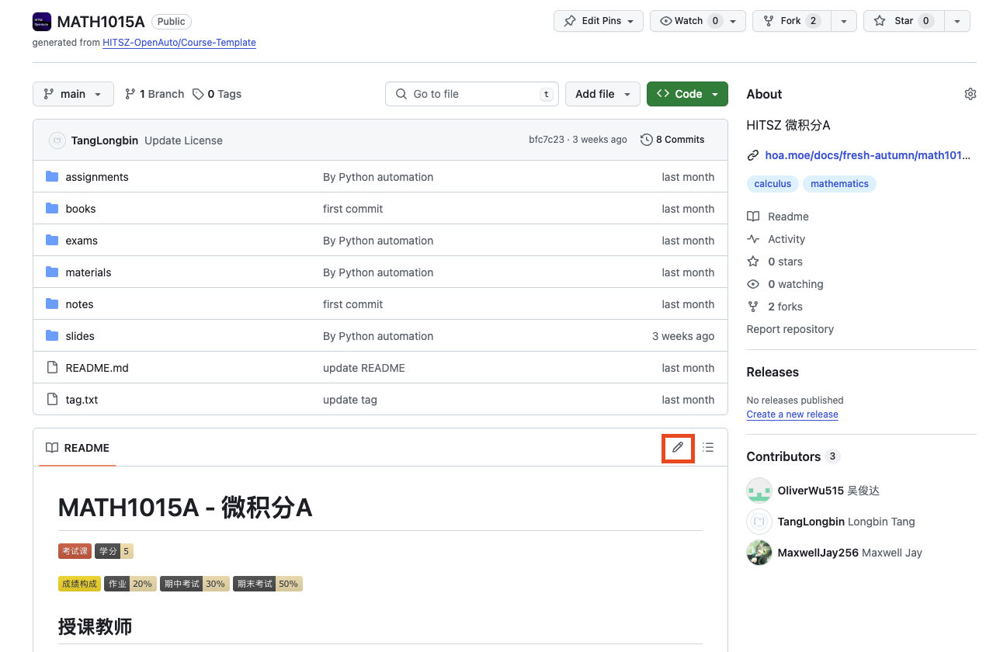

## 💡如何编写 OpenAuto 文档？

由于本网站的特殊架构，各个页面实际上是从分属不同仓库的 README.md 文件拉取的，因此对应修改需要定位到对应仓库。网站的页面中已经做好了链接到各仓库的入口，点击即可跳转：

点击下图中的按钮即可编辑：

编辑完成后点击右上方的"Commit changes"即可提交更改，我们会在收到 PR 的第一时间进行查看。

## ❗️编写时有哪些注意事项？

1. **不要随意删除/修改 已有文件 或 他人的评价、建议**
2. **在提出某项意见/评价时请按格式署名（不一定要真实姓名）、标注时间，例如：**

3. **文档格式尽量按照 「 [中文文案排版指北](https://github.com/sparanoid/chinese-copywriting-guidelines) 」要求编写**

## 写在最后

最后，由衷感谢每位 OpenAuto 项目的贡献者以及屏幕前的你，本项目的成长离不开你们的支持。希望 OpenAuto 能有越来越多的贡献者参与其中，能帮助越来越多的同学！
