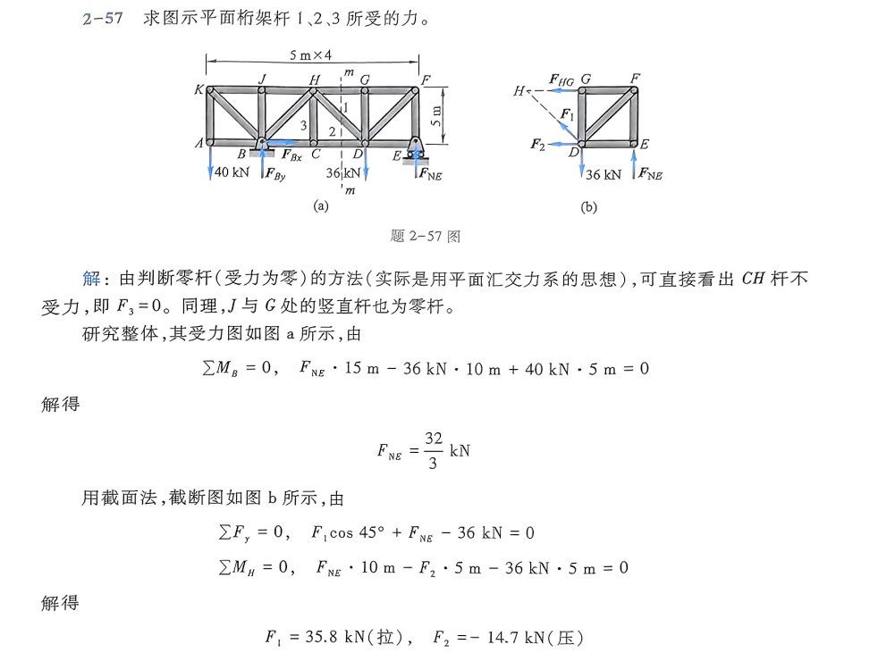
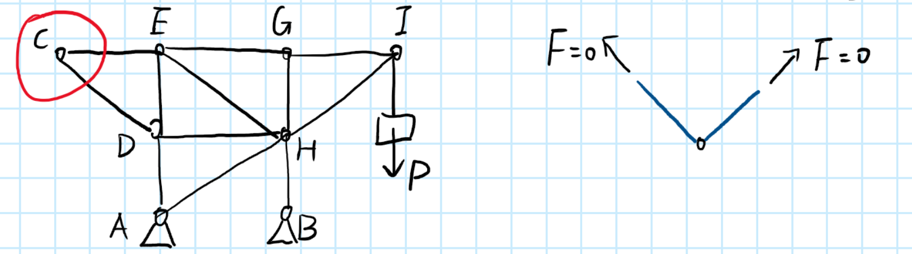
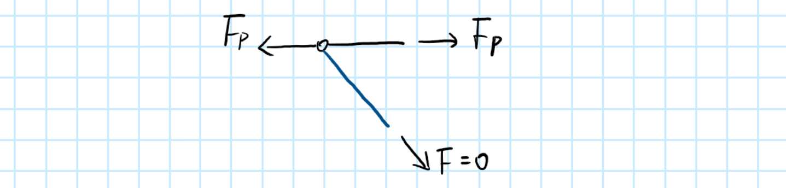
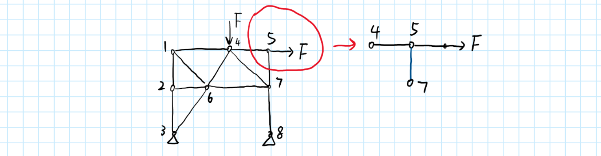
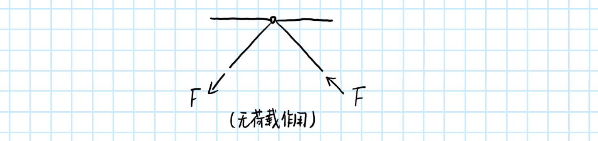
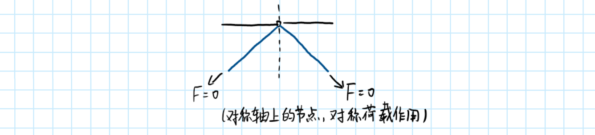
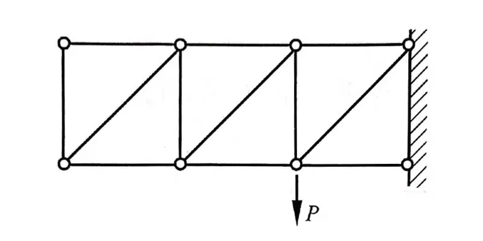
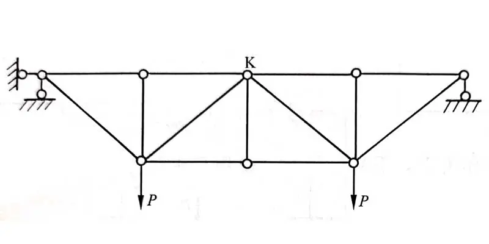

前两天做理论力学作业的时候，我看到习题解答上一道题的答案是这样的：

第一句“直接看出 $CH$ 杆不受力”直接给我整不会了。
然而老师在课堂上并没有详细讲解判断平面桁架中受力为零的杆的方法，所以我赶紧把作业扔在一边查了点资料。

研究了一会儿之后，我感觉零力杆的判定还是挺有意思的，属于理论力学解题的一个小技巧。
故在此分享一下自己整合网上资料后的内容。

当然，这不是什么重点知识，我就随便一写，你就随便一看。
文末有一道小例题，如果你能迅速得出答案，那么恭喜你，零力杆判断不可能难住你啦！

---

## 平面简单桁架中零力杆的判断方法

平面简单桁架中，那些受力为 0 的杆件被称为零力杆，或者“零杆”。
零杆是桁架在特定载荷下的特殊情况，虽然在实际工程中不可去掉，但在理论受力分析时可以被去掉以简化计算。

以下是 4 中常见的零力杆情况。

### 1. L 形节点

- 不共线的两杆节点不受外力作用时，两杆皆为零力杆。
  

证明很简单，对于节点 $C$，其平衡条件是 $\boldsymbol{F_{CE}} + \boldsymbol{F_{CD} = \boldsymbol{0}}$。
然而 $\boldsymbol{F_{CE}}$ 与 $\boldsymbol{F_{CD}}$ 并不共线，因此只能 $\boldsymbol{F_{CE}} = \boldsymbol{F_{CD}} = \boldsymbol{0}$。

- 若其中一杆与外力共线，则此杆内外力相等，不与外力共线的一杆为零杆。
  

### 2. T 形节点

- 无外力作用的连接三杆的节点，若其中两杆在一条直线上，则不共线的一杆为零力杆，而共线两杆内力相等且性质相同（同为拉力或同为压力）。
  

- 补充：当节点上作用有外力时，可以用一根杆来替代外力。

  **例** 下图中的节点 5 上作用了一个外力 $F$，则可以用一根向右的杆件代替 $F$，从而将节点 5
  看作 T 形节点，快速判断 57 为零力杆。当然了，5 本质上是一个 L 形节点。
  

### 3. X 形节点

- 无外力作用的连接四杆的节点，若两对杆分别共线，则同一直线上的两杆内力相等且性质相同（同为拉力或同为压力）。
  

X 形节点严格意义上没有出现零力杆，但是不少资料都提到了它，所以在这里也一并列出。

### 4. K 形节点

- 四杆相交成对称 K 形的节点，在无直接荷载作用时，两斜杆轴力异号等值。
  
- 平面桁架如果整体结构对称，荷载也对称，且对称轴上的 K 形节点不直接受到外力作用，则该节点上的两根斜杆为零力杆。
  

### 超级简单的例题

用本文提到的 4 种节点，数数下图的 2 个桁架中各有几根零力杆？

答案就藏在参考资料的链接中哦！

### 参考资料

> - [【跟陆工学“三大力学”】巧学“零杆”的判断方法，秒杀 1 分 - 知乎](https://zhuanlan.zhihu.com/p/489420425)
> - [每日推送 7：静定结构中的桁架零杆判定 - 知乎](https://zhuanlan.zhihu.com/p/381398503)
> - [一级注册建筑师真题实战 - 建筑结构（5）零杆的判断 - 知乎](https://zhuanlan.zhihu.com/p/96818725)

怎么都是土木建筑的考试资料啊（
