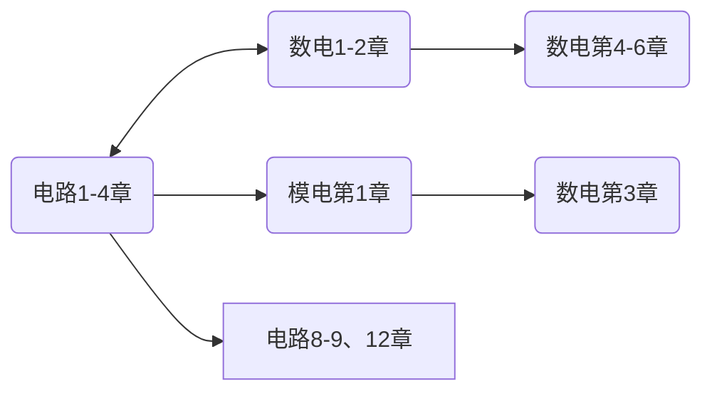

<!--
1. 通过 [Shields.io](https://shields.io/) 生成如下的徽章，标注课程的基本信息。
2. 请根据课程的具体内容增删仓库的子文件夹。子文件夹建议使用小写英文，并且添加 README.md。
3. 关于课程的描述可以不止以下几个方面，酌情增删。
4. hoa.moe 生成本课程对应页面后，请将页面链接复制到 GitHub 仓库的 About/Website 中。
5. 可以在 GitHub 页面的 About/Topics 中为课程添加话题名称。
-->

<!--

-->
注意，实验是独立设课。

2024年春季起开设的缝合课程，计算机与电子通信、自动化与电气工程、机器人与智能装备大类均开设。
包含原《电路IA》前四章、原《模拟电子技术基础》和原《数字电子技术基础》前若干章。
（具体是几章尚不清楚，因为这门课到现在为止**甚至没有大纲**）

要查找资料及查看学习建议，可以前往以下链接：
- [电路IA](https://hoa.moe/docs/fresh-spring/ee1011a/)
- [模拟电子技术基础](https://hoa.moe/docs/sophomore-spring/ee1007/)
- [数字电子技术基础](https://hoa.moe/docs/sophomore-spring/ee1009/)

## 授课教师

原来的电路老师+模电老师+数电老师各一位，分别上各自的部分。
<!--
- （教师名）
  - 授课风格：
  - 听课建议：
  - ……
-->

## 关于考试
第一年开课，目前未知。

## 学习建议
> by [Oliver Wu](https://github.com/OliverWu515), 2024.3

如果大家有预习的需求，下图所示预习顺序可供参考

上图中，方框中为选学内容（在预习的有限时间里优先级较低），圆框中为必学内容；标有双箭头的框之间可同步学习，标有单箭头的框之间有承接关系。
 
 
 

## 资料下载



 
如果你是校内学生，可移步至 [open.osa.moe](https://open.osa.moe/openauto/EE1013) 查看本门课程的电子书和课件
 

## 支持我们

如果你喜欢 HITSZ 自动化课程攻略共享计划，想支持我们，以下是几种支持我们的方式:

- HITSZ 自动化课程攻略共享计划 是所有同学都可以参与编写贡献的，如果你有好的笔记或者资料，欢迎前往我们的 [GitHub](https://github.com/HITSZ-OpenAuto) 进行贡献，也可以发邮件至 [📮hi@hoa.moe](mailto:hi@hoa.moe) 联系我们，我们会在收到的第一时间进行答复。

- 将本网站分享给你的同学也是支持我们的重要方式。

- 如果您认为本页面提供的信息对您有帮助，请考虑捐赠 ¥2 给我们。每一份慷慨支持都将大幅减轻我们承担的域名的费用负担。我们鼓励选择“向对方展示我的名字”，你的 ID 和留言将会显示在我们的 [感谢名单](https://hoa.moe/sponsor/#感谢名单) 中。

 

