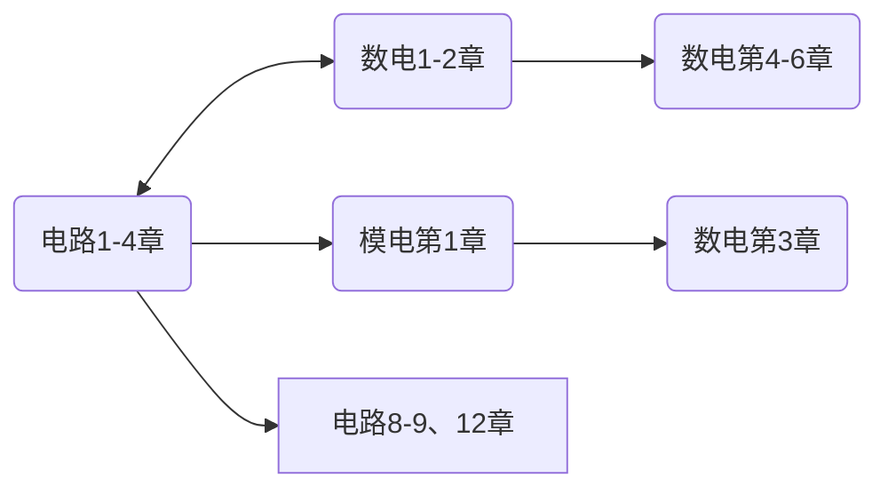


  
  
    
    
    
    
  
    
    
    
    
  
  
    
    
  
  
  
    
    
    
    
  
    
    
    
    
  
  
    
    
    
    
    
    
    
    
    
    
    
    
    
    
    
    
    
    
    
    
    
    
    
  
  
  
  
    
    
    
    
  
  
  
    
  
    
  
  
  
    
  


<!--
1. 通过 [Shields.io](https://shields.io/) 生成如下的徽章，标注课程的基本信息。
2. 请根据课程的具体内容增删仓库的子文件夹。子文件夹建议使用小写英文，并且添加 README.md。
3. 关于课程的描述可以不止以下几个方面，酌情增删。
4. hoa.moe 生成本课程对应页面后，请将页面链接复制到 GitHub 仓库的 About/Website 中。
5. 可以在 GitHub 页面的 About/Topics 中为课程添加话题名称。
-->

<!--

-->
注意，电路与电子技术实验（EE1014）是独立设课。

2024 年春季起开设的缝合课程，计算机与电子通信、自动化与电气工程、机器人与智能装备大类均开设。
包含《电路理论基础》前四章，《模拟电子技术基础》第一、四、五、六、七章，和《数字电子技术基础》第一、二、四、五、六、八章。电路前四章未做删减，模电、数电均有一定程度的删减，以教学大纲为准。

要查找资料及查看学习建议，可以前往以下链接：

- [电路 IA](https://hoa.moe/docs/fresh-spring/ee1011a/)
- [模拟电子技术基础](https://hoa.moe/docs/sophomore-spring/ee1007/)
- [数字电子技术基础](https://hoa.moe/docs/sophomore-spring/ee1009/)

## 学时安排

<h4>模电部分学时安排表（23 级）</h4> 

<!--标题-->
<table border="1" cellspacing="10">
<tr>
  <th align="center">章节</th>
  <th align="center">授课内容</th>
  <th align="center">学时安排</th>
  <th align="center">课程要求</th>
</tr>
<tr>
  <td rowspan="2" align="center">常用半导体器件</td>
  <td>PN 结；半导体二极管；</td>
  <td>2</td>
  <td>1.了解本征半导体、杂质半导体和 PN 结的形成；熟练掌握 PN 结的单向导电性（重点）； 
      2.熟练掌握半导体二极管的结构类型、伏安特性、参数、模型和基本应用电路。</td>
</tr>
<tr>
  <td>晶体三极管；场效应管</td>
  <td>2</td>
  <td>1.正确理解双极型晶体管的结构、类型和电流放大作用；熟练掌握共射特性曲线和参数； 
      2.正确理解场效应管的类型、结构、工作原理；熟练掌握场效应管的特性曲线、参数和型号。</td>
</tr>
<tr>
  <td rowspan="2" align="center">运算放大器的基本应用电路</td>
  <td>运算放大器概述；远算放大器的线性应用电路；</td>
  <td>2</td>
  <td>1.正确理解运算放大器的组成、符号和电压传输特性； 
      2.熟练掌握理想运算放大器的技术指标、工作在线性区和非线性区的特点 (重点)； 
      3.熟练掌握比例运算电路的组成、特点和分析方法 (重点)； 
      4.熟练掌握加减运算电路的组成、特点和分析方法 (重点)； 
      5.熟练掌握积分和微分运算电路的组成、特点和分析方法； 
      6.一般了解对数和指数运算电路的组成、特点和分析方法。</td>
</tr>
<tr>
  <td>运算放大器的非线性应用电路</td>
  <td>2</td>
  <td>1.熟练掌握单限比较器 (重点)；熟练掌握滞回比较器 (重点、难点)； 
      2.熟练掌握窗口比较器。</td>
</tr>
<tr>
  <td rowspan="2" align="center">放大电路中的反馈</td>
  <td>反馈的基本概念；反馈的判断方法；反馈的基本方程式</td>
  <td>2</td>
  <td>1.熟练掌握反馈的基本概念； 
      2.熟练掌握反馈组态和极性的判断方法 (重点)； 
      3.熟练掌握反馈基本方程式及负反馈、深度负反馈的概念 (重点)。</td>
</tr>
<tr>
  <td>四种负反馈放大电路的分析；负反馈对放大电路性能的影响</td>
  <td>2</td>
  <td>1.熟练掌握四种交流负反馈放大电路的组态特点； 
      2.熟练掌握四种交流负反馈放大电路的反馈系数及深度负反馈条件下放大倍数的计算方法 (重点、难点)； 
      3.正确理解负反馈对放大电路性能的影响，包括：稳定增益、改变输入输出电阻、展宽频带、抑制失真和噪声 (重点)。</td>
</tr>
<tr>
  <td rowspan="2" align="center">信号发生电路</td>
  <td>正弦波振荡电路的组成及振荡条件；正弦波振荡电路的组成、特点和分析方法</td>
  <td>2</td>
  <td>1.熟练掌握正弦波振荡电路的组成及振荡条件 (重点)； 
      2.掌握 RC 振荡电路的组成、特点和分析方法； 
      3.了解 LC 正弦波振荡电路的组成、特点和分析方法。</td>
</tr>
<tr>
  <td>非正弦波发生电路</td>
  <td>2</td>
  <td>1.熟练掌握矩形波、三角波和锯齿波发生电路的结构、原理和参数计算方法 (重点、难点)；</td>
</tr>
<tr>
  <td rowspan="2" align="center">信号的处理与变换</td>
  <td>频率特性；无源滤波器</td>
  <td>1</td>
  <td>1.熟练掌握频率特性的概念；  
      2.熟练掌握滤波器的分类与分析方法 (重点)； 
      3.熟练掌握无源滤波器的结构、特点和分析方法。</td>
</tr>
<tr>
  <td>有源滤波器</td>
  <td>1</td>
  <td>1.熟练掌握一阶、二阶有源低通滤波器的结构、特点和分析方法 (重点)； 
      2.正确理解简单有源高通、带通、带阻滤波器的结构、特点和分析方法 (重点)。</td>
</tr>
</table>

<h4>数电部分学时安排表（23 级）</h4> 

<!--标题-->
<table border="1" cellspacing="10">
<tr>
  <th align="center">章节</th>
  <th align="center">授课内容</th>
  <th align="center">学时安排</th>
  <th align="center">课程要求</th>
</tr>
<tr>
  <td rowspan="2" align="center">逻辑代数基础</td>
  <td>数制和码制；逻辑运算；逻辑代数的基本定理和基本规则；最小项和最大项的概念</td>
  <td>4</td>
  <td>1.熟练掌握几种常用的数制和编码 (重点)； 
      2.熟练掌握逻辑运算 (重点)； 
      3.熟练掌握逻辑代数的基本定理和基本规则 (重点)； 
      4.掌握最小项和最大项的概念和性质 (重点)</td>
</tr>
<tr>
  <td>逻辑函数的卡诺图化简法；具有无关项的逻辑函数化简</td>
  <td>2</td>
  <td>1.熟练掌握逻辑函数的卡诺图化简法 (重点)； 
      2.熟练掌握具有无关项的逻辑函数卡诺图化简法 (重点、难点)。</td>
</tr>
  <tr>
  <td rowspan="2" align="center">组合逻辑电路</td>
  <td>组合逻辑电路的分析方法；组合数字电路的设计方法</td>
  <td>1</td>
  <td>1.熟练掌握组合逻辑电路的特点和功能描述 (重点)； 
      2.熟练掌握组合逻辑电路的分析方法 (重点)； 
      3.熟练掌握组合逻辑电路的设计方法 (重点)。</td>
</tr>
<tr>
  <td>译码器 74LS138 及应用；数据选择器 74LS151 及应用；</td>
  <td>2</td>
  <td>1.熟练掌握译码器 74LS138 及应用 (重点、难点)。 
      2.了解数据选择器 74LS151 及应用；</td> 
</tr>
<tr>
  <td rowspan="3" align="center">时序逻辑电路</td>
  <td>触发器的基本概念</td>
  <td>2</td>
  <td>1.掌握 RS 触发器的结构与功能，掌握电平触发、边沿出发和脉冲触发的特点； 
      2.熟练掌握 RS,JK,D,T 等各类触发器功能。</td>
</tr>
<tr>
  <td>同步时序逻辑电路的分析</td>
  <td>2</td>
  <td>1.了解时序逻辑电路的特点和功能描述，掌握 Moore 型和 Mealy 型电路的定义和特点； 
      2.熟练掌握同步时序逻辑电路的分析方法 (重点)；</td>
</tr>
<tr>
  <td>同步时序逻辑电路的设计</td>
  <td>3</td>
  <td>1.熟练掌握同步时序逻辑电路的设计方法 (重点)；</td>
</tr>
<tr>
  <td rowspan="1" align="center">数模和模数转换</td>
  <td> A/D 和 D/A 转换器</td>
  <td>2</td>
  <td>1.熟练掌握 AD 与 DA 转换的基本概念 (重点)； 
      2.了解倒 T 型电阻解码网络 D/A 转换器； 
      3.熟练掌握集成 D/A 转换器 AD7524 (重点)； 
      4.熟练掌握 D/A 转换器的转换精度与转换时间 (重点、难点)。</td>
</tr>

</table>

> 文 / [Gaster](https://github.com/WDGaster703), 2024.12

## 授课教师

二/三位老师分别按顺序讲解一部分课程——但老师并不一定有讲授这节课的经历

> 文 / [IcyDesert](https://github.com/IcyDesert), 2024.5

23 级的授课老师如下：
- 电路部分：王毅，孙丽，和军平，詹瀚林；
- 模电部分：王立欣，谷雨，梁仲明，吴婷，潘学伟；
- 数电部分：王立欣，梁亮，梁仲明，朱荣伍，喻锦程；
- 三个部分的老师可以分别参考原《电路 IA》《电路 IB》《模拟电子电路基础》《数字电子电路基础》对应老师的介绍。
- 24 级据说授课老师会有变化，具体以实际授课为准。

> 文 / [Gaster](https://github.com/WDGaster703), 2024.12

## 关于考试

- 考试由电路、模电、数电三部分题目按顺序组合而成，分数占比 4:3:3，题型为填空题和计算题，其中计算题 3 题电路，2 题模电，2 题数电，填空题 4 题电路，3 题模电，3 题数电。
- 23 级的考试计算量很大，且模电部分考察了许多概念性填空，考试时注意时间安排。

> 文 / [Gaster](https://github.com/WDGaster703), 2024.12

## 学习建议

如果大家有预习的需求，下图所示预习顺序可供参考

上图中，方框中为选学内容（在预习的有限时间里优先级较低），圆框中为必学内容；标有双箭头的框之间可同步学习，标有单箭头的框之间有承接关系。

> 文 / [Oliver Wu](https://github.com/OliverWu515), 2024.3

电路部分学有余力建议自学频率响应（第七章）和暂态电路（第八、九章）的内容，在模电部分对这部分知识有要求但是电路部分学时没有安排。电路和数电总体按体系讲解，可以跟着教学计划学习，学有余力可以自学跳过的内容。模电授课内容较为零碎，建议跟着上交大 zzy 或者清华 hcy 对模电整本书进行初步的学习，至少对分立元件搭成的放大电路有一点基本的认知。

> 文 / [Gaster](https://github.com/WDGaster703), 2024.12

### 网课推荐

- [电路 哈工大 - Bilibili](https://www.bilibili.com/video/BV19x411x7We/?spm_id_from=333.337.search-card.all.click)
- [模拟电子技术基础 上海交通大学 郑益慧主讲 - Bilibili](https://www.bilibili.com/video/BV1Gt411b7Zq)
- [模拟电子技术基础 清华大学 华成英主讲 - Bilibili](https://www.bilibili.com/video/BV1M7411b7Wb)
- [数字电子技术基础 清华大学 王红主讲 - Bilibili](https://www.bilibili.com/video/BV18p411Z7ce)

> 建议正常听课时关闭弹幕，有任何不懂的地方才打开，看看弹幕里的解答（这也是 B 站的一大好处，解答非常及时）

## 资料下载


  
  
    
    
    
    
  
    
    
    
    
  
  
    
    
  
  
  
    
    
    
    
  
    
    
    
    
  
  
    
    
    
    
    
    
    
    
    
    
    
    
    
    
    
    
    
    
    
    
    
    
    
  
  
  
  
    
    
    
    
  
  
  
    
  
    
  
  
  
    
  


如果你是校内学生，可移步至 <a href='https://open.osa.moe/openauto/EE1013'>open.osa.moe</a> 查看本门课程的电子书、课件和实验软件等。

## 参与

《HITSZ 自动化课程攻略共享计划》是所有同学都可以参与编写的，如果你有好的笔记或者资料，欢迎前往我们的 [GitHub](https://github.com/HITSZ-OpenAuto) 进行参与，也可以发邮件至 [📮hi@hoa.moe](mailto:hi@hoa.moe) 联系我们，我们会在收到的第一时间进行答复。


  © 版权声明：[知识共享署名-非商业性使用-相同方式共享 4.0 国际许可协议](https://creativecommons.org/licenses/by-nc-sa/4.0/)

