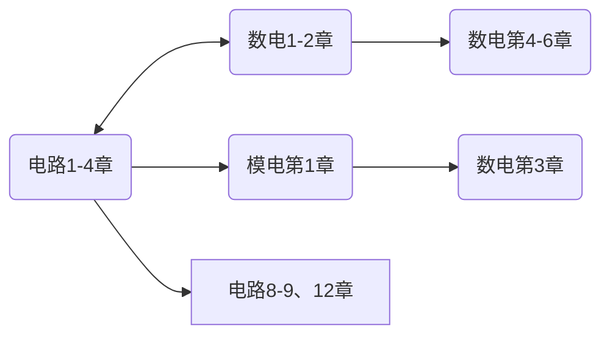



注意，电路与电子技术实验（[EE1014](https://hoa.moe/docs/fresh-spring/ee1014/)）是独立设课。

2024 年春季起开设的缝合课程，计算机与电子通信、自动化与电气工程、机器人与智能装备大类均开设。

2025 年春季学期改名为电路与电子学 II，机器人与智能装备、空天科技、智慧能源与低空动力大类开设。

要查找资料及查看学习建议，可以前往以下链接：

[电路 IA](https://hoa.moe/docs/fresh-spring/ee1011a/)

[模拟电子技术基础](https://hoa.moe/docs/sophomore-spring/ee1007/)

[数字电子技术基础](https://hoa.moe/docs/sophomore-spring/ee1009/)

## 授课教师

- 詹瀚林
- 吴婷
- 朱荣伍
- 孙丽
- 谷雨
- 梁亮
- 王灿
- 潘学伟
- 喻锦程
- 王毅
- 王立欣
- 张瑞宏
- 和军平
- 梁仲明

## 教材

## 在线资源

- [电路 哈工大 - Bilibili](https://www.bilibili.com/video/BV19x411x7We/?spm_id_from=333.337.search-card.all.click)：网课推荐
- [模拟电子技术基础 上海交通大学 郑益慧主讲 - Bilibili](https://www.bilibili.com/video/BV1Gt411b7Zq)：网课推荐
- [模拟电子技术基础 清华大学 华成英主讲 - Bilibili](https://www.bilibili.com/video/BV1M7411b7Wb)：网课推荐
- [数字电子技术基础 清华大学 王红主讲 - Bilibili](https://www.bilibili.com/video/BV18p411Z7ce)：网课推荐。建议正常听课时关闭弹幕，有任何不懂的地方才打开，看看弹幕里的解答。

## 关于考试

- 考试由电路、模电、数电三部分题目按顺序组合而成，分数占比 4:3:3。
- 题型为填空题和计算题：其中计算题 3 题电路，2 题模电，2 题数电；填空题 4 题电路，3 题模电，3 题数电。
- 23 级的考试计算量很大，且模电部分考察了许多概念性填空，考试时注意时间安排。

## 学习建议

预习顺序参考：

方框中为选学内容（在预习的有限时间里优先级较低），圆框中为必学内容；标有双箭头的框之间可同步学习，标有单箭头的框之间有承接关系。

电路部分学有余力建议自学频率响应（第七章）和暂态电路（第八、九章）的内容，在模电部分对这部分知识有要求但是电路部分学时没有安排。

电路和数电总体按体系讲解，可以跟着教学计划学习，学有余力可以自学跳过的内容。
模电授课内容较为零碎，建议跟着上交大 zzy 或者清华 hcy 对模电整本书进行初步的学习，至少对分立元件搭成的放大电路有一点基本的认知。

## 课程安排

2024 年春季学时安排：总学时 64 (电路 28 + 模电 18 + 数电 18)。

### 电路部分

| 章节 | 授课内容 | 学时安排 | 课程要求 |
| :---: | :--- | :---: | :--- |
| 电路元件和电路定律 | 电流电压与电功率；电容、电感；独立源、受控源 | 3 | 1.熟练掌握电流、电压与电功率的基本概念和计算方法 (重点)；2.熟练掌握参考方向的概念 (难点)； 3.熟练掌握各元件的定义、符号表示、外特性及分类 (重点)；4.熟练掌握各元件的端口特性 (重点)； 5.掌握各元件的功率计算 (重点、难点)，电感、电容的储能计算；6.熟练掌握各电源元件的定义、符号表示和外特性；7.掌握各电源的功率计算。 |
| 电路元件和电路定律 | 基尔霍夫定律 | 2 | 1.了解描述电路结构的相关术语； 2.熟练掌握基尔霍夫电流定律和电压定律的表述 (重点)； 3.熟练运用基尔霍夫定律列写电路方程 (重点)； 4.掌握独立的 KCL、KVL 方程的列写方法 (重点、难点)。 |
| 线性直流电路 | 线性电阻电路的等效变换法 | 2 | 1.掌握等效的概念； 2.熟练应用简单电阻网络（串并联等）及复杂电阻网络的等效方法及结论 (重点)； 3.熟练应用含源支路的等效变换条件 (重点)； 4.运用等效变换方法求解简单电路。 |
| 线性直流电路 | 支路电流法，回路电流法 | 2 | 1.熟练掌握支路电流法的原理及方程的一般列写规则； 2.熟练掌握回路电流法的原理及方程的一般列写规则； |
| 线性直流电路 | 节点电压法 | 2 | 1.熟练掌握节点电压法的原理及方程的一般列写规则。 |
| 电路定理 | 置换定理、齐性定理和叠加定理 | 2 | 1.透彻理解并熟练掌握置换定理 (重点)； 2.透彻理解并熟练掌握齐性定理和叠加定理 (重点、难点)。 |
| 电路定理 | 等效电源定理 | 2 | 1.透彻理解并熟练掌握戴维宁定理和诺顿定理 (重点、难点)； 2.了解特勒根定理、互易定理和对偶原理。 |
| 正弦电路的稳态分析 | 正弦电流，正弦量的相量表示法 | 2 | 1.掌握正弦量的含义及其数学表达式； 2.透彻理解正弦量的相量表示法及其性质 (重点)。 |
| 正弦电路的稳态分析 | 电路定律的相量形式，电路元件的 VCR 方程 | 2 | 1.透彻理解基尔霍夫定律的相量形式特点 (重点)； 2.透彻理解元件约束方程的相量形式特点； 3.理解阻抗和导纳的概念。 |
| 正弦电路的稳态分析 | 正弦电路的相量分析法 | 2 | 1.熟练掌握正弦电流电路的相量分析法 (重点)。 |
| 正弦电路的稳态分析 | 正弦电路的功率 | 3 | 1.熟练掌握正弦电流电路功率的定义和功率计算，并体会其相互关系 (重点、难点)； 2.了解功率因数提高的原理、意义和方法； 3.正确理解并应用最大功率传输定理 (重点)。 |
| 正弦电路的稳态分析 | 耦合电感；理想变压器 | 4 | 1.理解耦合电感、理想变压器的概念； 2.熟练掌握含耦合电感的电路分析、列写相应方程 (重点)； 3.熟练掌握含理想变压器的电路分析、列写相应方程 (重点)。 |

### 模电部分

| 章节 | 授课内容 | 学时安排 | 课程要求 |
| :---: | :--- | :---: | :--- |
| 常用半导体器件 | PN 结；半导体二极管； | 2 | 1.了解本征半导体、杂质半导体和 PN 结的形成；熟练掌握 PN 结的单向导电性（重点）； 2.熟练掌握半导体二极管的结构类型、伏安特性、参数、模型和基本应用电路。 |
| 常用半导体器件 | 晶体三极管；场效应管 | 2 | 1.正确理解双极型晶体管的结构、类型和电流放大作用；熟练掌握共射特性曲线和参数； 2.正确理解场效应管的类型、结构、工作原理；熟练掌握场效应管的特性曲线、参数和型号。 |
| 运算放大器的基本应用电路 | 运算放大器概述；远算放大器的线性应用电路； | 2 | 1.正确理解运算放大器的组成、符号和电压传输特性； 2.熟练掌握理想运算放大器的技术指标、工作在线性区和非线性区的特点 (重点)； 3.熟练掌握比例运算电路的组成、特点和分析方法 (重点)； 4.熟练掌握加减运算电路的组成、特点和分析方法 (重点)； 5.熟练掌握积分和微分运算电路的组成、特点和分析方法； 6.一般了解对数和指数运算电路的组成、特点和分析方法。 |
| 运算放大器的基本应用电路 | 运算放大器的非线性应用电路 | 2 | 1.熟练掌握单限比较器 (重点)；熟练掌握滞回比较器 (重点、难点)； 2.熟练掌握窗口比较器。 |
| 放大电路中的反馈 | 反馈的基本概念；反馈的判断方法；反馈的基本方程式 | 2 | 1.熟练掌握反馈的基本概念； 2.熟练掌握反馈组态和极性的判断方法 (重点)； 3.熟练掌握反馈基本方程式及负反馈、深度负反馈的概念 (重点)。 |
| 放大电路中的反馈 | 四种负反馈放大电路的分析；负反馈对放大电路性能的影响 | 2 | 1.熟练掌握四种交流负反馈放大电路的组态特点； 2.熟练掌握四种交流负反馈放大电路的反馈系数及深度负反馈条件下放大倍数的计算方法 (重点、难点)； 3.正确理解负反馈对放大电路性能的影响，包括：稳定增益、改变输入输出电阻、展宽频带、抑制失真和噪声 (重点)。 |
| 信号发生电路 | 正弦波振荡电路的组成及振荡条件；正弦波振荡电路的组成、特点和分析方法 | 2 | 1.熟练掌握正弦波振荡电路的组成及振荡条件 (重点)； 2.掌握 RC 振荡电路的组成、特点和分析方法； 3.了解 LC 正弦波振荡电路的组成、特点和分析方法。 |
| 信号发生电路 | 非正弦波发生电路 | 2 | 1.熟练掌握矩形波、三角波和锯齿波发生电路的结构、原理和参数计算方法 (重点、难点)； |
| 信号的处理与变换 | 频率特性；无源滤波器 | 1 | 1.熟练掌握频率特性的概念； 2.熟练掌握滤波器的分类与分析方法 (重点)； 3.熟练掌握无源滤波器的结构、特点和分析方法。 |
| 信号的处理与变换 | 有源滤波器 | 1 | 1.熟练掌握一阶、二阶有源低通滤波器的结构、特点和分析方法 (重点)； 2.正确理解简单有源高通、带通、带阻滤波器的结构、特点和分析方法 (重点)。 |

### 数电部分

| 章节 | 授课内容 | 学时安排 | 课程要求 |
| :---: | :--- | :---: | :--- |
| 逻辑代数基础 | 数制和码制；逻辑运算；逻辑代数的基本定理和基本规则；最小项和最大项的概念 | 4 | 1.熟练掌握几种常用的数制和编码 (重点)； 2.熟练掌握逻辑运算 (重点)； 3.熟练掌握逻辑代数的基本定理和基本规则 (重点)； 4.掌握最小项和最大项的概念和性质 (重点) |
| 逻辑代数基础 | 逻辑函数的卡诺图化简法；具有无关项的逻辑函数化简 | 2 | 1.熟练掌握逻辑函数的卡诺图化简法 (重点)； 2.熟练掌握具有无关项的逻辑函数卡诺图化简法 (重点、难点)。 |
| 组合逻辑电路 | 组合逻辑电路的分析方法；组合数字电路的设计方法 | 1 | 1.熟练掌握组合逻辑电路的特点和功能描述 (重点)； 2.熟练掌握组合逻辑电路的分析方法 (重点)； 3.熟练掌握组合逻辑电路的设计方法 (重点)。 |
| 组合逻辑电路 | 译码器 74LS138 及应用；数据选择器 74LS151 及应用； | 2 | 1.熟练掌握译码器 74LS138 及应用 (重点、难点)。 2.了解数据选择器 74LS151 及应用； |
| 时序逻辑电路 | 触发器的基本概念 | 2 | 1.掌握 RS 触发器的结构与功能，掌握电平触发、边沿出发和脉冲触发的特点； 2.熟练掌握 RS,JK,D,T 等各类触发器功能。 |
| 时序逻辑电路 | 同步时序逻辑电路的分析 | 2 | 1.了解时序逻辑电路的特点和功能描述，掌握 Moore 型和 Mealy 型电路的定义和特点； 2.熟练掌握同步时序逻辑电路的分析方法 (重点)； |
| 时序逻辑电路 | 同步时序逻辑电路的设计 | 3 | 1.熟练掌握同步时序逻辑电路的设计方法 (重点)； |
| 数模和模数转换 | A/D 和 D/A 转换器 | 2 | 1.熟练掌握 AD 与 DA 转换的基本概念 (重点)； 2.了解倒 T 型电阻解码网络 D/A 转换器； 3.熟练掌握集成 D/A 转换器 AD7524 (重点)； 4.熟练掌握 D/A 转换器的转换精度与转换时间 (重点、难点)。 |

## 资料下载

如果你是校内学生，可点击如下「内网网盘」按钮查看本门课程的电子书、课件和实验软件等。









## 参与

《HITSZ 自动化课程攻略共享计划》是所有同学都可以参与编写的，如果你有好的笔记或者资料，欢迎前往我们的 [GitHub](https://github.com/HITSZ-OpenAuto) 进行参与，也可以发邮件至 [📮hi@hoa.moe](mailto:hi@hoa.moe) 联系我们，我们会在收到的第一时间进行答复。


  © 版权声明：[知识共享署名-非商业性使用-相同方式共享 4.0 国际许可协议](https://creativecommons.org/licenses/by-nc-sa/4.0/)


