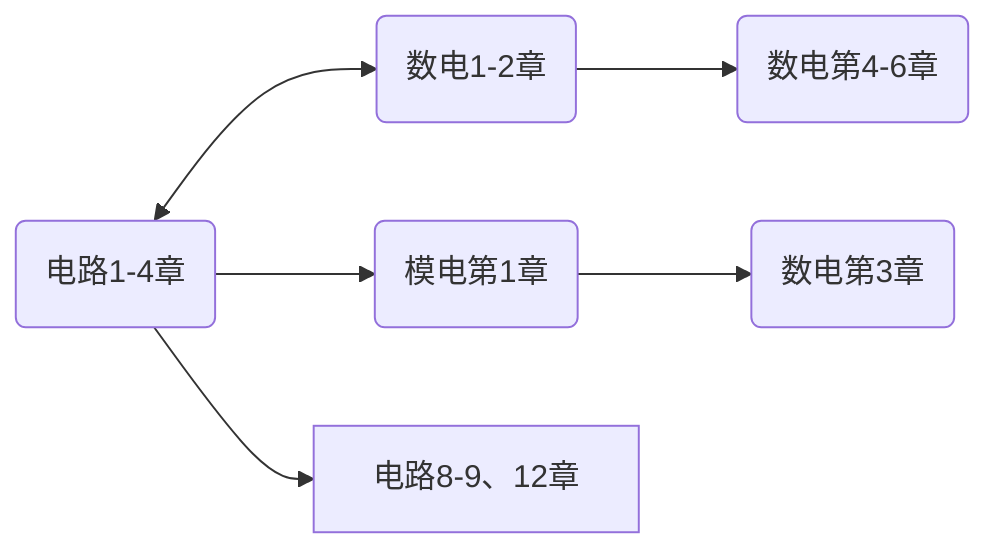



<!--
1. 通过 [Shields.io](https://shields.io/) 生成如下的徽章，标注课程的基本信息。
2. 请根据课程的具体内容增删仓库的子文件夹。子文件夹建议使用小写英文，并且添加 README.md。
3. 关于课程的描述可以不止以下几个方面，酌情增删。
4. hoa.moe 生成本课程对应页面后，请将页面链接复制到 GitHub 仓库的 About/Website 中。
5. 可以在 GitHub 页面的 About/Topics 中为课程添加话题名称。
-->

<!--

-->
注意，实验是独立设课。

2024 年春季起开设的缝合课程，计算机与电子通信、自动化与电气工程、机器人与智能装备大类均开设。
包含原《电路 IA》前四章、原《模拟电子技术基础》和原《数字电子技术基础》前若干章。
（具体是几章尚不清楚，因为这门课到现在为止**甚至没有大纲**）

要查找资料及查看学习建议，可以前往以下链接：

- [电路 IA](https://hoa.moe/docs/fresh-spring/ee1011a/)
- [模拟电子技术基础](https://hoa.moe/docs/sophomore-spring/ee1007/)
- [数字电子技术基础](https://hoa.moe/docs/sophomore-spring/ee1009/)

## 授课教师

二/三位老师分别按顺序讲解一部分课程——但老师并不一定有讲授这节课的经历

> 文 / [IcyDesert](https://github.com/IcyDesert), 2024.5

## 关于考试

第一年开课，目前未知。

## 学习建议

如果大家有预习的需求，下图所示预习顺序可供参考

上图中，方框中为选学内容（在预习的有限时间里优先级较低），圆框中为必学内容；标有双箭头的框之间可同步学习，标有单箭头的框之间有承接关系。

> 文 / [Oliver Wu](https://github.com/OliverWu515), 2024.3

### 网课推荐

- [模拟电子技术基础 上海交通大学 郑益慧主讲 - Bilibili](https://www.bilibili.com/video/BV1Gt411b7Zq)
- [模拟电子技术基础 清华大学 华成英主讲 - Bilibili](https://www.bilibili.com/video/BV1M7411b7Wb)
- [数字电子技术基础 清华大学 王红主讲 - Bilibili](https://www.bilibili.com/video/BV18p411Z7ce)

> 建议正常听课时关闭弹幕，有任何不懂的地方才打开，看看弹幕里的解答（这也是 B 站的一大好处，解答非常及时）

## 资料下载

如果你是校内学生，可移步至 <a href='https://open.osa.moe/openauto/EE1013'>open.osa.moe</a> 查看本门课程的电子书、课件和实验软件等。

## 参与

《HITSZ 自动化课程攻略共享计划》是所有同学都可以参与编写的，如果你有好的笔记或者资料，欢迎前往我们的 [GitHub](https://github.com/HITSZ-OpenAuto) 进行参与，也可以发邮件至 [📮hi@hoa.moe](mailto:hi@hoa.moe) 联系我们，我们会在收到的第一时间进行答复。

此外，如果您认为 `HITSZ 自动化课程攻略共享计划` 提供的信息对您有帮助，请考虑捐助 ¥2 给我们。每一份慷慨捐助都将大幅减轻我们承担的域名的费用负担，同时也是对维护者最大的鼓励。你的 ID 和留言将会显示在我们的 [Sponsor](https://hoa.moe/sponsor/) 页面中。

 

 


  © 版权声明：[知识共享署名-非商业性使用-相同方式共享 4.0 国际许可协议](https://creativecommons.org/licenses/by-nc-sa/4.0/)

