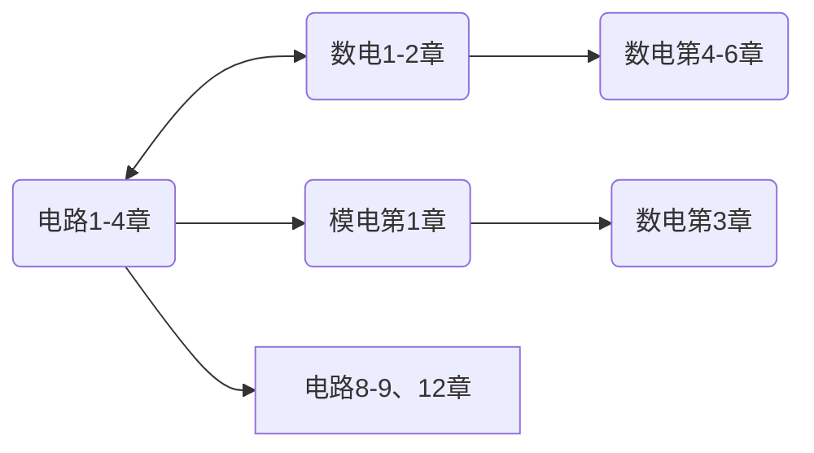


<!-- TOML-META: repo_type="normal" -->
<!-- TOML-BADGES: source="grades_summary" -->

注意，电路与电子技术实验（[EE1014](https://hoa.moe/docs/fresh-spring/ee1014/)）是独立设课。

2024 年春季学期起开设的缝合课程，2025 年春季学期改名为电路与电子学 II。

要查找资料及查看学习建议，可以前往以下链接：

[电路 IA](https://hoa.moe/docs/fresh-spring/ee1011a/)

[模拟电子技术基础](https://hoa.moe/docs/sophomore-spring/ee1007/)

[数字电子技术基础](https://hoa.moe/docs/sophomore-spring/ee1009/)

## 授课教师

<!-- TOML-LECTURERS: part="items" -->
- 詹瀚林
  <!-- TOML-ITEM: id="review-詹瀚林 -1" -->
  - 负责电路部分
  - 老师比较年轻，学术水平也高，但是讲课水平比较一般。
- 孙丽
  <!-- TOML-ITEM: id="review-孙丽 -1" -->
  - 负责电路部分
  - 老师人很好，上课不考勤，主要依照 PPT 进行授课，会在开始新的一章前把该章节所有的 PPT 都发在课程群里，利好同学们自学和复习。
  - 建议课前预习 PPT，关注每节课开头都会提出的四个问题，课上跟着老师做例题（PPT 中的例题较多）。老师语速较快，如果没跟上需要课后再复习巩固。
    > 文 / 方朔寒，2026-05
- 王灿
  <!-- TOML-ITEM: id="review-王灿 -1" author_type="list" -->
  - 负责电路部分
  - 机电学院最好的老师之一，对于电路这门相对难懂的课，要把它讲好真的不容易。老师会用幻灯片，适当结合板书，对于题目的做法讲解细致。课前会用雨课堂推送预习题（计入平时成绩），课中也有现场做题，难度较大。
  - 选了他就好好听吧，这都不听算是亏大了。
    > 文 / [Oliver Wu](https://github.com/OliverWu515)，2023-11，[Maxwell Jay](https://github.com/MaxwellJay256)，2023-11
- 王毅
  <!-- TOML-ITEM: id="review-王毅 -1" author_type="list" -->
  - 负责电路部分
  - 车轱辘话比较多，总结能力较强，不强调做题细节，只点拨大致思路。
  - 听一个知识总结，掌握大致脉络还是足够的；但是对于做题的训练不够，所以课下需要多花时间。
    > 文 / [Oliver Wu](https://github.com/OliverWu515)，2023-11，[Maxwell Jay](https://github.com/MaxwellJay256)，2023-11
  <!-- TOML-ITEM: id="review-王毅 -2" -->
  - 老师的麦声音较小，且上课语速比较平，所以可能会比较催眠。
  - 老师对于知识点的讲解比较灵动，许多好理解的部分（比如部分纯粹的等式变形）会跳过，对于例题的讲解也不会细细拆解，三言两语便点出题目的关键之处，颇有四两拨千斤的味道。
  - 24 春，王毅老师欢迎大家去听听不同老师的课，找到最适合自己的老师，比如王灿老师（
    > 文 / [Gaster](https://github.com/WDGaster703)，2024-12
- 和军平
  <!-- TOML-ITEM: id="review-和军平 -1" -->
  - 负责电路部分和模电前半部分
- 吴婷
  <!-- TOML-ITEM: id="review-吴婷 -1" -->
  - 负责模电部分
- 谷雨
  <!-- TOML-ITEM: id="review-谷雨 -1" -->
  - 负责模电部分
  - 会有随堂小测，现场做题。
  - 会用幻灯片，适当结合板书，对于题目的做法讲解细致。
  - 能把魔法电路的魔法原理清楚明白地让绝大多数同学能听懂，定性定量结合，风格类似上交大郑益慧。而且老师上课活力十足，绝对不会无聊。
  <!-- TOML-ITEM: id="review-谷雨 -2" -->
  - 老师既能像上交大郑益慧一样将放大电路掰成直观理解的样式，也能三言两语讲清楚定量计算部分，对于做题方面讲解的明晰程度甚至超出郑益慧。
  - 老师很年轻，且生活十分丰富，所以上课会分享很多有趣的故事，课堂幽默风趣。
    > 文 / [Gaster](https://github.com/WDGaster703)，2024-12
- 潘学伟
  <!-- TOML-ITEM: id="review-潘学伟 -1" -->
  - 负责模电部分。
- 王立欣
  <!-- TOML-ITEM: id="review-王立欣 -1" -->
  - 负责模电部分和数电部分
  - 同样是老教师，王立欣老师不像王毅老师一样语调较平，而是较为慷慨激昂，上课风格比较活跃，讲解也较为清晰。
  - 老师在电子技术领域浸淫数十年（是学校总负责电赛的老师），上课不会完全按照课本顺序（特别是数电部分，老师对课本在时序逻辑电路部分的讲解顺序颇有微词），且会拓展一些考试不要求的东西，各位同学根据自己的学习能力选择性掌握即可。
    > 文 / [Gaster](https://github.com/WDGaster703)，2024-12
- 梁仲明
  <!-- TOML-ITEM: id="review-梁仲明 -1" -->
  - 负责模电后半部分和数电
  - 老师是香港人，不太会普通话，上课使用广普 + 粤语，可能一些同学听起来会比较有障碍。
  - 上课以 PPT 为主，由于语言的关系，建议大家课前好好预习一下。
  - 如果做好了预习、自学工作，可以考虑在课堂上做题/查漏补缺。答疑直接问老师，老师一般会用英文回答。
- 梁亮
  <!-- TOML-ITEM: id="review-梁亮 -1" -->
  - 负责数电部分
  - 上课讲解比较清晰。但是课后答疑态度较差（"这个来上课的同学都知道的"），而且很喜欢在考试中出计算量极大、重复劳动很多的题目。往年许多同学考试成绩很差。（请将老师的授课水平和出卷风格分开评价，不要因为其出卷风格而全盘否定其授课水平）
    > 文 / [Oliver Wu](https://github.com/OliverWu515)，2023-06
  <!-- TOML-ITEM: id="review-梁亮 -2" -->
  - 现在梁老师课上课后答疑都非常热心，且出卷风格也大为改变，整体难度较低，基本是作业题变式。
  - 能将数电中较为困难的部分信手拈来，讲的深入浅出，个人认为不比清华的王红差。
    > 文 / [Gaster](https://github.com/WDGaster703)，2024-12
- 喻锦程
  <!-- TOML-ITEM: id="review-喻锦程 -1" -->
  - 负责电路部分和数电部分
  - 年轻小姐姐，人美心善，上课讲解细致（有时甚至达到啰嗦的程度）期末考前会录制复习视频，也会鼓励大家，发在群里的消息很有意思！
    > 文 / [Oliver Wu](https://github.com/OliverWu515)
- 朱荣伍
  <!-- TOML-ITEM: id="review-朱荣伍 -1" -->
  - 负责数电部分

## 教材和参考书
<!-- TOML-SECTION: title="教材和参考书" -->

<!-- TOML-ITEM: id="item-教材和参考书 -1" -->

- **电路理论基础**（孙立山 / 陈希有 等 / 高等教育出版社 / 第四版 / textbook）
- **模拟电子技术基础**（童诗白 / 华成英 / 高等教育出版社 / 第五版或第六版 / textbook）
- **数字电子技术基础**（阎石 / 王红 / 高等教育出版社 / 第五版 / textbook）

其他参考教材和教辅详见三电对应仓库里的资料，在此不详细列出。

## 在线资源
<!-- TOML-SECTION: title="在线资源" -->

<!-- TOML-ITEM: id="item-在线资源 -1" -->

- [电路 哈工大 - Bilibili](https://www.bilibili.com/video/BV19x411x7We/?spm_id_from=333.337.search-card.all.click)
- [模拟电子技术基础 上海交通大学 郑益慧主讲 - Bilibili](https://www.bilibili.com/video/BV1Gt411b7Zq)
- [模拟电子技术基础 清华大学 华成英主讲 - Bilibili](https://www.bilibili.com/video/BV1M7411b7Wb)
- [数字电子技术基础 清华大学 王红主讲 - Bilibili](https://www.bilibili.com/video/BV18p411Z7ce)

建议正常听课时关闭弹幕，有任何不懂的地方才打开，看看弹幕里的解答。

## 课程安排
<!-- TOML-SECTION: title="课程安排" -->

<!-- TOML-ITEM: id="item-课程安排 -1" -->

2024 年春季学时安排：总学时 64 (电路 28 + 模电 18 + 数电 18)。

{}
<!--标题-->
<table border="1" cellspacing="10">
<tr>
  <th align="center">章节</th>
  <th align="center">授课内容</th>
  <th align="center">学时安排</th>
  <th align="center">课程要求</th>
</tr>
<tr>
  <td rowspan="2" align="center">电路元件和电路定律</td>
  <td>电流电压与电功率；电容、电感；独立源、受控源</td>
  <td>3</td>
  <td>1.熟练掌握电流、电压与电功率的基本概念和计算方法 (重点)； 
      2.熟练掌握参考方向的概念 (难点)； 
      3.熟练掌握各元件的定义、符号表示、外特性及分类 (重点)； 
      4.熟练掌握各元件的端口特性 (重点)； 
      5.掌握各元件的功率计算 (重点、难点)，电感、电容的储能计算； 
      6.熟练掌握各电源元件的定义、符号表示和外特性； 
      7.掌握各电源的功率计算。</td>
</tr>
<tr>
  <td>基尔霍夫定律</td>
  <td>2</td>
  <td>1.了解描述电路结构的相关术语； 
      2.熟练掌握基尔霍夫电流定律和电压定律的表述 (重点)； 
      3.熟练运用基尔霍夫定律列写电路方程 (重点)； 
      4.掌握独立的 KCL、KVL 方程的列写方法 (重点、难点)。</td>
</tr>
<tr>
  <td rowspan="3" align="center">线性直流电路</td>
  <td>线性电阻电路的等效变换法</td>
  <td>2</td>
  <td>1.掌握等效的概念； 
      2.熟练应用简单电阻网络（串并联等）及复杂电阻网络的等效方法及结论 (重点)； 
      3.熟练应用含源支路的等效变换条件 (重点)； 
      4.运用等效变换方法求解简单电路。</td>
</tr>
<tr>
  <td>支路电流法，回路电流法</td>
  <td>2</td>
  <td>1.熟练掌握支路电流法的原理及方程的一般列写规则； 
      2.熟练掌握回路电流法的原理及方程的一般列写规则；</td>
</tr>
<tr>
  <td>节点电压法</td>
  <td>2</td>
  <td>1.熟练掌握节点电压法的原理及方程的一般列写规则。</td>
</tr>
<tr>
  <td rowspan="2" align="center">电路定理</td>
  <td>置换定理、齐性定理和叠加定理</td>
  <td>2</td>
  <td>1.透彻理解并熟练掌握置换定理 (重点)； 
      2.透彻理解并熟练掌握齐性定理和叠加定理 (重点、难点)。</td>
</tr>
<tr>
  <td>等效电源定理</td>
  <td>2</td>
  <td>1.透彻理解并熟练掌握戴维宁定理和诺顿定理 (重点、难点)； 
      2.了解特勒根定理、互易定理和对偶原理。</td>
</tr>
<tr>
  <td rowspan="5" align="center">正弦电路的稳态分析</td>
  <td>正弦电流，正弦量的相量表示法</td>
  <td>2</td>
  <td>1.掌握正弦量的含义及其数学表达式； 
      2.透彻理解正弦量的相量表示法及其性质 (重点)。</td>
</tr>
<tr>
  <td>电路定律的相量形式，电路元件的 VCR 方程</td>
  <td>2</td>
  <td>1.透彻理解基尔霍夫定律的相量形式特点 (重点)； 
      2.透彻理解元件约束方程的相量形式特点； 
      3.理解阻抗和导纳的概念。</td>
</tr>
<tr>
  <td>正弦电路的相量分析法</td>
  <td>2</td>
  <td>1.熟练掌握正弦电流电路的相量分析法 (重点)。</td>
</tr>
<tr>
  <td>正弦电路的功率</td>
  <td>3</td>
  <td>1.熟练掌握正弦电流电路功率的定义和功率计算，并体会其相互关系 (重点、难点)； 
      2.了解功率因数提高的原理、意义和方法； 
      3.正确理解并应用最大功率传输定理 (重点)。</td>
</tr>
<tr>
  <td>耦合电感；理想变压器</td>
  <td>4</td>
  <td>1.理解耦合电感、理想变压器的概念； 
      2.熟练掌握含耦合电感的电路分析、列写相应方程 (重点)； 
      3.熟练掌握含理想变压器的电路分析、列写相应方程 (重点)。</td>
</tr>
</table>
{}

{}
<!--标题-->
<table border="1" cellspacing="10">
<tr>
  <th align="center">章节</th>
  <th align="center">授课内容</th>
  <th align="center">学时安排</th>
  <th align="center">课程要求</th>
</tr>
<tr>
  <td rowspan="2" align="center">常用半导体器件</td>
  <td>PN 结；半导体二极管；</td>
  <td>2</td>
  <td>1.了解本征半导体、杂质半导体和 PN 结的形成；熟练掌握 PN 结的单向导电性（重点）； 
      2.熟练掌握半导体二极管的结构类型、伏安特性、参数、模型和基本应用电路。</td>
</tr>
<tr>
  <td>晶体三极管；场效应管</td>
  <td>2</td>
  <td>1.正确理解双极型晶体管的结构、类型和电流放大作用；熟练掌握共射特性曲线和参数； 
      2.正确理解场效应管的类型、结构、工作原理；熟练掌握场效应管的特性曲线、参数和型号。</td>
</tr>
<tr>
  <td rowspan="2" align="center">运算放大器的基本应用电路</td>
  <td>运算放大器概述；远算放大器的线性应用电路；</td>
  <td>2</td>
  <td>1.正确理解运算放大器的组成、符号和电压传输特性； 
      2.熟练掌握理想运算放大器的技术指标、工作在线性区和非线性区的特点 (重点)； 
      3.熟练掌握比例运算电路的组成、特点和分析方法 (重点)； 
      4.熟练掌握加减运算电路的组成、特点和分析方法 (重点)； 
      5.熟练掌握积分和微分运算电路的组成、特点和分析方法； 
      6.一般了解对数和指数运算电路的组成、特点和分析方法。</td>
</tr>
<tr>
  <td>运算放大器的非线性应用电路</td>
  <td>2</td>
  <td>1.熟练掌握单限比较器 (重点)；熟练掌握滞回比较器 (重点、难点)； 
      2.熟练掌握窗口比较器。</td>
</tr>
<tr>
  <td rowspan="2" align="center">放大电路中的反馈</td>
  <td>反馈的基本概念；反馈的判断方法；反馈的基本方程式</td>
  <td>2</td>
  <td>1.熟练掌握反馈的基本概念； 
      2.熟练掌握反馈组态和极性的判断方法 (重点)； 
      3.熟练掌握反馈基本方程式及负反馈、深度负反馈的概念 (重点)。</td>
</tr>
<tr>
  <td>四种负反馈放大电路的分析；负反馈对放大电路性能的影响</td>
  <td>2</td>
  <td>1.熟练掌握四种交流负反馈放大电路的组态特点； 
      2.熟练掌握四种交流负反馈放大电路的反馈系数及深度负反馈条件下放大倍数的计算方法 (重点、难点)； 
      3.正确理解负反馈对放大电路性能的影响，包括：稳定增益、改变输入输出电阻、展宽频带、抑制失真和噪声 (重点)。</td>
</tr>
<tr>
  <td rowspan="2" align="center">信号发生电路</td>
  <td>正弦波振荡电路的组成及振荡条件；正弦波振荡电路的组成、特点和分析方法</td>
  <td>2</td>
  <td>1.熟练掌握正弦波振荡电路的组成及振荡条件 (重点)； 
      2.掌握 RC 振荡电路的组成、特点和分析方法； 
      3.了解 LC 正弦波振荡电路的组成、特点和分析方法。</td>
</tr>
<tr>
  <td>非正弦波发生电路</td>
  <td>2</td>
  <td>1.熟练掌握矩形波、三角波和锯齿波发生电路的结构、原理和参数计算方法 (重点、难点)；</td>
</tr>
<tr>
  <td rowspan="2" align="center">信号的处理与变换</td>
  <td>频率特性；无源滤波器</td>
  <td>1</td>
  <td>1.熟练掌握频率特性的概念；  
      2.熟练掌握滤波器的分类与分析方法 (重点)； 
      3.熟练掌握无源滤波器的结构、特点和分析方法。</td>
</tr>
<tr>
  <td>有源滤波器</td>
  <td>1</td>
  <td>1.熟练掌握一阶、二阶有源低通滤波器的结构、特点和分析方法 (重点)； 
      2.正确理解简单有源高通、带通、带阻滤波器的结构、特点和分析方法 (重点)。</td>
</tr>
</table>
{}

{}
<!--标题-->
<table border="1" cellspacing="10">
<tr>
  <th align="center">章节</th>
  <th align="center">授课内容</th>
  <th align="center">学时安排</th>
  <th align="center">课程要求</th>
</tr>
<tr>
  <td rowspan="2" align="center">逻辑代数基础</td>
  <td>数制和码制；逻辑运算；逻辑代数的基本定理和基本规则；最小项和最大项的概念</td>
  <td>4</td>
  <td>1.熟练掌握几种常用的数制和编码 (重点)； 
      2.熟练掌握逻辑运算 (重点)； 
      3.熟练掌握逻辑代数的基本定理和基本规则 (重点)； 
      4.掌握最小项和最大项的概念和性质 (重点)</td>
</tr>
<tr>
  <td>逻辑函数的卡诺图化简法；具有无关项的逻辑函数化简</td>
  <td>2</td>
  <td>1.熟练掌握逻辑函数的卡诺图化简法 (重点)； 
      2.熟练掌握具有无关项的逻辑函数卡诺图化简法 (重点、难点)。</td>
</tr>
  <tr>
  <td rowspan="2" align="center">组合逻辑电路</td>
  <td>组合逻辑电路的分析方法；组合数字电路的设计方法</td>
  <td>1</td>
  <td>1.熟练掌握组合逻辑电路的特点和功能描述 (重点)； 
      2.熟练掌握组合逻辑电路的分析方法 (重点)； 
      3.熟练掌握组合逻辑电路的设计方法 (重点)。</td>
</tr>
<tr>
  <td>译码器 74LS138 及应用；数据选择器 74LS151 及应用；</td>
  <td>2</td>
  <td>1.熟练掌握译码器 74LS138 及应用 (重点、难点)。 
      2.了解数据选择器 74LS151 及应用；</td> 
</tr>
<tr>
  <td rowspan="3" align="center">时序逻辑电路</td>
  <td>触发器的基本概念</td>
  <td>2</td>
  <td>1.掌握 RS 触发器的结构与功能，掌握电平触发、边沿出发和脉冲触发的特点； 
      2.熟练掌握 RS,JK,D,T 等各类触发器功能。</td>
</tr>
<tr>
  <td>同步时序逻辑电路的分析</td>
  <td>2</td>
  <td>1.了解时序逻辑电路的特点和功能描述，掌握 Moore 型和 Mealy 型电路的定义和特点； 
      2.熟练掌握同步时序逻辑电路的分析方法 (重点)；</td>
</tr>
<tr>
  <td>同步时序逻辑电路的设计</td>
  <td>3</td>
  <td>1.熟练掌握同步时序逻辑电路的设计方法 (重点)；</td>
</tr>
<tr>
  <td rowspan="1" align="center">数模和模数转换</td>
  <td> A/D 和 D/A 转换器</td>
  <td>2</td>
  <td>1.熟练掌握 AD 与 DA 转换的基本概念 (重点)； 
      2.了解倒 T 型电阻解码网络 D/A 转换器； 
      3.熟练掌握集成 D/A 转换器 AD7524 (重点)； 
      4.熟练掌握 D/A 转换器的转换精度与转换时间 (重点、难点)。</td>
</tr>

</table>
{}

## 关于考试
<!-- TOML-SECTION: title="关于考试" -->

<!-- TOML-ITEM: id="item-关于考试 -1" -->

- 考试由电路、模电、数电三部分题目按顺序组合而成，分数占比 4:3:3。
- 题型为填空题和计算题：其中计算题 3 题电路，2 题模电，2 题数电；填空题 4 题电路，3 题模电，3 题数电。
- 23 级的考试计算量很大，且模电部分考察了许多概念性填空，考试时注意时间安排。

## 学习建议
<!-- TOML-SECTION: title="学习建议" -->

<!-- TOML-ITEM: id="item-学习建议 -1" -->

预习顺序参考：

```mermaid
graph LR
A(电路1-4章)
B(数电1-2章)
C(模电第1章)
A<-->B
A-->C
D(数电第3章)
C-->D
B-->E
E(数电第4-6章)
A-->F
F[电路8-9、12章]
```

方框中为选学内容（在预习的有限时间里优先级较低），圆框中为必学内容；标有双箭头的框之间可同步学习，标有单箭头的框之间有承接关系。

<!-- TOML-ITEM: id="item-学习建议 -2" -->

电路部分学有余力建议自学频率响应（第七章）和暂态电路（第八、九章）的内容，在模电部分对这部分知识有要求但是电路部分学时没有安排。

<!-- TOML-ITEM: id="item-学习建议 -3" -->

电路和数电总体按体系讲解，可以跟着教学计划学习，学有余力可以自学跳过的内容。
模电授课内容较为零碎，建议跟着上交大 zzy 或者清华 hcy 对模电整本书进行初步的学习，至少对分立元件搭成的放大电路有一点基本的认知。

## 资料下载

如果你是校内学生，可点击如下「内网网盘」按钮查看本门课程的电子书、课件和实验软件等。









## 参与

《HITSZ 自动化课程攻略共享计划》是所有同学都可以参与编写的，如果你有好的笔记或者资料，欢迎前往我们的 [GitHub](https://github.com/HITSZ-OpenAuto) 进行参与，也可以发邮件至 [📮hi@hoa.moe](mailto:hi@hoa.moe) 联系我们，我们会在收到的第一时间进行答复。


  © 版权声明：[知识共享署名-非商业性使用-相同方式共享 4.0 国际许可协议](https://creativecommons.org/licenses/by-nc-sa/4.0/)


