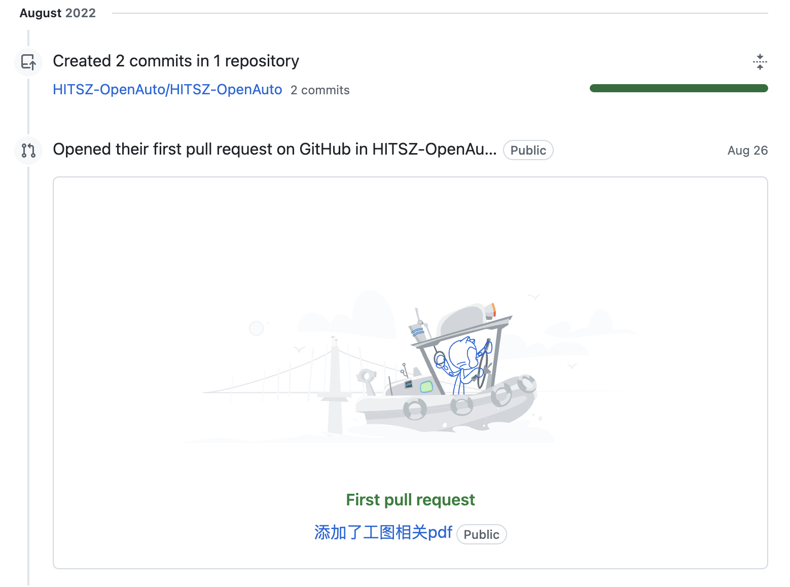

本文亦见于 [Longlin 的个人主页](https://blog.longlin.tech/posts/hoa-anniversary/)。

## 前言

截止 `2024.10.25` ，HOA 已达成 GitHub 195 位关注者，接待了 1.8w 位用户，产生了 22w 个 Page-View 事件。

说实话，我完全没有料到 HOA 能发展到现在这种规模，毕竟组织成员们都是非计算机专业的在校生，而且只能利用课余时间进行开发。可是，就是这么一个「不专业」的团队，仅凭大家的热心与兴趣，也能通过 commit 的不断累积打造出一款在「专业」内颇受欢迎的产品，我想这便是开源的魅力吧。

## TimeLine - 我在 OpenAuto 的那些 commit

### `2022年8月`

我提交了[人生第一个 PR](https://github.com/HITSZ-OpenAuto/HITSZ-OpenAuto/pull/9)，当时的我甚至连 GitHub 的操作流程都不熟悉，只是因为在群里看到有个资料共享计划的宣传，点进链接后发现仓库里有些课程缺少相关资料，便把之前从 Zlib 里下载的工图 PDF 上传了。现在看来，那个夏天，便是一切的开端呢（笑）

### `2023年3月`

当时学校是第一年在大一开设「自动化认识与实践」考试课，由于没有前人的资料参考，实验指导书更是靠不住，大家或多或少都踩了不少坑，结题时学生和老师间还闹出了一点[不愉快事件](https://github.com/longlin10086/HITSZ_lab_project?tab=readme-ov-file#4-%E5%86%99%E5%9C%A8%E6%9C%80%E5%90%8E)，因此，很有必要留下一些 文字/资料 给下届学弟学妹参考。正好看到 [Maxwell Jay](https://github.com/MaxwellJay256) 在仓库更新了一些相关资料，于是便顺手补充了一些之前集中的资料（[PR](https://github.com/HITSZ-OpenAuto/HITSZ-OpenAuto/pull/22)）

### `2023年6月 - 2023年9月`

这段时间的 PR 主要是针对刚刚结课的大一课程补充资料与说明，完善改进了下目录结构。这期间我提了我的[第一个 issue](https://github.com/HITSZ-OpenAuto/HITSZ-OpenAuto/issues/40)，促成了 OpenAuto 仓库由个人维护转为组织维护。

### `2023年10月`

10 月 12 日，[Maxwell Jay](https://github.com/MaxwellJay256) 发布了 [issue#49](https://github.com/HITSZ-OpenAuto/HITSZ-OpenAuto/issues/49)，面对仓库日益增大的问题，我们开始商讨如何对仓库进行拆分，[大物实验 IA](https://github.com/HITSZ-OpenAuto/PHYS1002) 作为第一个被分离出来的仓库，如今已经获得了**57 个 star**。

10 月 28 日，[Longbin](https://github.com/TangLongbin) 学长给所有 OpenAuto 项目的活跃开发者抄送了一封邮件：

咱们的 OpenAuto 2.0 计划算是正式启动了！

### `2023年11月`

计划已经启动，接下来便是技术选型和开发了。

11 月 6 日，在 [Longbin](https://github.com/TangLongbin) 学长搭建的 Jekyll 网站基础上，[Mither](https://github.com/kowyo) 用更现代的 Hugo 框架重新构建了一版前端，同时采用了一直用到现在的 [Hextra](https://imfing.github.io/hextra/) 主题。我在当天贡献了新项目的第一个 commit：

至此，我们项目的整体流程已经明晰————抓取各仓库的 markdown 文档后再使用 Hugo 在前端进行页面渲染。

11 月 7 日 -9 日，我在原 action 基础上进行了修改，实现了自动抓取组织下所有匹配的课程仓库的脚本，同时借助 tag.txt 对课程文档进行分类。（[PR](https://github.com/HITSZ-OpenAuto/hoa-moe/pull/3)）

主要功能实现后，剩下的便是搬运仓库和一些 CSS 上修修补补的工作了。当时还尝试了一些有意思的动画，不过由于不太合适所以最终还是被 discard。

整个 11 月我们的 QQ WorkGroup 可谓热火朝天，几乎每天都有人贡献新 feature，网站的迭代速度非常快。

### `2023年12月`

12 月 1 日，整个新项目基本成型。同天，正式告别老仓库（[PR#54](https://github.com/HITSZ-OpenAuto/HITSZ-OpenAuto/pull/54)）

12 月 2 日，OpenAuto 2.0 正式官宣🎉

发布当天，我们的 fo 数就涨到了 50 人，也有热心同学对我们进行了打赏赞助。

2023 年剩下的时间，我们主要为网站新增了 博客 与 友链 界面，自此，OpenAuto 的功能在资料下载基础上又向外拓展了不少。我也在此时写了一篇[贡献帮助文档](https://hoa.moe/blog/writing-rules/)（[PR](https://hoa.moe/blog/writing-rules/)），这份贡献指南后面还经过了几次改版，不过都是后话了。

### `2024年`

除了一些日常维护工作，我们也在思考如何改进我们的网站————新文档、新博客、VTuber logo、License 展示、AI 新闻周报、RSS 订阅……

相信 HOA 会越做越好！（我们可能会倒闭，但绝不会变质

## 尾记

不知不觉，新版 HOA 也迎来了一周岁生日，我也陪这个新生开源项目走过了第一年。从草创时期到稳定维护时期，我实实在在体会到了开源的乐趣，很幸运我能在刚接触开源什么都不懂的时候遇见它，更幸运的是，我通过开源遇见了一群志同道合的伙伴，请容许我用最朴素的文字对你们表示衷心的感谢！

最后的最后：
**OpenAuto，生日快乐。**
