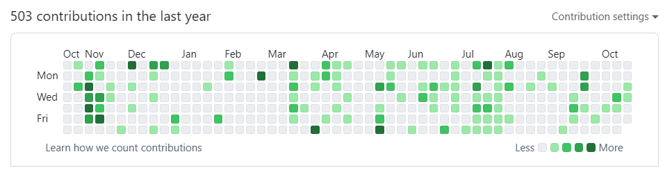

本文亦见于 [Oliver Wu 的个人博客](https://oliverwu.top/HOA-1st-anniversary)。

## 缘起

我一直对资料共享有着浓厚的兴趣，一直是自救群（一个供学生交流学习相关问题、分享学习资料的 QQ 群）活跃的资料贡献者和管理者。

2023 年 3 月，机缘巧合之下，我接触了 [HITSZ OpenAuto](https://github.com/HITSZ-OpenAuto) 项目，当时这个项目还是一个单独且硕大的仓库，课程资料按照学期组织。我对自己参与制作的「暑期电路补习」资料颇为满意，怀着让更多同学从这份资料受益的心愿，我便将其上传至「大一下/电路」的文件夹了。当时还不懂 Git 为何物，只知道从网页端笨拙地十个十个文件上传，因此平添了若干 dirty commits。现在想来，当时的自己多么稚嫩。

## 从单人到团队

继上面的贡献之后，我又在电路 IA 课程文档中留下了些许学习建议，此后便没再过多关注。10 月份，我偶然地收到 Longbin 学长的一封邮件，邮件中说，OpenAuto 已从一个大仓库转为组织方式维护，邀请我成为维护团队的一员，我很高兴地接受了邀请。

随后我们进行了多次讨论。我们感受到，QQ 群文件多易受年级区隔，且文件夹支持不便，用 GitHub 仓库方式维护能够方便管理提交记录，且方便代际资料的组织。不过要将原有项目推向更大的用户群，且吸纳更多的维护者，难点有二：

一是针对使用者而言的。成功连接 GitHub 对于使用者而言有一定要求，因此为了降低使用门槛，急需直白清晰的前端页面，且要能在国内顺畅地访问到。于是几位前端开发者共同努力，选用 [Hugo](https://gohugo.io/) 作为引擎、[Hextra](https://github.com/imfing/hextra) 作为主题，打造了现在按学期组织、学期内以课程类别排序的呈现效果，还购买了现在这个短小可爱的域名。

二是针对维护者而言的。原仓库规模太大，整体拉取耗时长、占空间；而且之前仓库文件结构较为混乱，不方便维护。因此我们定下了按照课程分别建立子仓库、且规范文件夹与资料命名的目标。于是几位同学齐心协力，花了一个月把各门课程资料分别迁移出来。我主要负责了这份工作。

前端页面需要依赖各仓库的信息来生成，所以我们在各页面下建立了 tag，通过该文件来识别课程类型与名称，再根据文件夹和文档内容生成页面。当时，为了实现心目中的课程资料目录架构，并不擅长前端编写的我自告奋勇地接手了这项任务，虽然结果还不错，但是过程嘛……（捂脸）

  

上面工作的完成，宣告着 OpenAuto 2.0 的正式成型。12 月初，我们在自救群和空间发布了海报，得到了同学们热切的回应。

## 日常维护

在项目正式发布之后，很少再有项目伊始那种大刀阔斧的增删，取而代之的是琐碎的维护和更新。每天，我辗转于各个仓库之间，创建 commit、审核与合并各种各样的 pr。虽然比较繁琐，但我看着资料越来越丰富、文档越来越完善，成就感难以言表。我过去一年的 commit 中，至少有 90% 是在 OpenAuto 中提交的。

  

虽说总体框架不再有变动，核心维护团队成员总能以各种各样的新点子予我惊喜。比如，全新的 VTuber Logo 和周边贴纸；越来越丰富且友好的参与指南和 commit message 提示；利用 Hextra 短代码生成的文件下载界面和信息提示框；利用 GPT 生成的 AI 周报总结；随着仓库内容更新而自动触发的课程页面更新…… 在这样一个活跃的团队中工作，我也充满激情。

核心维护者外的贡献者们也带来了一篇篇优质的博客、一份份用心撰写的学习建议和课程资料，不断为这个项目注入新的活力。

## 致谢与展望

感谢主攻网页前端开发的维护者们（以及网站框架与主题的作者），清晰简约的界面离不开你们的努力；你们还使得贡献者得以专注于资料的更新，维护者得以最大限度发挥在资料管理方面的热情和能力。

感谢所有和我一起负责资料管理的维护者们，你们高效率的审核与回复是资料及时更新的基础，让我感受到「事事有着落」的安全感。

感谢 OSA 提供的网盘基础设施支持，感谢校内类似项目维护者提供的宝贵经验。

感谢所有资料、文档贡献者，你们的支持与贡献让我们感受到，在知识共享、减少弯路的途中，我们并不孤寂。

还要感谢向我们提出意见和建议以及打赏我们的同学。

在这一年里，OpenAuto 日渐成熟。然而，仍有不少问题值得我们进一步探索，例如资料的利用态度问题、维护的可持续性问题、网站的呈现方式问题等。也希望大家多提意见和建议、多多贡献资料。

最后，**OpenAuto，生日快乐。**