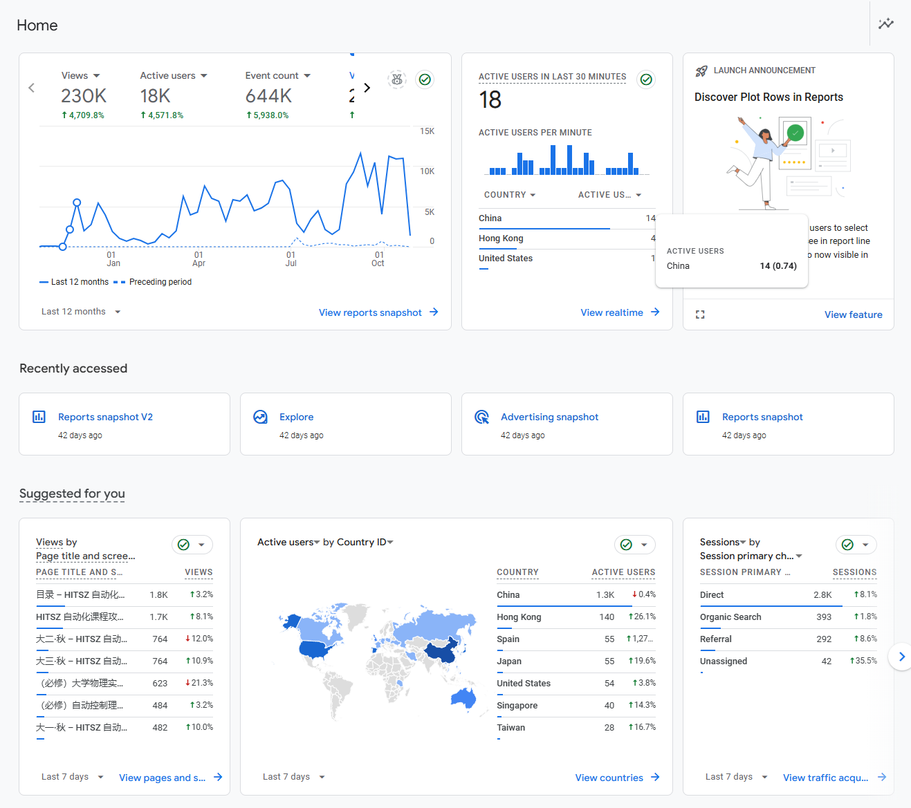

承蒙各位支持，我们的网站在过去一年中收获了 **23 万+** 的浏览量，课程仓库数增加至 **60 余个**，总课程资料大小超过 **10G**，并且仍在不断丰富中。

  

HOA 网站（OpenAuto 2.0）的几位创始人结合自身的经历各写了一篇感想，角度各异，欢迎各位阅读：

- Kowyo：[《开源的心情：杂志、画画与创业公司》](https://hoa.moe/news/1st-anniversary/kowyo/)
- Longlin Li：[《写在 HOA 一周年之际——从前端开发者视角讲述的 OpenAuto 发展历程》](https://hoa.moe/news/1st-anniversary/longlin/)
- Maxwell Jay：[《杂谈：关于分享知识——HOA 一周年纪念》](https://hoa.moe/news/1st-anniversary/maxwell/)
- Oliver Wu：[《OpenAuto 一周年生日纪——从资料维护者视角讲述的 OpenAuto 发展历程》](https://hoa.moe/news/1st-anniversary/oliverwu/)

OpenAuto 的发展壮大离不开各位资料贡献者的支持。如果你符合下列任意一项：

- 热心于创作课程笔记、实验报告或试卷题解等各类资料
- 擅长前端开发与设计
- 会使用 Git 和 GitHub
- 善于撰写文档或产出（技术向）博客文章
- 擅长资料组织与管理

我们都欢迎你向 OpenAuto 发起贡献！如果你感兴趣，可以试着阅读 [参与指南](https://hoa.moe/blog/writing-rules/)，然后发送邮件至 [hi@hoa.moe](mailto:hi@hoa.moe)，说明自身的情况与长处（也可以提出疑问），并留下联系方式，我们会尽快与你取得交流，并带领你熟悉整个贡献流程！