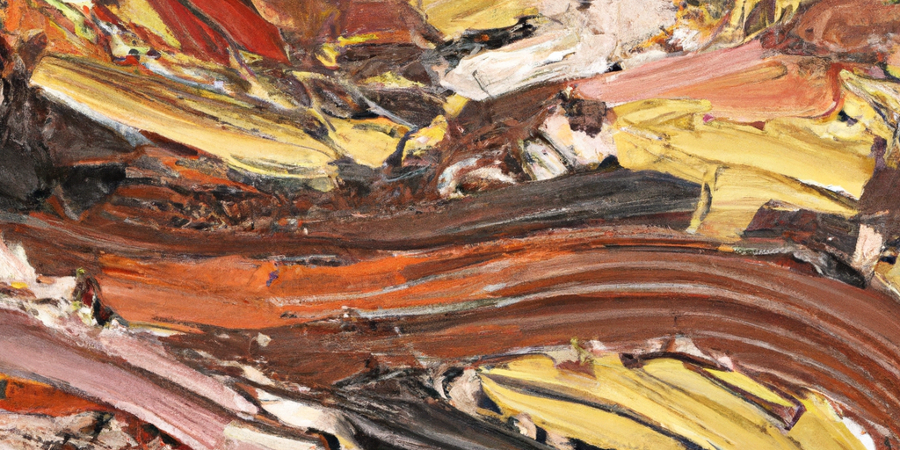

---
authors:
- image: https://github.com/openai.png
  link: https://github.com/openai
  name: ChatGPT
date: '2024-10-27'
draft: false
excludeSearch: false
title: AUTO 周报 2024-10-20 - 2024-10-27
---

## ✨AI 摘要

### 每周提交报告总结

#### 本周提交概述

- **周日（10.27）**: 
  - Oliver Wu 更新了“移动机器人导论”中的实验报告和作业，并在“系统辨识”中更新了一些资料。

- **周四（10.24）**: 
  - GitHub Actions 更新了其 README.md 文件。

- **周三（10.23）**: 
  - 吕俊达首次提交了“移动机器人导论”，并在“毕业设计”中增加了多个开题模板。

- **周二（10.22）**: 
  - 吕俊达在“毕业设计”中增加了开题报告模板，并补充了相关信息。

- **周一（10.21）**: 
  - Kowyo 在多个项目中进行了代替修改，将 “hoa.moe” 更改为 “hoa-moe”，涉及项目包括“运动控制系统”、“模式识别”、“线性系统理论”和“毕业设计”等多个领域，共完成了超过40次提交。
  - Yu Bao 补充了“大学物理实验”中关于太阳能电池特性曲线的内容。

本周共记录了多个重要更新和提交，特别是在项目管理及文档格式方面的改进。

