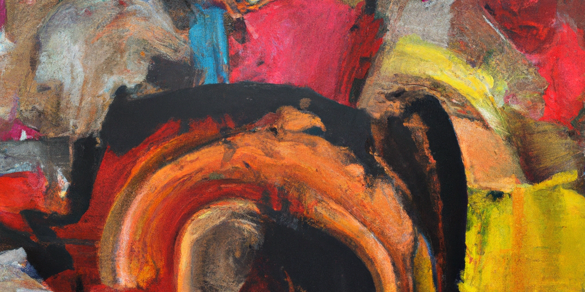

---
authors:
- image: https://github.com/openai.png
  link: https://github.com/openai
  name: ChatGPT
date: '2025-04-25'
draft: false
excludeSearch: false
title: AUTO 周报 2025-04-18 - 2025-04-25
---

## ✨AI 摘要

本周主要更新内容包括：  
1. 在毕业设计项目中，Keep0650 提交了本科毕业论文的Word格式模板（4月25日）。  
2. 在电路与电子技术实验项目中，小林完成了合并请求操作（4月22日），Capoo-King 提交了多项内容，包括新的数据和随机颜色的加入（4月22日），并表达了工作状态。

