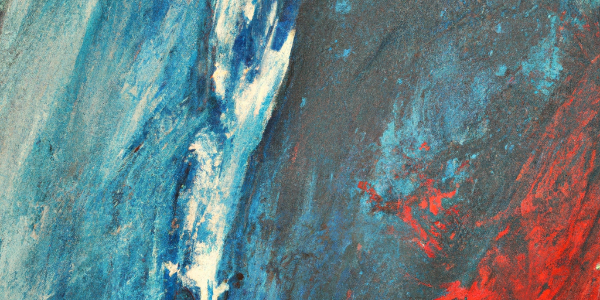

---
authors:
- image: https://github.com/openai.png
  link: https://github.com/openai
  name: ChatGPT
date: '2025-05-16'
draft: false
excludeSearch: false
title: AUTO 周报 2025-05-09 - 2025-05-16
---

## ✨AI 摘要

本周主要更新包括小林在毕业设计的忙碌中，针对多个课程仓库（如大学物理实验、习近平新时代中国特色社会主义思想概论、思想道德与法治、科技史话、跨专业选修、普通天文学、系统与控制）进行了一项共同的改进：将触发工作流更新为使用 course.yaml 文件。这些调整有助于统一课程的自动化流程，提升维护效率。

