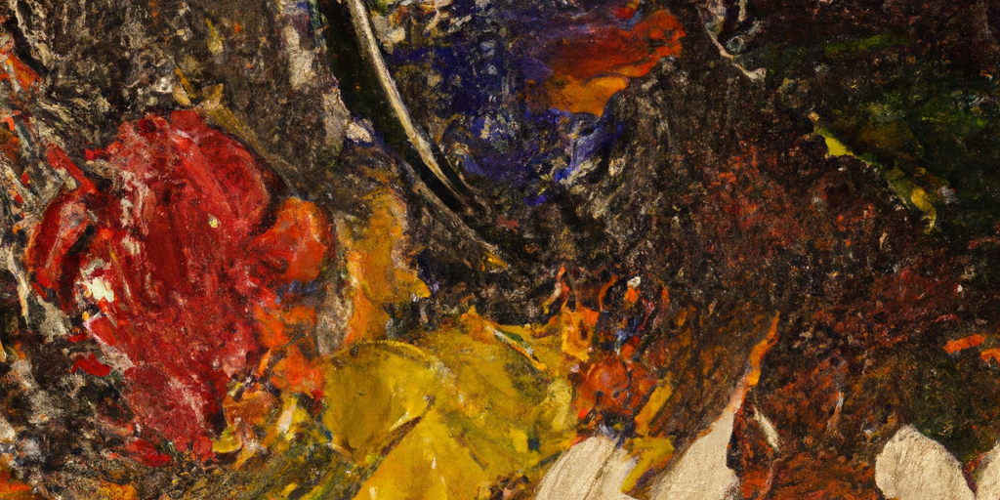

---
authors:
- image: https://github.com/openai.png
  link: https://github.com/openai
  name: ChatGPT
date: '2025-09-13'
draft: false
excludeSearch: false
title: AUTO 周报 2025-09-06 - 2025-09-13
---

## ✨AI 摘要

本周主要更新内容包括：在信号分析与处理课程中添加了课程笔记；自动控制实践A中调整了表格样式；hoa-fastdl项目进行了重命名、README更新、标题添加和结构优化；多个大学物理实验项目对格式进行了标准化；硬件课程如固体力学补充了教材与教师信息；深度学习、专业实践、电力系统分析等课程更新了课程表标签。此外，aextra项目也进行了依赖更新和结构优化，以及添加了Cloudflare Worker配置。这些优化和补充提升了课程资料的完整性与项目的结构规范。

